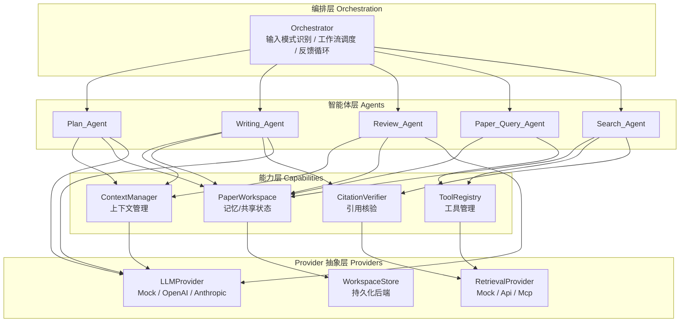
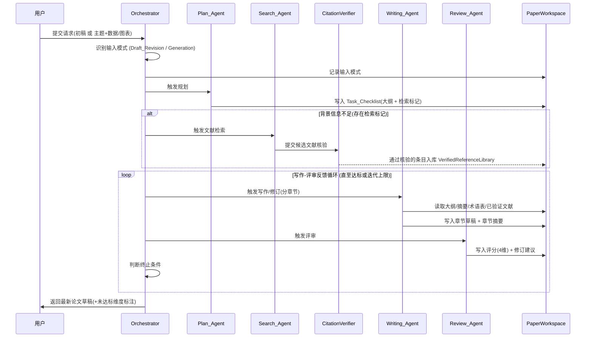

# Design Document

## Overview

本设计文档描述「学术论文写作多智能体系统」（academic-paper-writing-agent）的技术架构与实现策略。系统借鉴通用智能体架构（如 Claude Code）在**上下文管理、记忆管理、工具管理**三方面的解耦思想，采用 Python 实现，强调清晰的模块边界与可插拔的接口契约，以支持「骨架优先、模块递进」的增量开发。

设计的核心原则：

1. **面向接口编程**：所有外部能力（LLM、文献检索）与所有智能体都通过抽象接口（`Protocol` / `ABC`）暴露，实现可插拔、可替换、可 mock。
2. **单一真相源**：所有跨智能体共享状态收敛到一个持久化的 `PaperWorkspace`，智能体之间不直接传递大段状态，只通过工作区读写。
3. **依赖倒置**：高层编排（`Orchestrator`）依赖抽象的智能体接口与 provider 接口，不依赖具体实现，便于在骨架阶段用桩实现跑通全流程。
4. **引用真实性硬约束**：写作智能体只能引用 `VerifiedReferenceLibrary` 中的条目，伪造引用在架构层面被阻断。

需求映射：本设计覆盖 requirements.md 中的全部 9 条需求（详见末尾「需求映射」表）。

## Architecture

### 分层架构

系统分为四层，自上而下依赖，禁止反向依赖：



### 主工作流时序



## Components and Interfaces

### 模块目录结构

```
src/paper_agent/
├── workspace/              # 记忆/共享状态 (Phase 0)
│   ├── models.py           # PaperWorkspace 及所有数据模型 (dataclass/pydantic)
│   ├── store.py            # WorkspaceStore 抽象 + 实现
│   └── repository.py       # 对 workspace 的读写封装(原子更新)
├── providers/
│   ├── llm/
│   │   ├── base.py         # LLMProvider 接口
│   │   ├── mock.py         # MockLLMProvider
│   │   └── openai.py       # (Phase 2+) 真实实现
│   └── retrieval/
│       ├── base.py         # RetrievalProvider 接口 + ReferenceEntry
│       ├── mock.py         # MockRetrievalProvider
│       ├── api.py          # (Phase 2+) arXiv + Semantic Scholar
│       └── mcp.py          # (Phase 3) MCP 封装
├── agents/
│   ├── base.py             # Agent 接口 + AgentContext/AgentResult
│   ├── plan_agent.py
│   ├── search_agent.py
│   ├── query_agent.py
│   ├── writing_agent.py
│   └── review_agent.py
├── context/
│   └── manager.py          # ContextManager: 摘要、术语注入、上下文裁剪
├── tools/
│   ├── registry.py         # ToolRegistry 工具注册/调度
│   └── citation.py         # CitationVerifier 引用真实性核验
├── export/
│   ├── base.py             # DocumentExporter 接口
│   ├── markdown.py         # MarkdownExporter (Phase 1 默认, 调试用)
│   ├── latex.py            # LatexExporter (Phase 2: 正文 + .bib)
│   └── docx.py             # DocxExporter (Phase 3)
├── orchestrator.py         # Orchestrator 工作流编排
└── config.py               # 配置(provider 选择、阈值、迭代上限)
```

### 核心接口契约

#### Agent 接口（统一智能体抽象）

所有智能体实现同一接口，使 `Orchestrator` 可以一致地调度它们，并便于在骨架阶段替换为桩。

```python
class Agent(Protocol):
    name: str
    def run(self, ctx: "AgentContext") -> "AgentResult": ...
```

- `AgentContext`：封装本次调用所需的只读输入——工作区句柄（只读视图）、当前任务项、相关上下文片段（由 `ContextManager` 准备）。
- `AgentResult`：封装结构化产出（状态、对工作区的更新意图、日志）。智能体**不直接写工作区**，而是返回更新意图，由 `repository` 统一原子落盘（保证 Req 9 的持久化一致性）。

#### LLMProvider 接口（可插拔大模型）

```python
class LLMProvider(Protocol):
    def complete(self, messages: list[Message], **opts) -> LLMResponse: ...
```

- `MockLLMProvider`：返回可预测的确定性内容，供骨架与单测使用，零网络依赖。
- 真实实现（`OpenAIProvider` 等）在 Phase 2+ 接入，不改动任何智能体代码。

#### RetrievalProvider 接口（可插拔检索）

```python
class RetrievalProvider(Protocol):
    def search(self, query: str, limit: int) -> list[ReferenceEntry]: ...
    def fetch_metadata(self, identifier: str) -> ReferenceEntry | None: ...
```

- `ReferenceEntry`：至少含 `title, authors, year, source_id(DOI/arXiv id), source` 字段（满足 Req 3/4 可核验要求）。
- `MockRetrievalProvider`：返回固定的、带合法标识符的样例文献，供骨架使用。
- `ApiRetrievalProvider`：Phase 2 实现，首选 **arXiv API（无需 key）+ Semantic Scholar Academic Graph API（免费，可选 key 提速率）**；二者均免费。
- `McpRetrievalProvider`：Phase 3，封装现成开源学术检索 MCP server。

provider 的选择通过 `config.py` 注入，符合依赖倒置——切换数据源不影响主流程。

#### DocumentExporter 接口（可插拔输出格式，Req 10）

最终论文格式与写作/评审逻辑解耦：智能体只产出**中性的内部表示**（结构化 Markdown / 带语义标记的段落），由导出器渲染为目标格式。

```python
class DocumentExporter(Protocol):
    format: Literal["latex", "docx", "markdown"]
    def export(self, ws: PaperWorkspace, out_dir: str) -> ExportResult: ...
```

- `MarkdownExporter`：Phase 1 默认，零依赖，便于预览与调试。
- `LatexExporter`：Phase 2，渲染正文 `.tex`，并将 `verified_references` 导出为 `.bib`，正文以 `\cite{}` 引用（Req 10.5）；支持期刊/会议模板。
- `DocxExporter`：Phase 3，面向社科与非技术协作场景。
- 导出器据 `PaperWorkspace.output_format` 选择（Req 10.1-10.4），未指定时用 `config` 中的默认格式（Req 10.2）。各导出器必须保留章节草稿、图表说明与对已验证文献的引用（Req 10.6）。

#### WorkspaceStore 接口（可插拔持久化）

```python
class WorkspaceStore(Protocol):
    def load(self, workspace_id: str) -> PaperWorkspace | None: ...
    def save(self, ws: PaperWorkspace) -> None: ...   # 失败抛异常
```

- 默认 `JsonFileStore`（本地 JSON 文件，零依赖，便于骨架与调试）。
- Req 9.3 要求：持久化失败时阻止本次更新——`repository` 在 `save` 抛异常时回滚内存中的更新，不向智能体返回成功。

## Data Models

`PaperWorkspace` 是系统的单一真相源，结构如下（字段名示意，最终用 dataclass/pydantic 实现）：

```python
@dataclass
class PaperWorkspace:
    workspace_id: str
    input_mode: Literal["draft_revision", "generation"]   # Req 1
    original_draft: str | None                            # 草稿修订模式输入
    topic_background: str | None                          # 从零生成模式输入
    outline: list[OutlineNode]                            # 大纲 (Req 2)
    task_checklist: list[TaskItem]                        # 任务清单 (Req 2)
    glossary: dict[str, str]                              # 术语表 (Req 5.5)
    verified_references: list[ReferenceEntry]             # 已验证文献库 (Req 4)
    section_drafts: dict[str, SectionDraft]               # 各章节草稿 (Req 5)
    section_summaries: dict[str, str]                     # 章节摘要 (Req 5.2)
    figures: list[FigureRecord]                           # 图表+说明 (Req 6)
    review_records: list[ReviewRecord]                    # 评审记录 (Req 7)
    iteration: int                                        # 当前反馈轮数 (Req 8)
    output_format: Literal["latex", "docx", "markdown"]   # 输出格式 (Req 10)
    created_at: datetime
    updated_at: datetime

@dataclass
class TaskItem:
    id: str
    description: str
    section_ref: str | None
    needs_retrieval: bool          # Req 2.5: 标记需检索
    status: Literal["pending", "in_progress", "done"]

@dataclass
class SectionDraft:
    section_id: str
    title: str
    content: str
    cited_reference_ids: list[str]  # 仅可引用 verified_references 中的 id (Req 4.3)

@dataclass
class ReviewRecord:
    iteration: int
    scores: dict[ScoringDimension, float]   # 逻辑性/新颖性/论证充分性/语言质量
    suggestions: dict[ScoringDimension, str]

class ScoringDimension(str, Enum):
    LOGIC = "logic"
    NOVELTY = "novelty"
    SUFFICIENCY = "sufficiency"
    LANGUAGE = "language"
```

### 引用真实性数据流（Req 4 硬约束）

1. `Search_Agent` 通过 `RetrievalProvider` 取回候选 `ReferenceEntry`。
2. `CitationVerifier.verify(entry)` 用 `source_id` 回查检索源确认真实存在。
3. 仅核验通过的条目写入 `verified_references`；未通过则拒绝入库（Req 4.1/4.2）。
4. `Writing_Agent` 引用时只能从 `verified_references` 取 id 填入 `SectionDraft.cited_reference_ids`；若需引用未入库文献，触发核验流程而非直接生成引用（Req 4.4）。

## 上下文管理与局部修改

### ContextManager（上下文管理模块，支撑写作智能体）

借鉴通用智能体的上下文压缩思想，避免长论文撑爆 LLM 上下文：

- **章节摘要注入**：写某章节时，注入「全局大纲 + 已完成章节的摘要」而非全文（Req 5.3）。
- **术语表注入**：注入 `glossary` 以保持术语一致（Req 5.5）。
- **上下文预算裁剪**：按 token 预算对注入内容排序裁剪，优先保留与当前章节强相关的摘要。
- 摘要生成本身调用 `LLMProvider`，在章节完成后由 `ContextManager` 产出（Req 5.2）。

### 局部修改（Localized_Edit，Req 5.7-5.9）

写作智能体对已存在草稿执行「定位 + 局部替换」而非整篇重写：

- **内容型修订建议**：定位到建议指向的片段，仅替换该片段，其余内容保持不变（Req 5.8）。实现上采用「锚点定位（章节 id + 文本片段匹配）→ 生成替换片段 → 拼接」。
- **结构型修订建议**：在受影响章节范围内做重写/新增/删除，不触碰未受影响章节（Req 5.9）。
- 写作智能体内部据 `ReviewRecord.suggestions` 的类型分流到上述两条路径。

## Orchestrator 工作流

```
1. receive(request) → 识别 input_mode (Req 1)，初始化/加载 PaperWorkspace
2. plan: Plan_Agent 生成 Task_Checklist (Req 2)
3. if 存在 needs_retrieval 任务:
       Search_Agent + CitationVerifier 收集并核验文献 (Req 3/4)
4. feedback_loop:
       while not should_terminate():
           Writing_Agent 写作/局部修订 (Req 5)
           Review_Agent 评分 + 建议 (Req 7)
           iteration += 1
5. return 最新草稿 (+ 未达标维度标注) (Req 8)
6. export: DocumentExporter 按 output_format 渲染并导出文件 (Req 10)
```

终止条件 `should_terminate()`（Req 8）：

- 全部 `ScoringDimension` 得分 ≥ `quality_threshold` → 终止（达标）。
- 或 `iteration >= iteration_limit` → 终止（超限）；若超限未达标，结果中标注未达标维度（Req 8.4）。

阈值与上限来自 `config.py`，可配置。

## Error Handling

- **持久化失败**（Req 9.3）：`repository` 捕获 `WorkspaceStore.save` 异常 → 回滚内存更新 → 向上抛出 `PersistenceError`，本轮更新视为未发生。
- **检索源不可用**：`RetrievalProvider` 抛 `RetrievalError`，`Search_Agent` 降级——标记相关任务为「检索失败」并继续可写作部分，不中断整体流程。
- **核验失败**：候选文献被拒入库，记录原因；写作智能体不得引用。
- **输入缺失**（Req 1.3）：`Orchestrator` 在模式识别阶段直接返回提示，要求补充输入。
- **LLM 调用失败**：provider 层封装重试/超时，超出后抛 `LLMError`，由调用方智能体决定降级或中止当前任务。

## Correctness Properties

以下不变式在系统运行的任意时刻都必须成立，作为实现与测试的正确性基准：

### Property 1: 引用真实性
`SectionDraft.cited_reference_ids` 中的每个 id 必有对应条目存在于 `verified_references`；不存在被引用却未经核验的文献。

**Validates: Requirements 4.3**

### Property 2: 核验入库
`verified_references` 中的每个条目都通过过 `CitationVerifier`，且具备非空 `source_id`。

**Validates: Requirements 4.1, 4.2, 4.5**

### Property 3: 持久化一致性
内存中的 `PaperWorkspace` 状态与 `WorkspaceStore` 中持久化的状态在每次成功更新后保持一致；若 `save` 失败，则内存更新被回滚，二者仍一致。

**Validates: Requirements 9.2, 9.3**

### Property 4: 输入模式确定性
一个 `PaperWorkspace` 一经确定 `input_mode` 即不再改变，后续所有智能体行为据此分流。

**Validates: Requirements 1.1, 1.2, 1.4**

### Property 5: 局部修改保持性
对某章节执行 Localized_Edit 后，未被修订建议涉及的内容保持不变，且其他章节的草稿不受影响。

**Validates: Requirements 5.8, 5.9**

### Property 6: 反馈循环终止性
反馈循环必在有限轮内终止——要么全维度达标，要么达到 `iteration_limit`；`iteration` 单调递增，不存在无限循环。

**Validates: Requirements 8.1, 8.2**

### Property 7: 达标标注完整性
当因迭代上限终止且未达标时，返回结果必包含全部未达标维度的标注。

**Validates: Requirements 8.4**

## Testing Strategy

- **单元测试**：每个智能体注入 `MockLLMProvider` 与 `MockRetrievalProvider`，断言其对工作区的更新意图（`AgentResult`），不依赖网络。
- **工作区测试**：`JsonFileStore` 的存取、原子更新、持久化失败回滚（Req 9.3）。
- **引用真实性测试**：构造伪造/真实文献，验证只有真实条目入库、写作智能体无法引用未验证条目（Req 4）。
- **反馈循环测试**：构造评分序列，验证达标终止与迭代上限终止两条路径及未达标标注（Req 8）。
- **集成测试（骨架冒烟）**：用全 mock provider 跑通 `Orchestrator` 端到端，验证两种输入模式各自的工作流走通。

## 分阶段实现策略（骨架优先，模块递进）

> 与用户约定的增量路线一致：先端到端跑通最小骨架，再按价值优先级加深各模块。每个阶段结束都应有可运行、可测试的产物。

**Phase 0 — 地基（数据模型 + 持久化）**
- 实现 `workspace/models.py`（`PaperWorkspace` 及全部数据模型）、`store.py`（`JsonFileStore`）、`repository.py`（原子更新 + 失败回滚）。
- 这是所有智能体共享的真相源，必须最先稳定。

**Phase 1 — 最小骨架（walking skeleton）**
- 实现 `Agent` 接口、`Orchestrator`、`MockLLMProvider`、`MockRetrievalProvider`。
- 每个智能体先用最简桩实现（返回固定/模板化产出），打通「输入识别 → 规划 → 检索 → 写作 → 评审 → 终止 → 导出」全流程。
- 默认 `MarkdownExporter`（零依赖）完成导出环节。
- 目标：集成冒烟测试能从头跑到尾，两种输入模式分别走通。

**Phase 2 — 模块加深（按价值优先级）**
1. `Writing_Agent`：分章节写作 + 局部修改（Localized_Edit）。
2. `Review_Agent` + 反馈循环终止逻辑（4 维评分、阈值/上限）。
3. `ContextManager`：章节摘要、术语表注入、上下文裁剪。
4. `ToolRegistry` + `Search_Agent`/`Paper_Query_Agent` + `CitationVerifier`；接入 `ApiRetrievalProvider`（arXiv + Semantic Scholar）。
5. `LatexExporter`：正文 `.tex` + BibTeX 导出（Req 10.5），作为正式学术产出格式。

**Phase 3 — 完善**
- 两种输入模式的差异化处理细化（草稿修订 vs 从零生成）。
- 图表与实验数据处理（Req 6）。
- `DocxExporter`：面向社科与协作场景的 docx 导出（Req 10）。
- 持久化健壮性与并发安全；接入真实 `LLMProvider` 与 `McpRetrievalProvider`。

## 需求映射

| 需求 | 设计落点 |
|---|---|
| Req 1 输入模式识别 | `Orchestrator.receive` + `PaperWorkspace.input_mode` |
| Req 2 规划与任务清单 | `Plan_Agent` + `TaskItem`(needs_retrieval) |
| Req 3 文献检索 | `Search_Agent`/`Paper_Query_Agent` + `RetrievalProvider` |
| Req 4 引用真实性(硬约束) | `CitationVerifier` + `VerifiedReferenceLibrary` + 写作引用约束 |
| Req 5 分章节写作/局部修改 | `Writing_Agent` + `ContextManager` + Localized_Edit |
| Req 6 图表与数据 | `FigureRecord` + 写作智能体图表说明逻辑 |
| Req 7 评审评分 | `Review_Agent` + `ReviewRecord`(4 维) |
| Req 8 反馈循环终止 | `Orchestrator.should_terminate` + 阈值/上限配置 |
| Req 9 共享工作区/记忆 | `PaperWorkspace` + `WorkspaceStore` + 原子更新/失败回滚 |
| Req 10 可选输出格式 | `DocumentExporter`(Latex/Docx/Markdown) + `output_format` 字段 |
