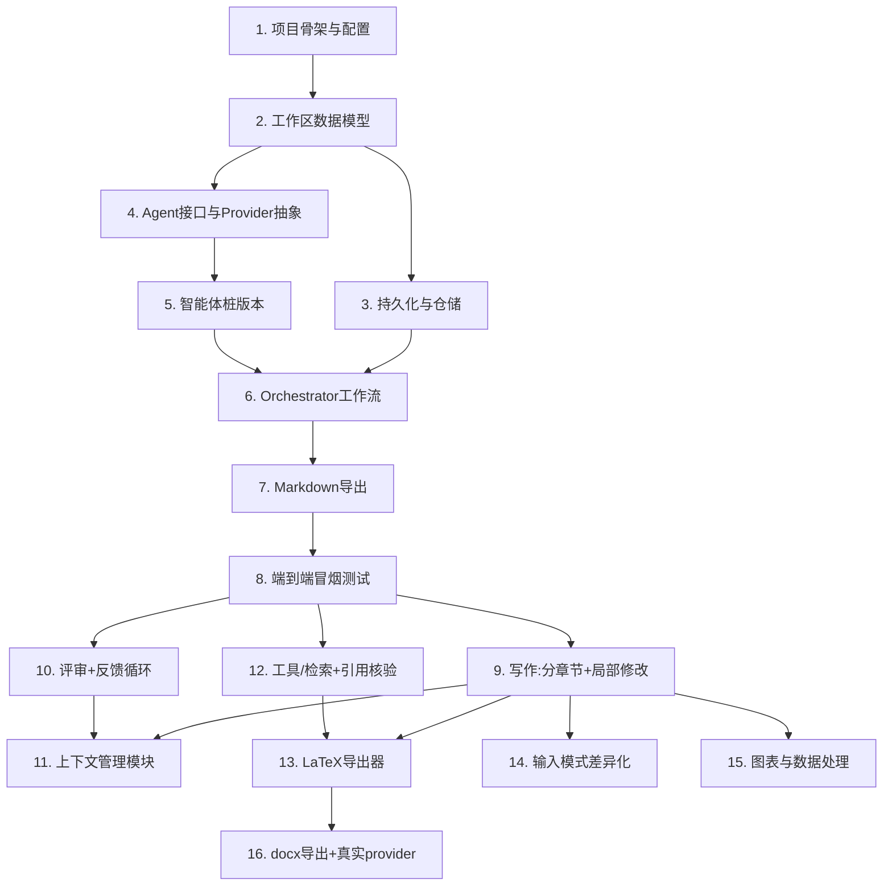

# Implementation Plan

## Overview

按「骨架优先、模块递进」组织实现。Phase 0/1 完成即可端到端跑通（全 mock provider）；Phase 2/3 逐步替换为真实能力。所有任务均为可独立验证的编码步骤，并映射到 requirements.md 中的需求。

## Task Dependency Graph



```json
{
  "waves": [
    { "wave": 1, "tasks": ["1"] },
    { "wave": 2, "tasks": ["2"] },
    { "wave": 3, "tasks": ["3", "4"] },
    { "wave": 4, "tasks": ["5"] },
    { "wave": 5, "tasks": ["6"] },
    { "wave": 6, "tasks": ["7"] },
    { "wave": 7, "tasks": ["8"] },
    { "wave": 8, "tasks": ["9", "10", "12"] },
    { "wave": 9, "tasks": ["11", "13", "14", "15"] },
    { "wave": 10, "tasks": ["16"] }
  ]
}
```

## Tasks

### Phase 0 — 地基：数据模型与持久化

- [x] 1. 搭建项目骨架与配置
  - 创建 `src/paper_agent/` 包结构、`pyproject.toml`、`config.py`（provider 选择、质量阈值、迭代上限、默认输出格式）
  - 配置 `pytest`
  - _Requirements: 8, 9, 10_

- [ ] 2. 实现工作区数据模型
  - 在 `workspace/models.py` 实现 `PaperWorkspace` 及 `TaskItem`、`SectionDraft`、`ReviewRecord`、`ReferenceEntry`、`FigureRecord`、`OutlineNode`、`ScoringDimension`、`output_format` 等数据结构
  - _Requirements: 1, 2, 4, 5, 6, 7, 8, 9, 10_

- [ ] 3. 实现持久化后端与仓储
  - `workspace/store.py`：`WorkspaceStore` 接口 + `JsonFileStore`
  - `workspace/repository.py`：原子更新、save 失败回滚内存状态
  - 单测：存取、原子更新、持久化失败回滚（Property 3）
  - _Requirements: 9.1, 9.2, 9.3, 9.4, 9.5_

### Phase 1 — 最小骨架（端到端，全 mock）

- [ ] 4. 定义 Agent 接口与 Provider 抽象
  - `agents/base.py`：`Agent`、`AgentContext`、`AgentResult`（智能体返回更新意图，不直接写工作区）
  - `providers/llm/base.py` + `mock.py`：`LLMProvider` + `MockLLMProvider`
  - `providers/retrieval/base.py` + `mock.py`：`RetrievalProvider` + `ReferenceEntry` + `MockRetrievalProvider`
  - _Requirements: 3, 4, 5, 7_

- [ ] 5. 实现各智能体的桩版本
  - `plan_agent`、`search_agent`、`query_agent`、`writing_agent`、`review_agent` 的最简实现（模板化产出）
  - _Requirements: 2, 3, 5, 7_

- [ ] 6. 实现 Orchestrator 工作流
  - 输入模式识别（Req 1）、调度规划/检索/写作/评审、反馈循环与终止条件（Req 8）
  - 单测：达标终止、迭代上限终止、未达标维度标注（Property 6/7）
  - _Requirements: 1, 8_

- [ ] 7. 实现导出模块（Markdown）并打通导出环节
  - `export/base.py`：`DocumentExporter`；`export/markdown.py`：`MarkdownExporter`
  - Orchestrator 末尾调用导出
  - _Requirements: 10.1, 10.2, 10.3, 10.4, 10.6_

- [ ] 8. 端到端冒烟集成测试
  - 全 mock provider 跑通两种输入模式的完整流程
  - _Requirements: 1, 2, 3, 5, 7, 8, 10_

### Phase 2 — 模块加深

- [x] 9. 写作智能体：分章节写作 + 局部修改
  - 章节级写作；Localized_Edit（内容型局部替换 / 结构型范围内增删改）
  - 单测：局部修改保持性（Property 5）
  - _Requirements: 5.1, 5.2, 5.3, 5.4, 5.5, 5.6, 5.7, 5.8, 5.9_

- [x] 10. 评审智能体 + 反馈循环
  - 四维评分（逻辑性/新颖性/论证充分性/语言质量）、修订建议、评审记录回写与回馈
  - _Requirements: 7.1, 7.2, 7.3, 7.4, 8.1, 8.2, 8.4_

- [x] 11. 上下文管理模块
  - `context/manager.py`：章节摘要生成、术语表注入、上下文预算裁剪
  - _Requirements: 5.2, 5.3, 5.5_

- [x] 12. 工具与检索：真实文献源 + 引用核验
  - `tools/registry.py`；`tools/citation.py`（`CitationVerifier`）
  - `providers/retrieval/api.py`：arXiv + Semantic Scholar
  - 单测：引用真实性与核验入库（Property 1/2）
  - _Requirements: 3.1, 3.2, 3.3, 3.4, 4.1, 4.2, 4.3, 4.4, 4.5_

- [x] 13. LaTeX 导出器
  - `export/latex.py`：正文 `.tex` + BibTeX 导出，保留引用与图表说明
  - _Requirements: 10.4, 10.5, 10.6_

### Phase 3 — 完善

- [x] 14. 输入模式差异化
  - 草稿修订模式 vs 从零生成模式的规划与写作分支细化
  - _Requirements: 1.1, 1.2, 1.3, 2.4, 5.4_

- [x] 15. 图表与实验数据处理
  - 用户提供说明则沿用，否则生成；图表入工作区并在正文引用
  - _Requirements: 6.1, 6.2, 6.3, 6.4_

- [x] 16. docx 导出器与真实 provider 接入
  - `export/docx.py`；接入真实 `LLMProvider` 与 `McpRetrievalProvider`
  - _Requirements: 10.4, 10.6_

## Notes

- Phase 0/1 是端到端可运行的最小闭环，建议优先完成并保持绿色测试。
- 上下文管理（任务 11）与工具/检索（任务 12）作为支撑模块，安排在骨架稳定之后，避免过度设计。
- 真实 LLM / MCP provider（任务 16）放在最后接入，前期一律用 mock，保证开发与测试零外部依赖。
