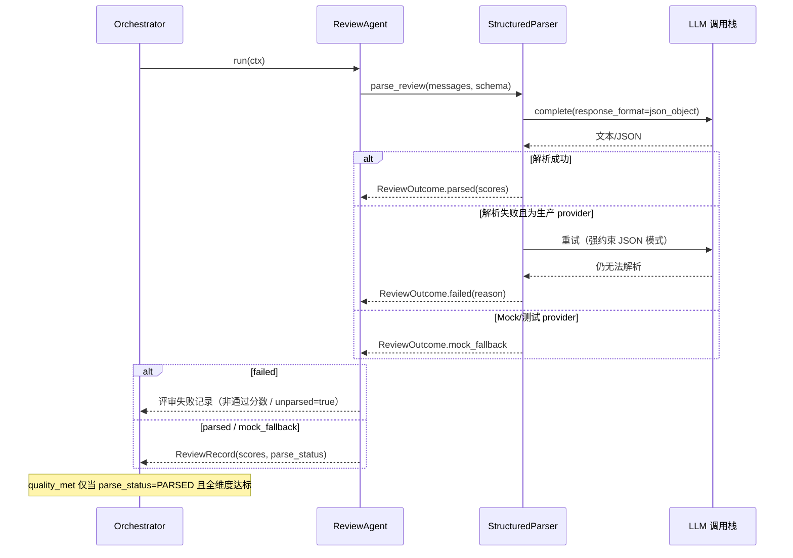
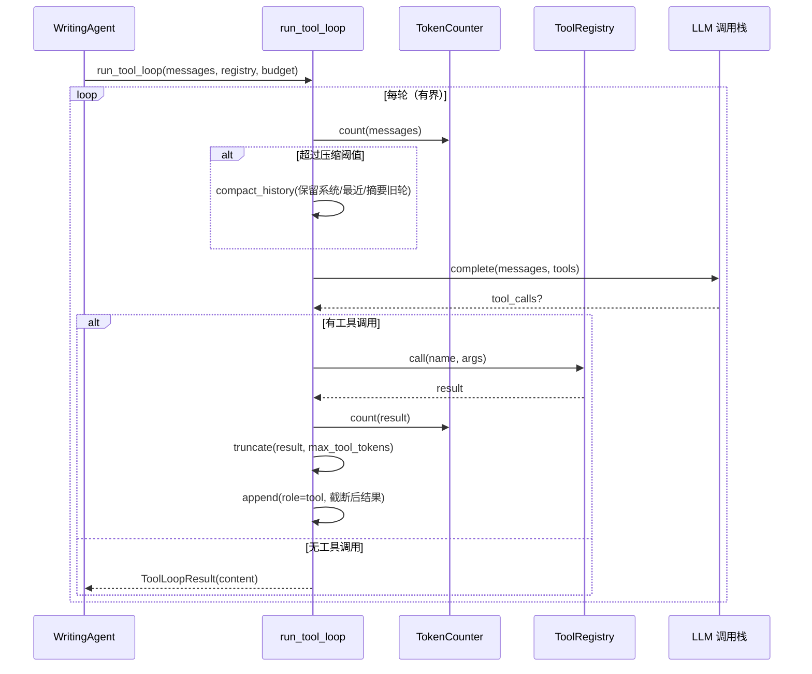
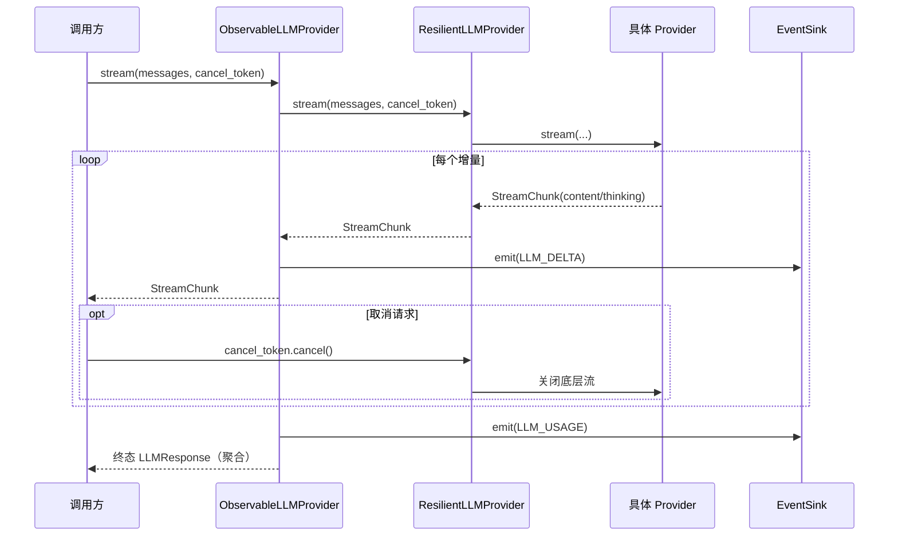

# 设计文档：agent-architecture-upgrade（智能体架构升级）

## Overview

本特性是对现有学术论文写作多智能体系统（`src/paper_agent/`）的一次架构强化升级，**不改变**既有的核心契约与编排范式，而是在其上加固「正确性、健壮性与上下文经济性」三条主线。系统现状是固定编排管线（规划 → 引用审计 → 检索 → 写作—评审反馈循环 → 导出），各专职智能体（`PlanAgent`/`SearchAgent`/`WritingAgent`/`ReviewAgent`/`CitationAuditAgent`）实现统一的 `Agent` 协议，返回 `WorkspaceMutation` 意图由 `Orchestrator` 经 `WorkspaceRepository` 原子落盘。

本次升级聚焦四项按优先级排序的改进：(1) 修复 `ReviewAgent` 在生产环境下因 JSON 解析失败而**伪造单调递增分数**导致反馈循环误判 `quality_met` 的正确性缺陷，并把同类「静默 `extract_json` 回退」问题在 plan/search 中统一治理；(2) 为 `LLMProvider` 抽象增加流式接口 `stream()` 与可层叠的健壮性（指数退避重试、超时、429 限流处理），并保持 `complete()` 向后兼容；(3) 扩展工具生态并把更多结构化步骤改走 function calling / JSON 模式（`response_format`），新增按需读取工作区、章节级精确编辑、质量闸/引用检查等模型可调用工具；(4) 为工具循环引入基于真实分词器的 token 计量、工具结果截断与历史压缩。

设计严格遵循既有原则：依赖倒置、`Agent`/`AgentResult`/`WorkspaceMutation` 协议、原子持久化与断点续跑、优雅降级、以及现有事件/可观测性与用量统计系统。模型路由、提示缓存、章节级并行/子智能体作为「前瞻方向」在末尾说明，本设计不与之冲突也不将其纳入核心范围。

## Architecture

整体仍是「编排器驱动的管线 + 反馈循环」，本次升级以**装饰器层叠**与**协议扩展**的方式插入新能力，对智能体业务代码侵入最小。

```mermaid
graph TD
    App[app.build_orchestrator 装配] --> Orc[Orchestrator 编排器]

    subgraph LLM 调用栈（装饰器层叠 / 自外向内）
        Obs[ObservableLLMProvider 事件+用量] --> Res[ResilientLLMProvider 重试/超时/429退避]
        Res --> Base[具体 LLMProvider complete/stream]
    end

    Orc -->|依赖抽象| Obs

    subgraph Agents 智能体
        Plan[PlanAgent]
        Search[SearchAgent]
        Write[WritingAgent]
        Review[ReviewAgent ★正确性修复]
        Audit[CitationAuditAgent]
    end
    Orc --> Plan & Search & Write & Review & Audit

    Write --> TL[run_tool_loop ★压缩+截断+真实计量]
    TL --> Reg[ToolRegistry ★扩展工具集]
    Reg --> T1[search_literature]
    Reg --> T2[read_section / read_reference ★新]
    Reg --> T3[edit_section ★新 章节级精确编辑]
    Reg --> T4[run_quality_gate / check_citations ★新]

    TL --> CM[ContextManager ★真实分词器计量]
    CM --> Tok[TokenCounter 分词器抽象]
    Obs --> Usage[UsageTracker 复用 TokenCounter]

    Plan & Search & Review -->|结构化输出| SP[StructuredParser ★ JSON模式+重试+显式失败]

    Orc --> Repo[WorkspaceRepository 原子落盘]
```

关键架构决策：

- **健壮性独立成层（`ResilientLLMProvider`）**：把重试/超时/429 退避从 `OpenAICompatibleProvider` 内部上提为一个可复用的装饰器，置于 `ObservableLLMProvider` 与具体 provider 之间。这样所有 provider（含未来新增的 Anthropic/Gemini 原生适配器）自动获得统一健壮性，且事件层能观测到「重试中」事件。`OpenAICompatibleProvider` 内既有的重试保留为兜底但默认关闭，避免双重重试。
- **流式作为协议一等公民（`stream()`）**：在 `LLMProvider` 协议上新增可选的 `stream()`，返回增量事件迭代器，支持取消令牌（`CancellationToken`）。既有的 `complete(on_delta=...)` 回调式流式继续可用，新接口为更显式的「token 流经事件系统 + 可中断」提供基础。
- **结构化解析统一治理（`StructuredParser`）**：把「调用 LLM → 解析 JSON → 失败处理」的散落逻辑收敛到一个组件，区分**测试/Mock 回退路径**与**生产解析失败路径**（重试 + JSON 模式 → 仍失败则显式报错或返回非通过结果，绝不伪造通过分数）。
- **上下文经济性闭环**：`TokenCounter` 分词器抽象同时服务 `ContextManager`（摘要预算裁剪）、`UsageTracker`（用量统计）与 `run_tool_loop`（历史压缩 + 工具结果截断），消除 `len//2` 估算口径不一致问题。

## Sequence Diagrams（关键时序）

### 时序 1：反馈循环中的评审（正确性修复后）



### 时序 2：写作工具循环（上下文压缩 + 工具结果截断）



### 时序 3：流式输出与取消



## Components and Interfaces

### 组件 1：扩展的 `LLMProvider` 协议（流式 + 取消）

**Purpose**：在不破坏 `complete()` 的前提下，引入显式流式接口与取消机制，使 token 输出可经事件系统流动并支持中断。

```python
from __future__ import annotations
from dataclasses import dataclass, field
from typing import Iterator, Protocol, runtime_checkable


@dataclass
class StreamChunk:
    """流式增量。kind ∈ {"content", "thinking"}。"""
    kind: str
    text: str


class CancellationToken:
    """协作式取消令牌：调用方 cancel()，生产侧在每个增量边界检查。"""
    def __init__(self) -> None:
        self._cancelled = False

    def cancel(self) -> None:
        self._cancelled = True

    @property
    def cancelled(self) -> bool:
        return self._cancelled


@runtime_checkable
class LLMProvider(Protocol):
    def complete(self, messages: list["Message"], **opts) -> "LLMResponse":
        """同步一次性补全（向后兼容，保持现有签名与 on_delta 回调能力）。"""
        ...

    def stream(
        self,
        messages: list["Message"],
        *,
        cancel_token: "CancellationToken | None" = None,
        **opts,
    ) -> Iterator[StreamChunk]:
        """流式补全：逐块产出 StreamChunk。可选实现。

        默认混入（mixin）可基于 complete(on_delta=...) 适配，使既有 provider
        无需改动即获得 stream()。具体 provider 可覆写以获得真正的原生流式。
        """
        ...
```

**Responsibilities**：
- 保持 `complete()` 签名与行为不变（既有智能体零改动）。
- `stream()` 在每个增量边界检查 `cancel_token`，被取消时关闭底层流并停止产出。
- 提供 `StreamingMixin`，用 `complete(on_delta=...)` 适配出 `stream()`，让 `MockLLMProvider` 与现有 provider 自动具备流式能力。

### 组件 2：`ResilientLLMProvider`（健壮性装饰器层）

**Purpose**：统一的重试/超时/限流处理，层叠在任意 `LLMProvider` 外、`ObservableLLMProvider` 内。

```python
@dataclass
class RetryPolicy:
    max_retries: int = 3
    base_backoff: float = 1.0        # 指数退避基数（秒）
    max_backoff: float = 30.0
    jitter: float = 0.25             # 抖动比例，避免重试风暴
    respect_retry_after: bool = True # 429 优先采用响应头 Retry-After


class ResilientLLMProvider(LLMProvider):
    def __init__(
        self,
        inner: LLMProvider,
        policy: RetryPolicy | None = None,
        sink: "EventSink | None" = None,   # 可选：发出 LLM_RETRY 事件
    ) -> None: ...

    def complete(self, messages, **opts) -> "LLMResponse": ...
    def stream(self, messages, *, cancel_token=None, **opts): ...
```

**Responsibilities**：
- 区分可重试（超时、连接重置、429、5xx）与不可重试（鉴权、400 请求格式）异常。
- 指数退避 + 抖动；429 时优先遵循 `Retry-After`。
- 流式失败在「尚未产出任何增量」时可整体重试；已产出增量后失败则抛出 `LLMError`（不重复输出）。
- 重试时通过 `sink` 发出 `LLM_RETRY` 事件（新增 `EventKind`），保证过程可观测。

### 组件 3：`StructuredParser`（结构化输出统一治理）

**Purpose**：消除散落的 `extract_json` 静默回退，区分 Mock 回退与生产解析失败，杜绝伪造通过结果。

```python
from enum import Enum

class ParseStatus(str, Enum):
    PARSED = "parsed"              # 成功解析为合法结构
    MOCK_FALLBACK = "mock_fallback"  # 识别为 Mock/测试 provider 的非结构化输出
    FAILED = "failed"             # 生产 provider 多次尝试后仍无法解析

@dataclass
class ParseOutcome:
    status: ParseStatus
    data: dict | None = None
    raw: str = ""
    attempts: int = 0
    reason: str = ""

class StructuredParser:
    def __init__(self, llm: LLMProvider, max_parse_retries: int = 1) -> None: ...

    def request_json(
        self,
        messages: list["Message"],
        *,
        required_keys: tuple[str, ...] = (),
        is_mock: bool = False,
    ) -> ParseOutcome:
        """调用 LLM 并解析 JSON。

        - 首次启用 response_format={"type":"json_object"}（provider 支持时）。
        - 解析失败：若 is_mock → MOCK_FALLBACK；否则重试（强约束提示），
          仍失败 → FAILED。永不返回伪造的"成功"数据。
        """
        ...
```

**Responsibilities**：
- 优先走 JSON 模式（`response_format`）；provider 不支持时回退到 `extract_json` 抽取。
- 由调用方声明 `is_mock`（通常由 provider 能力探测或配置注入），决定回退语义。
- 返回带 `status` 的结构，调用方据此选择：使用数据 / 测试桩回退 / 显式失败。

### 组件 4：扩展的 `ToolRegistry` 工具集

**Purpose**：把更多结构化步骤改走 function calling，新增工作区读取、章节精确编辑、质量检查工具。

| 工具名 | 用途 | 是否变更工作区 |
| --- | --- | --- |
| `search_literature` | （现有）按主题检索并核验文献 | 累积到 found，由智能体回写 |
| `read_section` | 读取指定章节全文（按需，不长期占用上下文） | 只读 |
| `read_reference` | 读取某条参考文献的完整元数据 | 只读 |
| `edit_section` | 章节级精确编辑（替换片段/插入，而非整章重写） | 产出编辑意图 |
| `run_quality_gate` | 触发确定性质量闸检查并返回问题清单 | 只读 |
| `check_citations` | 校验正文引用 id 是否都在已验证库中 | 只读 |

```python
class WorkspaceReadTools:
    """只读工作区访问，供模型按需取材，避免预先把全文塞进上下文。"""
    def __init__(self, ws_view: "WorkspaceView") -> None: ...
    def read_section(self, section_id: str) -> str: ...
    def read_reference(self, reference_id: str) -> str: ...

class SectionEditTool:
    """章节级精确编辑：返回结构化编辑意图而非整章文本。"""
    def edit_section(
        self, section_id: str, anchor: str, replacement: str, mode: str = "replace"
    ) -> str:
        """mode ∈ {"replace","insert_after","insert_before"}。
        anchor 为定位锚文本；找不到锚点时返回明确错误（不静默整章覆盖）。
        累积 SectionEdit，由 WritingAgent 转为 WorkspaceMutation。
        """
        ...
```

**Responsibilities**：
- 读工具只读 `WorkspaceView`（只读投影），不持有可变工作区。
- 编辑工具产出 `SectionEdit` 意图，最终仍由 `WritingAgent` 汇聚为 `WorkspaceMutation`，保持「智能体不直接写工作区」的契约。
- 质量/引用工具复用既有 `QualityGate` 与 `CitationVerifier`，仅做模型可调用封装。

### 组件 5：`TokenCounter`（分词器抽象）与升级的 `ContextManager`

**Purpose**：用真实分词器替换 `len//2` 估算，统一服务上下文裁剪、用量统计与工具循环压缩。

```python
@runtime_checkable
class TokenCounter(Protocol):
    def count(self, text: str) -> int: ...
    def count_messages(self, messages: list["Message"]) -> int: ...

class TiktokenCounter(TokenCounter):
    """基于 tiktoken 的实现；按模型选择编码，缺失时回退 cl100k_base。"""
    def __init__(self, model: str = "gpt-4o-mini") -> None: ...

class HeuristicTokenCounter(TokenCounter):
    """无 tiktoken 时的回退：中英文混合 ~2 字符/token（与历史口径兼容）。"""
```

**Responsibilities**：
- `ContextManager` 注入 `TokenCounter`，`_select_summaries` 按真实 token 预算裁剪。
- `UsageTracker` 复用同一 `TokenCounter`，估算口径一致。
- `run_tool_loop` 用它做历史 token 计量与工具结果截断阈值判断。

### 组件 6：升级的 `run_tool_loop`（压缩 + 截断 + 真实计量）

**Purpose**：解决无界追加消息与 `str(result)` 原样塞入的问题。

```python
@dataclass
class ToolLoopConfig:
    max_iters: int = 4
    context_token_budget: int = 8000     # 触发历史压缩的阈值
    max_tool_result_tokens: int = 1000   # 单个工具结果截断上限
    keep_recent_turns: int = 2           # 压缩时保留最近 N 轮原文

def run_tool_loop(
    llm: LLMProvider,
    messages: list["Message"],
    registry: "ToolRegistry",
    *,
    counter: "TokenCounter",
    config: "ToolLoopConfig | None" = None,
    **complete_opts,
) -> "ToolLoopResult": ...
```

**Responsibilities**：
- 每轮前检查累计 token，超阈值则压缩历史（保留系统提示 + 最近若干轮 + 旧轮摘要）。
- 工具结果超过 `max_tool_result_tokens` 时截断并标注「[已截断 N tokens，可用 read_* 工具按需取全文]」。
- 计量与压缩均通过 `TokenCounter`，与全局口径一致。

## Data Models

```python
from dataclasses import dataclass, field
from enum import Enum

class ParseStatus(str, Enum):
    PARSED = "parsed"
    MOCK_FALLBACK = "mock_fallback"
    FAILED = "failed"

@dataclass
class ReviewRecord:
    """评审记录（扩展 parse_status 以区分真实评审与回退/失败）。"""
    iteration: int
    scores: dict["ScoringDimension", float]
    suggestions: dict["ScoringDimension", str] = field(default_factory=dict)
    section_feedback: dict[str, str] = field(default_factory=dict)
    # ★新增：标记本条记录的来源，决定其能否触发 quality_met。
    parse_status: ParseStatus = ParseStatus.PARSED
    unparsed_reason: str = ""

@dataclass
class SectionEdit:
    """章节级精确编辑意图（由 edit_section 工具产出）。"""
    section_id: str
    anchor: str
    replacement: str
    mode: str = "replace"   # replace | insert_after | insert_before

@dataclass
class StreamChunk:
    kind: str   # "content" | "thinking"
    text: str

@dataclass
class RetryPolicy:
    max_retries: int = 3
    base_backoff: float = 1.0
    max_backoff: float = 30.0
    jitter: float = 0.25
    respect_retry_after: bool = True
```

**Validation Rules（校验规则）**：
- `ReviewRecord.parse_status == FAILED` 时，`scores` 必须全部低于任一达标阈值（语义上「非通过」），且 `unparsed_reason` 非空。
- `SectionEdit.mode` 必须属于受限集合；`anchor` 在目标章节中未命中时工具返回错误而非静默写入。
- `RetryPolicy.max_retries >= 0`，`base_backoff <= max_backoff`。

## Algorithmic Pseudocode（核心算法 · Python）

### 算法 1：评审结果生成（正确性修复核心）

```python
def review_run(self, ctx: AgentContext) -> AgentResult:
    """ReviewAgent.run 的修复版本。

    前置条件：ws 已有至少一个章节草稿（否则上层不应进入反馈循环）。
    后置条件：返回的 ReviewRecord.parse_status 真实反映来源；
              生产解析失败绝不产生达标分数。
    """
    ws = ctx.workspace
    iteration = ws.iteration + 1
    paper_text = self._assemble_paper(ws)

    if not paper_text.strip():
        # 无内容可评：显式非通过，而非伪造分数。
        record = self._failed_review(iteration, reason="空论文，无可评审内容")
        return self._wrap(record, iteration)

    outcome = self._parser.request_json(
        templates.review_paper(paper_text, dims=[d.value for d in ScoringDimension]),
        required_keys=("scores",),
        is_mock=self._is_mock,
    )

    if outcome.status is ParseStatus.PARSED:
        record = self._build_record_from(outcome.data, ws, iteration)
        if record is None:  # 结构在但 scores 不可用
            record = self._failed_review(iteration, reason="scores 字段缺失/非法")
    elif outcome.status is ParseStatus.MOCK_FALLBACK:
        # 仅测试/骨架：允许确定性回退，使反馈循环可终止。
        record = self._mock_fallback_review(iteration)
    else:  # ParseStatus.FAILED —— 生产环境解析失败
        # 关键修复：绝不伪造递增分数。记为非通过，迫使再迭代或触达迭代上限。
        record = self._failed_review(iteration, reason=outcome.reason)

    return self._wrap(record, iteration)


def _failed_review(self, iteration: int, reason: str) -> ReviewRecord:
    """生产解析失败 → 全维度置于阈值之下，标记 unparsed。"""
    return ReviewRecord(
        iteration=iteration,
        scores={dim: 0.0 for dim in ScoringDimension},
        suggestions={dim: f"评审输出无法解析（{reason}），本轮不计为达标" 
                     for dim in ScoringDimension},
        parse_status=ParseStatus.FAILED,
        unparsed_reason=reason,
    )
```

**Preconditions**：`ws` 已初始化；`self._parser` 已注入；`self._is_mock` 由装配期能力探测确定。
**Postconditions**：返回的 `ReviewRecord` 的 `parse_status` 准确；`FAILED` 与空论文路径产生的分数恒低于阈值。
**Loop Invariants**：N/A（无循环）。

### 算法 2：编排器达标判定（消费 parse_status）

```python
def feedback_loop(self, ws) -> tuple[str, list[ScoringDimension]]:
    """前置：写作—评审在每轮内各执行一次。
    后置：返回 'quality_met' 当且仅当最近评审 parse_status==PARSED
          且全维度达标且质量闸通过；否则按迭代上限终止。
    """
    edits = {}
    while True:
        self._run_agent(ws, self._writing, extras=edits)
        self._run_agent(ws, self._review)
        self._apply(ws, _bump_iteration())

        latest = ws.review_records[-1]
        unmet = self._unmet_dimensions(ws)
        report = self._gate.check(ws)
        self._apply(ws, _set_quality_report(report.issues))

        # ★关键守卫：未真实解析的评审不得触发达标。
        review_trustworthy = latest.parse_status is ParseStatus.PARSED
        llm_ok = review_trustworthy and not unmet
        gate_ok = report.passed

        if llm_ok and gate_ok:
            return "quality_met", []
        if ws.iteration >= self._config.iteration_limit:
            # 终止原因区分：若因评审不可信而到上限，给出可诊断的终止原因。
            reason = ("iteration_limit_unparsed_review"
                      if not review_trustworthy else "iteration_limit")
            return reason, unmet
        edits = self._build_edits(ws, unmet, report)
```

**Preconditions**：`ws.review_records` 在 `review` 执行后非空。
**Postconditions**：`quality_met` 蕴含「最近评审可信」。
**Loop Invariants**：每次迭代 `ws.iteration` 严格递增，保证在 `iteration_limit` 处必然终止。

### 算法 3：工具循环的历史压缩与结果截断

```python
def run_tool_loop(llm, messages, registry, *, counter, config=None, **opts):
    config = config or ToolLoopConfig()
    schemas = registry.to_openai_schemas()
    calls_made = 0

    for _ in range(config.max_iters):
        # 不变式：进入每轮前，messages 的 token 数 <= 预算（必要时已压缩）。
        if counter.count_messages(messages) > config.context_token_budget:
            messages = compact_history(
                messages, counter, config,
                summarizer=lambda txt: _summarize(llm, txt),
            )

        resp = llm.complete(messages, tools=schemas, **opts)
        if not resp.tool_calls:
            return ToolLoopResult(content=resp.content, tool_calls_made=calls_made)

        messages.append(Message(role="assistant", content=resp.content or "",
                                tool_calls=resp.tool_calls))
        for call in resp.tool_calls:
            calls_made += 1
            try:
                result_text = str(registry.call(call.name, **call.arguments))
            except Exception as exc:
                result_text = f"工具执行失败：{exc}"
            # ★截断超长工具结果，保留可读头部 + 截断提示。
            result_text = truncate_to_tokens(
                result_text, config.max_tool_result_tokens, counter,
                note="[结果过长已截断，可用 read_section/read_reference 取全文]",
            )
            messages.append(Message(role="tool", content=result_text,
                                    tool_call_id=call.id))

    final = llm.complete(messages, **opts)  # 去掉工具强制收尾
    return ToolLoopResult(content=final.content, tool_calls_made=calls_made)


def compact_history(messages, counter, config, summarizer):
    """保留：系统提示 + 最近 keep_recent_turns 轮原文；旧轮折叠为一条摘要。
    不变式：返回后 token 数显著下降且语义关键信息（已检索文献、约束）保留。
    """
    system = [m for m in messages if m.role == "system"]
    body = [m for m in messages if m.role != "system"]
    recent = body[-(config.keep_recent_turns * 2):]
    old = body[: len(body) - len(recent)]
    if not old:
        return messages
    digest = summarizer(_render_for_summary(old))
    return system + [Message(role="system", content=f"[早前对话摘要] {digest}")] + recent
```

**Preconditions**：`counter` 可用；`config.max_tool_result_tokens > 0`。
**Postconditions**：返回的 `messages` token 数 ≤ 预算（除单条不可分割消息外）。
**Loop Invariants**：每轮 `calls_made` 单调不减；循环至多 `max_iters` 轮，保证终止。

### 算法 4：带退避与 429 处理的健壮重试

```python
def resilient_complete(self, messages, **opts):
    """前置：inner.complete 可能抛出瞬时/永久错误。
    后置：返回成功响应，或在耗尽重试后抛出 LLMError。
    """
    last_exc = None
    for attempt in range(self._policy.max_retries + 1):
        try:
            return self._inner.complete(messages, **opts)
        except Exception as exc:
            last_exc = exc
            if attempt >= self._policy.max_retries or not is_retryable(exc):
                break
            delay = backoff_delay(self._policy, attempt, exc)  # 指数+抖动；429读Retry-After
            self._emit_retry(attempt + 1, delay, exc)
            time.sleep(delay)
    raise LLMError(f"LLM 调用失败（重试 {self._policy.max_retries} 次）：{last_exc}")


def backoff_delay(policy, attempt, exc) -> float:
    if policy.respect_retry_after and (ra := retry_after_seconds(exc)) is not None:
        return min(ra, policy.max_backoff)
    base = min(policy.base_backoff * (2 ** attempt), policy.max_backoff)
    return base * (1 + random.uniform(0, policy.jitter))
```

**Preconditions**：`policy.max_retries >= 0`。
**Postconditions**：仅对可重试错误重试；不可重试错误立即抛出；总尝试次数 ≤ `max_retries + 1`。
**Loop Invariants**：`attempt` 严格递增，循环必然终止。

## Key Functions with Formal Specifications（关键函数与形式化规格）

### `StructuredParser.request_json`

```python
def request_json(self, messages, *, required_keys=(), is_mock=False) -> ParseOutcome
```
- **Preconditions**：`messages` 非空；`self._llm` 已注入。
- **Postconditions**：
  - 返回 `status == PARSED` ⟹ `data` 为 dict 且包含全部 `required_keys`。
  - 返回 `status == MOCK_FALLBACK` ⟹ `is_mock == True`。
  - 返回 `status == FAILED` ⟹ `is_mock == False` 且已至少尝试 `max_parse_retries + 1` 次。
  - 任何情况下都**不**返回带伪造内容的 `PARSED`。
- **Loop Invariants**：重试计数 `attempts` 单调递增至上限。

### `ResilientLLMProvider.stream`

```python
def stream(self, messages, *, cancel_token=None, **opts) -> Iterator[StreamChunk]
```
- **Preconditions**：`inner` 实现 `stream` 或可经 `StreamingMixin` 适配。
- **Postconditions**：
  - 已产出 ≥1 个增量后底层失败 ⟹ 抛出 `LLMError`，不重试（避免重复输出）。
  - 未产出任何增量即失败且错误可重试 ⟹ 按 `RetryPolicy` 重试。
  - `cancel_token.cancelled` 变为真后，迭代器在下一增量边界停止产出。
- **Loop Invariants**：每产出一个增量前检查一次取消标志。

### `truncate_to_tokens`

```python
def truncate_to_tokens(text, max_tokens, counter, note) -> str
```
- **Preconditions**：`max_tokens > 0`。
- **Postconditions**：`counter.count(返回值) <= max_tokens + counter.count(note)`；当未截断时返回原文。
- **Loop Invariants**：二分/逐步缩减时已保留长度单调不增。

## Example Usage（示例）

```python
# 1) 装配：层叠 健壮性 + 可观测性，并向后兼容。
base = build_llm_provider(config)                 # 具体 provider
resilient = ResilientLLMProvider(base, RetryPolicy(max_retries=3), sink=sink)
llm = ObservableLLMProvider(resilient, sink, tracker)   # 外层仍是可观测层

counter = TiktokenCounter(config.llm_model) if has_tiktoken() else HeuristicTokenCounter()
context = ContextManager(llm, counter=counter, token_budget=1500)

# 2) 评审：解析失败不再伪造分数。
parser = StructuredParser(llm, max_parse_retries=1)
review = ReviewAgent(llm, parser=parser, is_mock=is_mock_provider(base))

# 3) 流式 + 取消。
token = CancellationToken()
for chunk in llm.stream(messages, cancel_token=token):
    render(chunk.text)
    if user_pressed_stop():
        token.cancel()

# 4) 工具循环：真实计量 + 截断 + 压缩。
result = run_tool_loop(
    llm, messages, registry,
    counter=counter,
    config=ToolLoopConfig(context_token_budget=8000, max_tool_result_tokens=1000),
)

# 5) 扩展工具注册（function calling）。
registry.register("read_section", "读取指定章节全文", read_tools.read_section,
                  parameters={"type": "object",
                              "properties": {"section_id": {"type": "string"}},
                              "required": ["section_id"]})
registry.register("edit_section", "对章节做锚点定位的精确编辑（非整章重写）",
                  edit_tool.edit_section, parameters=EDIT_SCHEMA)
```

## Correctness Properties

以下属性以全称量化陈述，作为后续派生测试（含性质测试）的依据：

### Property 1: 评审不可伪造达标
对任意论文文本与任意迭代轮次，若生产 provider 的评审输出无法解析为合法 JSON，则产生的 `ReviewRecord.parse_status == FAILED` 且其 `scores` 不会使任一维度达到阈值。即 `∀ run. unparsable(review_output) ⟹ ¬quality_met_by(record)`。

### Property 2: 达标蕴含可信评审
编排器返回 `"quality_met"` ⟹ 最近 `ReviewRecord.parse_status == PARSED` 且全维度达标且质量闸通过。

### Property 3: 终止性
反馈循环对任意输入必在 ≤ `iteration_limit` 轮内终止（`ws.iteration` 每轮严格递增）。

### Property 4: complete 向后兼容
对任意 `messages`，引入 `stream()` 后 `complete(messages)` 的返回语义与升级前一致（既有测试不变）。

### Property 5: 重试有界且仅对可重试错误
对任意异常序列，`ResilientLLMProvider` 的底层调用次数 ≤ `max_retries + 1`，且不可重试错误触发恰好 1 次调用。

### Property 6: 流式聚合一致
对任意流，`stream()` 产出的 content 增量按序拼接，等于等价 `complete()` 的 `content`（同一确定性 mock 下）。

### Property 7: 上下文预算
`run_tool_loop` 每轮调用 LLM 前，`counter.count_messages(messages) <= context_token_budget`，单条不可分割消息除外。

### Property 8: 工具结果截断
任何回灌的 tool 消息，其 token 数 ≤ `max_tool_result_tokens + len(note)`。

### Property 9: 局部编辑不外溢
`edit_section` 仅修改目标 `section_id`；锚点未命中时不产生任何工作区变更（保持既有「未涉及章节字节级不变」约束）。

### Property 10: 持久化原子性保持
所有新工具与智能体仍通过 `AgentResult.mutations` 经仓储落盘，不存在绕过仓储的直接写入。

## Error Handling

### 场景 1：生产评审输出无法解析
- **Condition**：JSON 模式 + 重试后仍无法得到合法 `scores`。
- **Response**：记 `ReviewRecord(parse_status=FAILED)`，分数置于阈值下，发出告警事件。
- **Recovery**：进入下一轮重试写作—评审；到达迭代上限则以 `iteration_limit_unparsed_review` 终止，导出仍执行（优雅降级），但终止原因可诊断。

### 场景 2：LLM 瞬时故障（超时/连接重置/5xx）
- **Condition**：底层抛出可重试异常。
- **Response**：`ResilientLLMProvider` 指数退避 + 抖动重试，发 `LLM_RETRY` 事件。
- **Recovery**：成功则继续；耗尽重试抛 `LLMError`，由上层智能体的既有降级路径处理。

### 场景 3：429 限流
- **Condition**：收到 429（可能带 `Retry-After`）。
- **Response**：优先按 `Retry-After` 休眠（封顶 `max_backoff`），否则退避公式。
- **Recovery**：重试；多次仍 429 则抛 `LLMError`。

### 场景 4：流式中途失败 / 用户取消
- **Condition**：已产出部分增量后底层断流，或 `cancel_token.cancel()`。
- **Response**：断流抛 `LLMError`（不重试避免重复）；取消则干净停止并关闭底层流。
- **Recovery**：调用方决定重发或回退到 `complete()`。

### 场景 5：工具执行异常 / 锚点未命中
- **Condition**：工具 handler 抛错，或 `edit_section` 锚点未找到。
- **Response**：把错误文本作为 tool 结果回灌让模型自纠；`edit_section` 返回明确错误且不产生变更。
- **Recovery**：模型重试调用或换策略；不污染工作区。

### 场景 6：分词器缺失
- **Condition**：`tiktoken` 未安装。
- **Response**：回退 `HeuristicTokenCounter`（与历史口径一致），不报错。
- **Recovery**：功能照常，仅计量精度下降。

## Testing Strategy

### Unit Testing（单元测试）
- `ReviewAgent`：分别构造 Mock 回退、合法 JSON、不可解析 JSON、空论文四类输入，断言 `parse_status` 与分数语义（覆盖 P1）。
- `ResilientLLMProvider`：注入可控异常序列，断言重试次数、退避时长、429 `Retry-After` 行为、不可重试早退（P5）。
- `StructuredParser`：JSON 模式成功/降级抽取/失败重试路径。
- `truncate_to_tokens` / `compact_history`：边界与不变式（P7/P8）。
- `edit_section`：锚点命中/未命中（P9）。

### Property-Based Testing（性质测试）
- **库**：`hypothesis`（Python 生态标准选择，与现有 pytest 一致）。
- 对 P3（终止性）、P5（重试有界）、P6（流式聚合一致）、P7/P8（预算/截断）生成随机输入做性质断言。
- 对 P1 用随机「不可解析文本」生成器验证「永不达标」。

### Integration Testing（集成测试）
- 端到端跑 `Orchestrator`：用一个「会产出不可解析评审」的脚本化 provider，断言不会误判 `quality_met`（P2）且最终以可诊断原因终止。
- 装配栈测试：`Observable(Resilient(base))` 三层叠加下事件与用量统计齐全。

## Performance Considerations（性能考量）

- **真实分词器开销**：`tiktoken` 计数有成本；对热路径（每轮工具循环）缓存消息级计数，仅对增量重算。
- **退避与吞吐**：抖动避免重试风暴；`max_backoff` 封顶防止长尾阻塞。
- **上下文压缩**：压缩触发一次额外的摘要 LLM 调用，但显著降低后续每轮的输入 token，长论文净收益为正。
- **流式**：降低首字延迟感知，且取消可及时止损，避免为废弃输出付费。

## Security Considerations（安全考量）

- **密钥处理**：沿用从环境变量读取 API Key 的现状，重试/事件日志中不打印密钥或完整请求体（仅预览片段）。
- **工具最小权限**：读工具仅暴露只读 `WorkspaceView`；编辑工具产出意图而非直接写盘，保持仓储为唯一写入路径。
- **不可信输出隔离**：工具结果与 LLM 输出视为不可信数据，截断与解析均做防御式处理，不直接 eval/exec。
- **引用真实性硬约束**：`check_citations` 与既有 `CitationVerifier` 维持「只引用已验证文献」的不变量。

## Dependencies（依赖）

- **新增（可选）**：`tiktoken`（真实 token 计量；缺失时回退启发式，不强依赖）。
- **复用现有**：`openai`（OpenAI 兼容 provider）、`hypothesis` + `pytest`（测试）。
- **内部依赖**：`observability.events`（新增 `LLM_RETRY` 事件种类）、`tools.registry`、`tools.quality_gate`、`tools.citation`、`context.manager`、`providers.llm.base`。
- **零新增强依赖**：所有新增能力遵循「核心零额外强依赖、真实增强惰性可选」的既有约定。

## 前瞻方向（非本次核心范围，设计不予阻断）

- **模型路由**：按任务难度选择 cheap/strong 模型（如摘要用小模型、评审用强模型）。`LLMProvider` 抽象与装配层已可承载「按角色注入不同 provider」，无需改协议。
- **提示缓存**：在稳定前缀（`stable_block` / `_run_context`）上加 `cache_control`，`OpenAICompatibleProvider` 可经 `extra_body` 透传，现有结构已为缓存前缀预留稳定段。
- **章节级并行 / 子智能体**：`run_tool_loop` 与 `Agent` 协议可作为子智能体单元；并行需引入工作区分片合并策略，留待后续。
