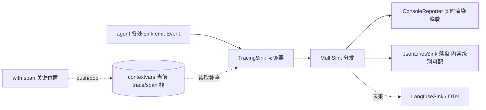

# Design Document

设计文档：agent-observability-tracing

## Overview

在既有 `observability`（`Event`/`EventSink`/`ConsoleReporter`/`ObservableLLMProvider`/
`UsageTracker`）之上，**加法式**补齐 trace/span 关联、结构化持久化与离线归因，全部经
`EventSink` 抽象落地，业务代码零/极小改动。核心思路：

- **不改 emit 调用点**：用 `contextvars` 维护"当前 trace/span 上下文"，由一个装饰器
  sink（`TracingSink`）在 `emit` 时把当前 trace/span/时间戳**自动补进事件**——各处
  `sink.emit(Event(...))` 一行不用改。
- **span 由上下文管理器开**：只在少数关键位置（LLM 调用、工具调用、一次 run/turn）用
  `with span(...)` 包一层，天然得到父子关系与耗时。
- **多路分发**：`MultiSink` 把事件同时给终端渲染与 JSONL 落盘（及未来的 Langfuse）。

## Architecture



## Components and Interfaces

### 1. Event 扩展（向后兼容）

`Event` 增加可选追踪字段，默认空——既有构造/断言不受影响（Req 5.2）：

```python
@dataclass
class Event:
    kind: EventKind
    message: str = ""
    data: dict = field(default_factory=dict)
    # 追踪字段（由 TracingSink 自动补全；未追踪时保持空）
    trace_id: str = ""
    span_id: str = ""
    parent_span_id: str = ""
    ts: float = 0.0                    # epoch 秒；0 表示未追踪
    duration_ms: float | None = None   # 仅 span 收尾事件带
```

### 2. 追踪上下文（contextvars）

```python
# tracing.py
_current: ContextVar[TraceState | None]

@dataclass
class TraceState:
    trace_id: str
    span_stack: list[str]        # 当前 span 栈（末尾为当前 span）

@contextmanager
def new_trace(trace_id: str | None = None) -> Iterator[str]: ...
@contextmanager
def span(sink, name: str, kind, *, data=None) -> Iterator[str]: ...
def current_ids() -> tuple[str, str]:  # (trace_id, span_id)，无则 ("","")
```

- `span(...)` 进入时 push 一个新 `span_id`（记录 parent 为进入前的 current），退出时 pop，
  并 emit 一个带 `duration_ms` 的 span 收尾事件；`try/finally` 保证异常也闭合（Req 4.2）。
- `contextvars` 在同线程/子上下文安全；并行子任务（`run_parallel`）各自 `copy_context`
  运行，互不串扰（子 span 归属各自分支）。

### 3. Sinks

```python
class TracingSink(EventSink):
    """装饰下游 sink：emit 时用 contextvars 当前 trace/span 与时间戳补全事件。"""

class MultiSink(EventSink):
    """把事件分发给多个 sink；单个失败不影响其余（Req 4.3）。"""

class JsonLinesSink(EventSink):
    """把事件逐行写为 JSON。内容级别 full/redacted/off 控制 message/data 记录量。
    I/O 异常吞掉（Req 2.4）；线程安全（并行时加锁）。"""
```

- `JsonLinesSink` 的 `content_level`：
  - `full`：完整 `message` + `data`。
  - `redacted`：`message` 截断到 `redact_chars`，`data` 中的大文本字段同样截断。
  - `off`：不写 `message`/大文本，仅保留结构（kind/trace/span/ts/duration/数值型 data）。
- 与 `ConsoleReporter` 的 `preview_chars` 独立（Req 3.4）：终端脱敏 ≠ 落盘级别。

### 4. LLM 调用 span（`ObservableLLMProvider`）

在 `complete`/`stream` 外层包 `with span(sink, "llm.complete", ...)`：
- span 内既有的 `LLM_REQUEST/RESPONSE/USAGE/DELTA` 事件自动带上该 span 的 id；
- span 收尾事件带 `duration_ms`；token 数放进 span 收尾事件 `data`（便于按 span 聚合成本）。
- 保持既有 emit 不动，只在方法体外包一层。

### 5. 工具调用 span 与 run/turn trace（`TaskAgent` / `ChatController`）

- `TaskAgent._execute_tool`：`with span(sink, f"tool.{name}", ...)` 包裹工具执行——每个
  工具调用一个 span，parent 为当前 LLM turn 或 trace 根。
- `TaskAgent.run` / `ChatController.send`：外层 `with new_trace()` 开 trace 根，使该次
  运行/该轮对话的所有事件同 `trace_id`。`converse` 复用当前 trace（同一轮）。
- `TaskAgent` 已持有 `self._sink`；无 sink（`NullSink`）时 span/trace 为廉价 no-op。

### 6. 装配（`build_agent_app`）

- 新增 `Config` 字段：`tracing_enabled: bool`、`trace_dir: str`、`trace_content_level: str`。
- 开启时：把用户传入的 `sink` 与一个 `JsonLinesSink(trace_dir/<trace_id>.jsonl)` 组成
  `MultiSink`，再包一层 `TracingSink`，作为最终 `sink` 注入 `ObservableLLMProvider` 与
  `TaskAgent`。
- 未开启时：装配路径与现状完全一致（Req 5.1/5.3）。
- trace 文件名用 trace_id；trace_dir 默认 `<workspace_dir>/traces`，加进 `.gitignore`。

### 7. 离线查看工具（`scripts/trace_view.py`）

读一份 JSONL → 按 `ts` 排序 → 按 span 树缩进打印时间线 → 高亮 error/DEGRADATION/LLM_RETRY
→ 末尾汇总：总耗时、总 token、LLM 调用数、工具调用数、降级/重试次数。纯读、零依赖。

## Data Models

新增：`TraceState`（运行期，不持久化）。落盘记录 = 扩展后的 `Event` 序列化 dict。
复用：`Event`/`EventKind`/`UsageTracker`。不改工作区核心模型。

## Correctness Properties

### Property 1: 向后兼容（未开启即不变）

未开启追踪时，`Event` 追踪字段为空，既有事件流/渲染逐字节不变；仅单 sink 装配可用。

**Validates: Requirements 5.1, 5.2, 5.3, 1.4**

### Property 2: Trace 归拢

一次 `new_trace` 作用域内 emit 的所有事件共享同一非空 `trace_id`。

**Validates: Requirements 1.1**

### Property 3: Span 父子与闭合

`span` 嵌套时子 span 的 `parent_span_id` 等于外层 span_id；span 即使体内抛异常也闭合并
emit 带 `duration_ms` 的收尾事件。

**Validates: Requirements 1.2, 1.3, 4.2**

### Property 4: 可观测不拖垮业务

任一 sink（含 JSONL I/O）抛异常被吞，不向业务传播；MultiSink 单 sink 失败不影响其余。

**Validates: Requirements 2.4, 4.1, 4.3**

### Property 5: JSONL 可解析且字段完备

落盘每行是合法 JSON 且含 `ts` / `trace_id` / `span_id` / `parent_span_id` / `kind`。

**Validates: Requirements 2.1, 2.2**

### Property 6: 内容级别隔离

`redacted` / `off` 级别下落盘不含超限全量内容；且落盘级别与终端 `preview_chars` 相互独立。

**Validates: Requirements 3.1, 3.2, 3.3, 3.4**

### Property 7: 并行隔离

`run_parallel` 的各子任务在各自 `copy_context` 中运行，其 span 归属各自分支，不串 trace 栈。

**Validates: Requirements 1.2**

## Error Handling

- sink/JSONL/追踪任何异常 → 吞掉并静默；绝不传播到 agent 循环。
- span 收尾在 `finally` 中；trace 文件句柄打开失败 → 该 sink 降级为 no-op。
- 外部/LLM 内容一律按不可信处理：落盘只做序列化，不 eval。

## Testing Strategy

- **属性测试**：Property 1-7 各至少一条。重点：trace 归拢、span 父子/闭合（含异常路径）、
  sink 失败隔离、JSONL 可解析、内容级别、并行隔离。
- **单元测试**：`TracingSink` 补全、`MultiSink` 分发与容错、`JsonLinesSink` 三级别、
  `new_trace`/`span` 上下文、离线查看聚合。
- **集成/回归**：开启追踪跑一次 mock LLM 任务，断言产出可解析 JSONL 且 span 树完整；
  未开启时既有测试全绿（逐字节兼容）。

## Migration & Sequencing

1. Event 扩展 + tracing 上下文 + 三个 sink（基础设施，纯新增）。
2. 接入 `ObservableLLMProvider`（LLM span）与 `TaskAgent`/`ChatController`（tool span + trace）。
3. 装配开关（`Config` + `build_agent_app`）+ `.gitignore` + 离线查看脚本。
4. 属性/集成测试收口。

各步加法式：未开启时平台行为与现状一致。
