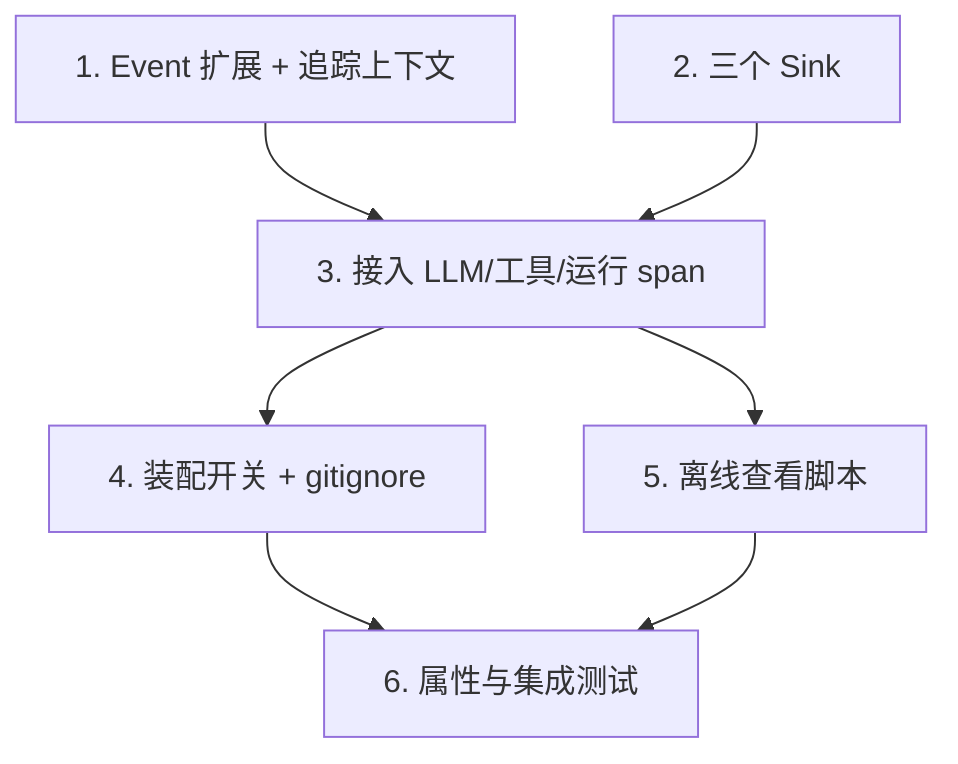

# Implementation Plan

## Overview

加法式落地可观测追踪：先建基础设施（Event 扩展 + contextvars 追踪 + 三个 sink），再非侵入
接入 LLM/工具/运行的 span 与 trace，然后装配开关与离线查看工具，最后属性/集成测试收口。
未开启追踪时平台行为与现状逐字节一致。

## Task Dependency Graph

```json
{
  "waves": [
    { "wave": 1, "tasks": ["1", "2"] },
    { "wave": 2, "tasks": ["3"] },
    { "wave": 3, "tasks": ["4", "5"] },
    { "wave": 4, "tasks": ["6"] }
  ]
}
```



## Tasks

- [x] 1. Event 追踪字段 + contextvars 追踪上下文
  - `events.py`：`Event` 增加可选 `trace_id/span_id/parent_span_id/ts/duration_ms`（默认空，向后兼容）
  - 新增 `observability/tracing.py`：`TraceState`、`new_trace()`、`span()`（try/finally 闭合 + 收尾事件带 duration）、`current_ids()`；基于 `contextvars`
  - 单元测试：trace 归拢、span 父子/闭合（含异常路径）、无 trace 时 no-op
  - _Requirements: 1.1, 1.2, 1.3, 1.4, 4.2, 5.2_

- [x] 2. 三个 Sink：TracingSink / MultiSink / JsonLinesSink
  - `TracingSink`：emit 时用 contextvars 补全 trace/span/ts
  - `MultiSink`：多路分发，单 sink 失败不影响其余（吞异常）
  - `JsonLinesSink`：逐行 JSON 落盘，内容级别 `full/redacted/off`，I/O 异常吞掉，线程安全
  - 单元测试：补全正确、分发容错、三级别落盘内容量、非法路径不崩
  - _Requirements: 2.1, 2.2, 2.4, 3.1, 3.2, 3.3, 3.4, 4.1, 4.3_

- [x] 3. 接入 LLM/工具/运行的 span 与 trace
  - `ObservableLLMProvider.complete/stream` 外层包 `span("llm.complete")`，收尾事件带 duration + token
  - `TaskAgent._execute_tool` 包 `span("tool.<name>")`；`TaskAgent.run` 与 `ChatController.send` 外层 `new_trace()`（converse 复用当前 trace）
  - 无 sink（NullSink）时 span/trace 为廉价 no-op
  - 单元测试：一次 mock 任务的事件全带同 trace_id；工具 span parent 正确
  - _Requirements: 1.1, 1.2, 1.3, 4.1_

- [x] 4. 装配开关 + gitignore
  - `Config` 增加 `tracing_enabled/trace_dir/trace_content_level`
  - `build_agent_app`：开启时把用户 sink 与 `JsonLinesSink` 组 `MultiSink` 再包 `TracingSink`；未开启时装配与现状一致
  - `.gitignore` 兜底 trace 目录
  - 单元测试：开启产出 JSONL；未开启装配路径不变
  - _Requirements: 2.3, 5.1, 5.3, 7.1, 7.2_

- [x] 5. 离线查看脚本 scripts/trace_view.py
  - 读 JSONL → 按 ts 排序 → span 树缩进时间线 → 高亮 error/DEGRADATION/LLM_RETRY → 汇总总耗时/总 token/调用数
  - 单元测试：对样例 trace 断言汇总数值与高亮
  - _Requirements: 6.1, 6.2, 6.3_

- [x] 6. 属性测试与集成回归
  - hypothesis 覆盖 Property 1-7
  - 集成：开启追踪跑 mock 任务，断言 JSONL 可解析 + span 树完整；未开启时既有测试全绿
  - _Requirements: 1.1, 1.2, 1.3, 2.1, 2.2, 3.1, 4.1, 4.2, 4.3, 5.1, 5.2, 7.1_

## Notes

- **加法式**：所有能力未开启时平台行为与现状一致（Property 1）。
- **非侵入**：靠 contextvars + 装饰器 sink，避免改动散落各处的 emit 调用点。
- **失败不拖垮业务**：sink/JSONL/追踪任何异常一律吞掉（Property 4）。
- **外部后端**：Langfuse/OTel 未来作为又一个 sink 挂入 MultiSink，本期不实现、仅留接入点。
