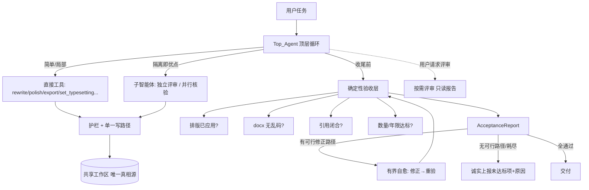

# Design Document

设计文档：agent-reliability-and-subagents（输出验收、按需评审与选择性子智能体）

## Overview

本设计在既有 `agent_platform` 之上增加**四层能力**，全部沿用既有契约（单一写路径、护栏、有界性、共享工作区）：

1. **确定性验收层（Acceptance Layer）**：任务收尾前，对最终产出与工作区状态做**可测、无 LLM**的核对（排版是否应用、docx 是否无乱码、引用是否闭合、数量/年限），产出结构化 `AcceptanceReport`。
2. **引用闭合（Citation Closure）**：导出时参考文献表只列被正文引用的文献；悬空/冗余作为验收发现上报。
3. **诚实上报 + 有界自愈闭环**：验收不通过时，若存在可行修正路径则在有限次数内自愈重验；否则如实上报未达标项与原因，绝不静默交付、绝不无界重试。
4. **按需评审（Review Capability）**：只读的 LLM 评审工具/子智能体，返回评审报告不改稿；仅在用户请求时触发。
5. **选择性子智能体（混合架构）**：顶层默认直接调工具；仅在"隔离即优点"处（独立评审、并行核验）委派子智能体；章节写作维持"共享工作区 + 精选上下文"。

设计取舍核心：**可测需求靠确定性验收兜底（可靠），主观质量靠按需评审补充（灵活），环境/代码类失败靠"检测+上报"（诚实），子智能体只在收益最大处用（不增无谓复杂度）。**

## Architecture



### 与既有组件的关系

- **不改**护栏"守正确性不管完整性"的定位——验收层是**附加的可测核对**，其结果走"自愈重提（经护栏）或上报"，不把完整性变成新的硬拦截。
- **复用** `ContextManager` 的"精选上下文"思路支撑章节写作（Req 6）。
- **复用** `ReviewAgent`/`AdversarialReviewAgent` 作为评审能力的底层。
- 一切写入仍经 `commit → GuardrailGate → 单一写路径`。

## Components and Interfaces

### 1. Acceptance Layer（确定性验收）

```python
@dataclass
class AcceptanceFinding:
    check: str            # "typesetting" | "mojibake" | "citation_closure" | "quantity" ...
    ok: bool
    detail: str           # 人类可读说明
    healable: bool        # 是否存在可行修正路径
    severity: str = "high"

@dataclass
class AcceptanceReport:
    findings: list[AcceptanceFinding]
    @property
    def passed(self) -> bool: ...          # 全部 ok
    @property
    def healable_failures(self) -> list[AcceptanceFinding]: ...
    @property
    def blocking_failures(self) -> list[AcceptanceFinding]: ...  # 不可自愈的未通过项

class AcceptanceChecker:
    """据任务的可测需求，对工作区/产出做确定性核对（无 LLM）。"""
    def check(self, ws, export_files: list[str], requirements: "TaskRequirements") -> AcceptanceReport: ...
```

- `TaskRequirements`：从用户任务中解析出的**可测约束**（期望输出格式、排版规格、参考文献数量区间、年限范围等）。解析可由 Top_Agent 在任务开始时填充（结构化），无法解析的约束不纳入验收（不臆测）。
- 各检查为独立纯函数，便于单测与扩展：
  - `check_typesetting_applied(docx_path, spec)`：读回 docx，核对正文段落 alignment/line_spacing/first_line_indent 是否等于设定值。
  - `detect_mojibake(text) -> bool`：异常码点比例、U+FFFD 替换符、连续 latin-1 高位序列等启发式；返回是否疑似乱码 + 证据。
  - `check_citation_closure(ws)`：正文 `[n]` 集合 vs 已验证文献 id 集合 → 悬空/冗余。
  - `check_quantity(ws, lo, hi)` / `check_recency(ws, min_year)`：文献数量/年限。

### 2. Citation Closure（导出只列被引用文献）

- 在 docx/latex/markdown 导出器构建参考文献表处，先计算**正文实际引用集合**（扫描各章节 `[n]`），参考文献表**仅包含该集合**中的文献，并保持编号稳定。
- 未被引用的已验证文献不进入参考文献表（它们仍留在工作区作为"候选"，但不污染成稿）。
- 悬空引用（正文 `[n]` 无对应文献）由 `check_citation_closure` 作为验收发现上报（healable：可触发补检索或提示）。

### 3. 诚实上报 + 有界自愈闭环

```python
@dataclass
class DeliveryOutcome:
    delivered: bool
    report: AcceptanceReport
    healed: list[str]           # 已自愈项
    unresolved: list[str]       # 未解决项 + 原因（诚实上报）
    export_files: list[str]

class AcceptanceLoop:
    def run(self, session, requirements, *, max_heal_rounds=2) -> DeliveryOutcome: ...
```

- 流程：导出 → 验收 → 若有 `healable_failures` 且未超 `max_heal_rounds` 与 token/时间预算 → 让 Top_Agent 针对具体发现修正（经护栏与单一写路径）→ 重导出重验；否则收敛。
- **可自愈判定**：只对"有可行修正路径"的发现自愈——如排版未应用（重新应用）、悬空引用（补检索或删标注）、内容含占位（改写）。环境/依赖/编码类（如"缺 pandoc"、"docx 乱码疑因工具编码"）标记 `healable=False` → 直接上报。
- **绝不**：无界重试；擅自破坏性改动（复用既有"禁止篡改参考文献"红线）。
- 收尾时 `TaskResult`/`DeliveryOutcome` 明确列出"已满足/未满足及原因"（Req 3.4）。

### 4. Review Capability（按需只读评审）

- 实现为工具 `review_paper`（只读）+ 可选独立评审子智能体：
  - 组装论文文本（受 token 预算约束）→ 调 `ReviewAgent`/`AdversarialReviewAgent` 的判定逻辑 → 返回各维度评分 + 具体问题 + 改进建议**文本**；**不产生 Mutation**（只读）。
  - 仅在用户请求评审时由 Top_Agent 调用（系统提示约束：定点编辑不触发）。
  - 以子智能体实现时用**独立上下文**（独立评审者，破自评偏置）。

### 5. 选择性子智能体（混合架构）

```python
class SubAgentRunner:
    """把一个子目标交给带独立上下文的有界 agent 循环执行，返回结构化结果。"""
    def run(self, goal: str, *, tools: ToolRegistry, curated_context: str,
            config: TaskAgentConfig) -> "SubAgentResult": ...

def run_parallel(tasks: list[Callable[[], T]], *, max_workers: int) -> list[T]: ...
```

- **委派准则（编码进 Top_Agent 系统提示 + 装配）**：
  - 简单/局部操作（排版、单章节编辑、导出）→ 直接工具，**不 fork**。
  - `Isolation_Beneficial_Task`（独立评审、并行独立查询）→ 委派子智能体 / 并行执行。
  - **不**对所有需求强制"写→审" fork。
- **并行核验**：批量文献核验拆为独立任务并发执行（`run_parallel`），彼此无需共享上下文；结果汇聚后经单一写路径落盘。
- **子智能体写入一致性**：子智能体改工作区同样只产 `ProposedChange` → `commit` → 护栏 → 单一写路径（Req 5.5 / 7.4）。

### 6. 章节写作维持全局理解

- 章节写作（工具或子智能体）统一经一个 `build_curated_context(ws, section_id)` 提供精选上下文：论文全局摘要 + 术语表（`ws.glossary`）+ 相邻章节摘要（`ws.section_summaries`）+ 目标章节全文 + 相关已验证文献。复用既有 `ContextManager` 能力，不新造。
- 工作区为唯一真相源；工作单元读精选视图，不维护副本。

## Data Models

新增：`AcceptanceFinding` / `AcceptanceReport` / `TaskRequirements` / `DeliveryOutcome` / `SubAgentResult`。
复用：`PaperWorkspace`、`ProposedChange`、`GateOutcome`、`ReviewRecord`、`ContextManager` 产物。
持久化：验收报告与交付结论并入 `TaskResult` 与 `ws.profile`（可观测/可复现），不改既有工作区核心字段。

## Correctness Properties

### Property 1: 验收确定性与可复现

对同一工作区与产出，`AcceptanceChecker.check` 的可测判定（乱码/排版/引用闭合/数量）为纯函数、结果确定，不依赖 LLM。

**Validates: Requirements 1.5, 2.4**

### Property 2: 引用闭合

导出的参考文献表 = 正文实际引用的文献集合；不含未被引用者；正文每个 `[n]` 要么有对应文献、要么被作为悬空引用报告。

**Validates: Requirements 2.1, 2.2, 2.3**

### Property 3: 不静默交付坏结果

若最终产出存在被验收判定为坏（乱码/排版未应用/引用不闭合）的项且未被自愈，则交付结论必包含该未满足项及原因（不存在"验收未过却标记为成功交付"的路径）。

**Validates: Requirements 1.1, 3.3, 3.4**

### Property 4: 有界自愈

自愈尝试次数 ≤ `max_heal_rounds` 且受 token/时间预算约束；无可行修正路径的发现不触发自愈。任意情况下流程有限步终止。

**Validates: Requirements 3.1, 3.2, 7.1**

### Property 5: 自愈不破坏 + 单一写路径

自愈过程中的所有工作区改动经护栏与单一写路径；不产生破坏性擅自改动（参考文献作者名等受保护内容不被篡改）。

**Validates: Requirements 3.5, 7.3**

### Property 6: 评审只读

`review_paper` / 评审子智能体不产生任何工作区 Mutation；调用它前后工作区内容字节不变。

**Validates: Requirements 4.1**

### Property 7: 子智能体写入一致性

子智能体（含并行任务）对工作区的任何改动与直接工具经同一护栏与单一写路径；不绕过有界性约束。

**Validates: Requirements 5.5, 7.4**

### Property 8: 章节写作有全局上下文

任一章节写作/改写工作单元被提供的上下文包含全局摘要与术语表等精选信息，而非仅目标章节孤立内容。

**Validates: Requirements 6.1, 6.3**

### Property 9: 向后兼容

未触发验收自愈、评审或子智能体时，既有增量工具路径行为不变；一切写入仍经单一写路径。

**Validates: Requirements 7.2, 7.3**

## Error Handling

- 验收检查内部异常（如读 docx 失败）→ 记为一条 `AcceptanceFinding(ok=False, healable=False)` 并上报，不崩溃。
- 自愈修正失败 → 计入尝试次数，耗尽即上报。
- 子智能体失败 → 作为工具失败回灌顶层，不中止会话；并行任务单个失败不影响其余（隔离）。
- 评审失败 → 返回"评审不可用及原因"，不阻断主任务。
- 外部/LLM 输出一律不可信：截断、防御式解析、不 eval/exec。

## Testing Strategy

- **属性测试（PBT）**：上述 9 条属性各配至少一条 property。重点：引用闭合（随机引用/文献集合，断言导出表=被引用集合）、不静默交付（构造坏产出，断言交付结论含未满足项）、有界自愈（随机 max_heal_rounds，断言必终止）、评审只读（断言无 mutation）、子智能体写入经护栏。
- **确定性检查单测**：`detect_mojibake`（含真实 GBK↔latin1 乱码样本 + 正常中文对照）、`check_typesetting_applied`、`check_citation_closure`、`check_quantity/recency`。
- **集成测试（Mock LLM + ScriptedElicitor）**：完整"任务→导出→验收→（自愈/上报）→交付"链路；含"排版未应用→自愈重应用→通过"与"乱码→不可自愈→上报"两条对照。
- **向后兼容回归**：未触发新能力时既有路径逐字节不变。

## Migration & Sequencing

按依赖与价值排序落地（不改既有行为、加法式接入）：
1. 引用闭合（导出只列被引用）+ 确定性验收（乱码/排版/引用/数量）——最痛、最确定。
2. 诚实上报 + 有界自愈闭环——把验收接成闭环。
3. 按需评审工具 `review_paper`。
4. 选择性子智能体（独立评审子智能体、并行核验）——架构演进，最后做。

各步均为加法式：未启用时平台行为与现状一致。
