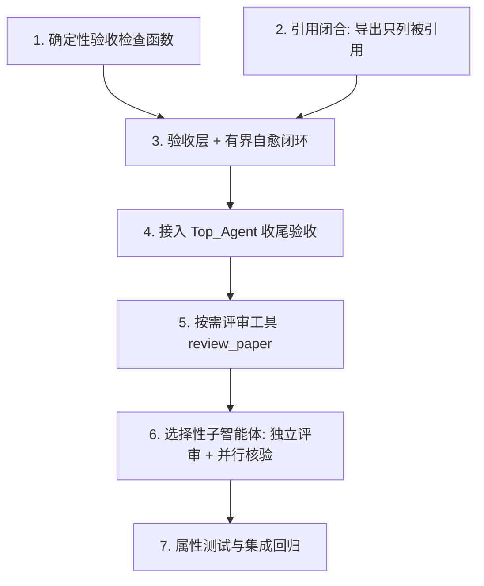

# Implementation Plan

## Overview

按"确定性优先、加法式接入、未启用即行为不变"落地。先做最痛且最确定的引用闭合与确定性验收，再接自愈闭环，然后按需评审，最后选择性子智能体。每个任务只做编码/测试，复用既有 `agent_platform` 与既有智能体，不改护栏"守正确性不管完整性"的定位。

## Task Dependency Graph

```json
{
  "waves": [
    { "wave": 1, "tasks": ["1", "2"] },
    { "wave": 2, "tasks": ["3"] },
    { "wave": 3, "tasks": ["4"] },
    { "wave": 4, "tasks": ["5"] },
    { "wave": 5, "tasks": ["6"] },
    { "wave": 6, "tasks": ["7"] }
  ]
}
```



## Tasks

- [x] 1. 确定性验收检查函数（无 LLM 纯函数）
  - 在 `src/paper_agent/agent_platform/acceptance.py` 实现 `detect_mojibake(text)`（异常码点比例/U+FFFD/连续 latin-1 高位序列启发式）、`check_typesetting_applied(docx_path, spec)`、`check_citation_closure(ws)`、`check_quantity(ws, lo, hi)`、`check_recency(ws, min_year)`
  - 定义 `AcceptanceFinding` / `AcceptanceReport` / `TaskRequirements` 数据模型
  - 单元测试：真实 GBK↔latin1 乱码样本 + 正常中文对照；排版核对；引用闭合悬空/冗余；数量/年限边界
  - _Requirements: 1.2, 1.3, 1.4, 1.5, 2.2_

- [x] 2. 引用闭合：导出只列被正文引用的文献
  - 在 docx/latex/markdown 导出器构建参考文献表处，先扫描各章节正文的 `[n]` 得到实际引用集合，参考文献表只列该集合中的文献（编号稳定）
  - 未被引用的已验证文献不进入参考文献表
  - 单元测试：随机引用/文献集合，断言导出表 = 被引用集合；未引用者不出现
  - _Requirements: 2.1, 2.3, 2.4_

- [x] 3. 验收层 + 有界自愈闭环
  - 在 `acceptance.py` 实现 `AcceptanceChecker.check(ws, export_files, requirements) -> AcceptanceReport` 与 `AcceptanceLoop.run(session, requirements, max_heal_rounds) -> DeliveryOutcome`
  - healable 判定：内容/工具层可修（排版重应用、悬空引用补/删标注、占位改写）→ 自愈；环境/编码类 → healable=False → 上报
  - 自愈修正经既有 `commit`/护栏/单一写路径；受最大轮数 + token/时间预算约束；不做破坏性擅改
  - 单元测试：全通过直接交付；可自愈项修正后重验通过；不可自愈项进入 unresolved 上报；有界终止
  - _Requirements: 1.1, 3.1, 3.2, 3.3, 3.4, 3.5, 7.1_

- [x] 4. 接入 Top_Agent 收尾验收
  - Top_Agent 任务开始时把可解析的可测约束填入 `TaskRequirements`（输出格式/排版/文献数量/年限）
  - 任务收尾前运行 `AcceptanceLoop`；`TaskResult` 增加已满足/未满足项及原因；未通过且不可自愈时明确上报
  - 未解析出任何可测约束时不做多余验收（不臆测），保持既有路径行为
  - 集成测试（Mock LLM）：排版未应用→自愈→通过；乱码→不可自愈→上报
  - _Requirements: 1.1, 3.3, 3.4, 7.2, 7.3_

- [x] 5. 按需评审工具 review_paper（只读）
  - 在 `agent_platform/tools/` 实现 `review_paper` 工具：组装论文文本（受 token 预算）→ 复用 `ReviewAgent`/`AdversarialReviewAgent` 判定 → 返回评分+问题+建议文本，**不产生 Mutation**
  - 系统提示：仅用户请求评审时调用；定点编辑不触发
  - 装配进 `build_agent_app`；单元测试：只读（调用前后工作区字节不变）、返回含维度评分
  - _Requirements: 4.1, 4.2, 4.3_

- [x] 6. 选择性子智能体：独立评审 + 并行核验
  - 实现 `SubAgentRunner`（独立上下文的有界子循环）与 `run_parallel`（并发独立任务）
  - 独立评审子智能体（独立上下文，破自评偏置）；批量文献核验并行化，结果汇聚经单一写路径落盘
  - Top_Agent 委派准则：简单/局部直接工具，仅隔离即优点场景 fork；不对所有需求强制写→审
  - 章节写作提供 `build_curated_context`（全局摘要+术语表+邻居摘要+目标章节全文），复用 ContextManager
  - 单元测试：子智能体写入经护栏；并行任务隔离；章节写作上下文含全局信息
  - _Requirements: 4.4, 5.1, 5.2, 5.3, 5.4, 5.5, 6.1, 6.2, 6.3, 6.4_

- [x] 7. 属性测试与集成回归
  - 用 hypothesis 为设计 Property 1-9 各写至少一条 property
  - 端到端：任务→导出→验收→(自愈/上报)→交付；含两条对照（可自愈/不可自愈）
  - 向后兼容回归：未触发新能力时既有路径逐字节不变
  - _Requirements: 1.5, 2.1, 2.2, 2.3, 3.1, 3.2, 3.3, 3.4, 3.5, 4.1, 5.5, 6.1, 6.3, 7.2, 7.3, 7.4_

## Notes

- **加法式**：所有能力未启用/未触发时，平台行为与现状一致（Property 9）。
- **确定性优先**：可测需求用无 LLM 的确定性检查兜底（可靠），主观质量用按需评审（灵活）。
- **诚实优先于自愈**：不可修的如实上报，绝不静默交付、绝不无界重试、绝不破坏性擅改。
- **子智能体选择性使用**：仅独立评审 + 并行核验；章节写作用共享工作区 + 精选上下文。
- 每任务完成运行相关单元/属性测试；任务 7 做端到端与兼容回归收口。
