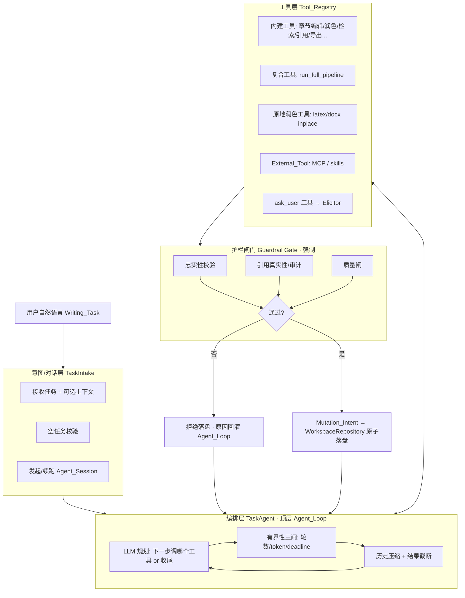
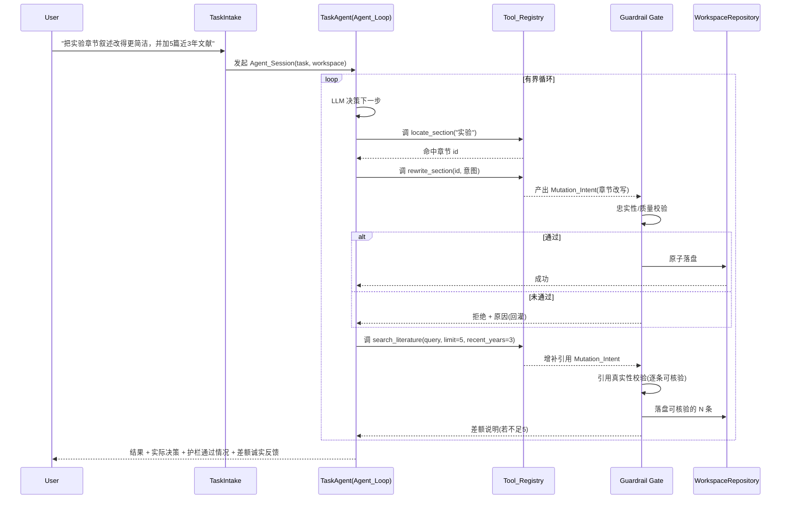

# Design Document

设计文档：agentic-paper-writing-platform（自然语言驱动的学术论文写作智能体平台）

## Overview

本设计把系统的**顶层控制权**从「按文件后缀选固定管线」（`entry.py` + `Orchestrator` 的线性阶段流水）转移到一个**任务智能体（Task Agent）**：用户的自然语言 `Writing_Task` 直接作为智能体目标，智能体在一个升级版的有界工具循环里自主编排工具，多步推进直至完成或诚实反馈。

关键设计取舍：**不推翻既有资产，而是重新组织控制流**。

- 既有的有界 ReAct 工具循环（`agents/tool_loop.py`）从「写作智能体内部子组件」提升为**顶层调度引擎**。
- 既有的每个能力（规划、检索、章节编辑、润色、原地润色、导出、文献扩充……）被封装为**统一的 `Tool`**，经既有 `Tool_Registry` 暴露给顶层智能体。
- 既有的完整管线（`Orchestrator.run`）**不删除**，而是降级为一个「复合工具」`run_full_pipeline`——当任务确实是「从主题从零写一篇」或「整篇修订」时，智能体可以直接调它，从而 100% 复用现有的规划→检索→写审循环→导出→护栏链路。
- **学术正确性护栏**不进入 LLM 自由裁量：任何产生 `Workspace` 内容改动的工具，其产出在落盘前经**统一护栏闸门（Guardrail Gate）**强制校验；未通过则拒绝落盘并把原因回灌给智能体。

设计遵循的既有契约：智能体不直接写工作区（`agents/base.py`）；一切写入经 `Mutation_Intent → WorkspaceRepository` 原子落盘；工具输出/LLM 输出视为不可信数据（截断、不 `eval`/`exec`）；澄清经 `Elicitor` 抽象；有界性由轮数/token/deadline 三闸保证。

### 设计目标与非目标

- **目标**：任意自然语言学术写作任务的受理与自主完成；章节级/局部精细操作；内容增补与文献护栏结合；护栏强制；MCP/skills 可扩展接入；澄清/降级/诚实反馈；有界/可观测/可续跑；向后兼容。
- **非目标**：不实现具体新领域工具算法（画图/docs 内部实现）；不改原地润色语义；不实现 pandoc/格式闸/会议模板细节（调用既有实现）；不定义 LLM 供应商选择。

## Architecture

### 三层架构



### 控制流：从「阶段流水」到「工具编排」

现状（被取代/降级）：`entry.decide_engine` 按扩展名选 `LATEX_INPLACE`/`DOCX_INPLACE`/`PIPELINE` → 分别执行。

目标：



## Components and Interfaces

### 1. TaskIntake（意图/对话层）

职责：受理 `Writing_Task`，做空任务校验，初始化或续跑 `Agent_Session`，不做固定意图分类。

```python
@dataclass
class WritingTask:
    """用户的一个自然语言写作任务及其可选上下文。"""
    instruction: str                       # 自由文本任务描述（必填，非空白）
    workspace_id: str | None = None        # 已有工作区（续跑/局部改） 
    draft_path: str | None = None          # 可选初稿文件
    topic_background: str | None = None    # 可选主题
    artifact: ResearchArtifact | None = None
    profile: dict = field(default_factory=dict)

class TaskIntake:
    def start(self, task: WritingTask) -> "AgentSession": ...
    def resume(self, session_id: str) -> "AgentSession": ...
```

- 空/纯空白 `instruction` → 拒绝并提示（Req 1.4）。
- 不含工作区但含 `draft_path`/`topic_background` → 初始化工作区（复用 `Orchestrator._init_workspace` 逻辑），作为任务上下文（Req 1.3、Req 11）。
- `Legacy_Entry`（只给初稿/主题、无 instruction）→ 合成一个默认 `instruction`（初稿→「修订润色本文」；主题→「据此主题从零撰写论文」），交给 TaskAgent（Req 11.1/11.2）。

### 2. TaskAgent（编排层 · 顶层 Agent_Loop）

由 `agents/tool_loop.run_tool_loop` 升级而来，作为**顶层**驱动。复用其既有的：历史压缩（`compact_history`）、结果截断（`truncate_to_tokens`）、token 计量（`TokenCounter`）、最大轮数、工具错误回灌。

```python
@dataclass
class TaskAgentConfig:
    max_iters: int = 12                 # 顶层任务通常比子循环需要更多轮
    context_token_budget: int = 32000
    max_tool_result_tokens: int = 2000
    keep_recent_turns: int = 3

class TaskAgent:
    def __init__(self, llm, registry: ToolRegistry, *, counter, config,
                 tracker: UsageTracker, deadline_s: float, sink: EventSink,
                 elicitor: Elicitor): ...

    def run(self, session: "AgentSession") -> "TaskResult": ...
```

有界性三闸（Req 9.1/9.2）——在既有工具循环基础上补齐 deadline 与全局 token 预算检查（`Orchestrator` 已有 `_deadline_exceeded`/`_budget_exceeded` 逻辑，抽为共享工具）：

- 每轮进入前检查：`iters < max_iters` 且 `tracker.total_tokens < budget` 且 `now < deadline`。
- 任一触达 → 停止工具调用，让 LLM 基于现有上下文给出最佳收尾答复，并在 `TaskResult` 标注触达了哪个上限。

系统提示（system prompt）约束智能体行为（映射 Req 8）：
- 目标不清/多解 → 调 `ask_user` 工具澄清，不擅自选择。
- 超出可用工具能力 → 如实说明无法完成，不编造。
- 部分完成 → 报告已完成/未完成部分。

### 3. Tool_Registry 与能力封装

复用既有 `tools/registry.py`（upsert、schema 导出、`before/after_tool_call` 钩子）。本设计新增一个**能力封装层**，把既有能力包装成 `Tool`：

| Tool 名 | 底层复用 | 是否改工作区 |
|---|---|---|
| `locate_section` | `prompts/section_types.infer_section_type` + 工作区投影 | 否 |
| `rewrite_section` | `WritingAgent` 章节写作 + `SectionEditTool` 锚点编辑 | 是 |
| `polish_section` | `LanguagePolishAgent` 逻辑（章节级） | 是 |
| `polish_inplace_latex` | `latex_inplace.InplaceLatexPolisher` | 是（保结构） |
| `polish_inplace_docx` | `docx_inplace.InplaceDocxPolisher` | 是（保结构） |
| `search_literature` | `tools/literature_tool` + `SearchAgent` | 是（增补引用） |
| `add_references` | `literature_tool` + `reference_enrichment` + `citation` | 是 |
| `edit_section_anchor` | `tools/section_edit_tool.SectionEditTool` | 是 |
| `set_typesetting` | 新增 DOCX 排版应用（行距/对齐/缩进） | 是 |
| `export_paper` | `export/factory.get_exporter` + 格式闸 | 否（产出文件） |
| `run_full_pipeline` | `Orchestrator.run`（整段复用） | 是 |
| `ask_user` | `tools/ask_user_tool` → `Elicitor` | 否 |

设计原则：
- **工具不直接写工作区**（沿用 `agents/base.py` 契约）。改工作区类工具**只产出 `Mutation_Intent`**，交给护栏闸门→仓储（见组件 5）。既有 `SectionEditTool` 已是此模式（累积 `SectionEdit` 意图）。
- `run_full_pipeline` 作为**复合工具**保证「从主题写全文/整篇修订」等重任务零回归地复用既有全链路。
- 工具描述与参数 schema 写清适用场景，供 LLM 正确选择（降低误用）。

### 4. External_Tool 接入（MCP / skills）

```python
class ExternalToolProvider(Protocol):
    """把外部工具（MCP server 工具 / skills）适配为可注册的 Tool。"""
    def discover(self) -> list[ToolSpec]: ...       # 名称/描述/参数 schema
    def invoke(self, name: str, **kwargs) -> Any: ... # 调用，返回不可信结果

def register_external_tools(registry: ToolRegistry,
                            provider: ExternalToolProvider) -> None:
    """把 provider 暴露的工具批量 upsert 进 registry（Req 7.1/7.2/7.3）。"""
```

- 以与内建工具**一致的 schema 形态**暴露给 Agent_Loop，无需改循环核心（Req 7.2/7.3）。
- 外部工具若改工作区，**同样经护栏闸门 + 单一写路径**（Req 7.4）。
- 外部工具不可用/出错 → 按普通 `Tool` 失败回灌，不终止会话（Req 7.5）。既有 `registry.call` 的异常已由工具循环捕获回灌。

### 5. Guardrail Gate（护栏闸门 · 强制）

这是本设计**不可绕过**的核心约束点（Req 5、Req 4.2/4.4、Req 7.4）。

```python
@dataclass
class GateOutcome:
    passed: bool
    accepted_mutations: list[WorkspaceMutation]   # 通过校验、可落盘
    rejected: list[RejectedChange]                # 未通过，含原因
    notes: list[str]                              # 差额/降级说明(回灌+上报)

class GuardrailGate:
    def __init__(self, faithfulness_agent, quality_gate, citation_verifier): ...
    def screen(self, ws: PaperWorkspace,
               proposed: list[WorkspaceMutation]) -> GateOutcome: ...
```

- **所有**改工作区的工具产出的 `Mutation_Intent` 必须先过 `screen`，再由仓储落盘。工具循环里不存在「跳过 screen 直接写」的路径（Req 5.2）——通过让改工作区工具**只返回意图、由固定的落盘协程统一处理**在结构上强制。
- 复用既有护栏实现：`CitationFaithfulnessAgent`/`FaithfulnessJudge`（忠实性）、`QualityGate`（质量）、`CitationVerifier`（引用真实性）。
- 未通过 → 该意图不落盘，`RejectedChange.reason` 回灌给 Agent_Loop 供修正（Req 5.3）。
- 引用增补：逐条经 `CitationVerifier` 校验可核验性，仅落盘可核验者；不足请求数量时产 `notes` 差额说明，绝不以虚构文献填充（Req 4.2/4.3）。

### 6. 落盘协程（单一写路径）

```python
def apply_screened(repo: WorkspaceRepository, ws: PaperWorkspace,
                   outcome: GateOutcome) -> None:
    """把通过闸门的 Mutation_Intent 原子落盘（Req 6）。"""
    for mut in outcome.accepted_mutations:
        repo.update(ws, mut)   # 复用既有原子更新
```

- 沿用 `Orchestrator._apply` 的既有原子 `repo.update` 语义（Req 6.2）。
- 批量应用中任一失败 → 仓储保证一致状态，不留部分写入（Req 6.3；依赖既有 `WorkspaceRepository` 事务性）。

### 7. AgentSession / 可观测 / 可续跑

```python
@dataclass
class AgentSession:
    session_id: str          # == workspace_id，复用既有工作区持久化即得续跑
    workspace: PaperWorkspace
    task: WritingTask
    transcript: list[dict]   # 工具调用与关键决策（可观测/可复现）

@dataclass
class TaskResult:
    session_id: str
    summary: str                       # 面向用户的结果与实际决策(Req 8.5)
    completed: list[str]               # 已完成部分(Req 8.3)
    unfinished: list[str]              # 未完成部分 + 原因(Req 8.2/8.3)
    guardrail_report: dict             # 通过/未通过维度(Req 5.4)
    bound_hit: str | None              # 触达的上限(Req 9.2)
    export_files: list[str]
```

- `session_id` 复用既有 `workspace_id` + `WorkspaceRepository.load` → 续跑天然可得（Req 9.4/9.5）。
- 每次工具调用/关键决策经既有 `EventSink` 发事件（Req 9.3）；`before/after_tool_call` 钩子记 transcript。

## Data Models

新增模型（不改既有 `PaperWorkspace` 核心字段，向后兼容）：

- `WritingTask`、`AgentSession`、`TaskResult`、`TaskAgentConfig`（见上）。
- `GateOutcome`、`RejectedChange{section_id, reason, dimension}`。
- `ToolSpec{name, description, parameters_schema}`（External_Tool 发现用）。
- `Typesetting`（DOCX 排版）：`line_spacing: float|None`、`alignment: str|None`、`first_line_indent: str|None`、`font: str|None`——`None` 即「未指定」，导出走既有默认。

复用既有：`PaperWorkspace`、`OutlineNode`、`SectionEdit`、`ResearchArtifact`、`ReviewRecord`、`ScoringDimension`、`OutputFormat`。

`Writing_Task` 的处理状态与 transcript 持久化进 `ws.profile`（既有 dict 扩展点），使续跑可复现。

## Correctness Properties

供属性测试（PBT）验证的核心不变式：

### Property 1: 护栏不可绕过

对任意工具序列产生的任意 `Mutation_Intent` 集合，落盘的内容改动集合 ⊆ 经 `GuardrailGate.screen` 且 `passed` 的集合。不存在未过闸门的内容改动落盘。

**Validates: Requirements 5.1, 5.2**

### Property 2: 单一写路径

任意工具执行后，`Workspace` 的变更只可能来自 `apply_screened`；工具本身不产生持久化副作用。

**Validates: Requirements 6.1**

### Property 3: 原子一致性

一批意图应用中途失败后，重新加载的 `Workspace` 等于「全部成功」或「全不应用」之一，无部分写入。

**Validates: Requirements 6.3**

### Property 4: 引用真实性单调

增补引用后，工作区中所有引用仍全部可核验；不可核验的候选永不落盘。

**Validates: Requirements 4.2, 4.3**

### Property 5: 有界终止

任意任务在有限步内终止；终止时若因上限，`bound_hit` 非空且如实标注类型。

**Validates: Requirements 9.1, 9.2**

### Property 6: 局部任务隔离

`Section_Scope_Task` 完成后，目标范围外的章节内容字节级不变。

**Validates: Requirements 3.2**

### Property 7: 不可信数据安全

任意工具结果纳入上下文前，其 token 数 ≤ 截断上限 + 备注；全程无 `eval`/`exec`。

**Validates: Requirements 10.2, 10.3**

### Property 8: 上下文有界

任意时刻 Agent_Loop 的消息 token 数经压缩后 ≤ 预算（或已记不可压缩下限）。

**Validates: Requirements 10.4**

### Property 9: 向后兼容等价

`Legacy_Entry` 输入（仅初稿/主题、无 instruction）产出的论文结果与既有 `Orchestrator.run` 路径等价。

**Validates: Requirements 11.1, 11.2**

### Property 10: External_Tool 一致性

外部工具的工作区改动与内建工具经同一闸门与写路径；外部工具异常不终止会话。

**Validates: Requirements 7.4, 7.5**

## Error Handling

- **工具失败**：`registry.call` 异常 → 工具循环捕获 → 错误文本截断后回灌（既有机制，Req 2.4/7.5）。
- **护栏拒绝**：非异常路径；`RejectedChange.reason` 回灌，智能体可改后重试（Req 5.3）。
- **澄清不可达**（非交互）：`AutoElicitor` 取默认答案继续（Req 8.4）。
- **超出能力**：智能体经系统提示识别 → 产出「无法完成 + 原因」的 `TaskResult`，不崩溃（Req 8.2）。
- **上限触达**：优雅收尾 + 标注（Req 9.2）。
- **续跑不存在**：`repo.load` 返回空 → 明确报错（复用既有 `InputValidationError`）。
- 外部/LLM 数据一律不可信：截断、防御式解析、不执行（Req 10）。

## Testing Strategy

- **属性测试（PBT / hypothesis）**：上节 10 条不变式各配至少一条 property。重点：护栏不可绕过（构造随机工具意图序列，断言落盘集合被闸门约束）、局部任务隔离（随机章节集，断言范围外字节不变）、有界终止（随机 max_iters/budget，断言必然终止）。
- **契约测试**：每个能力封装 `Tool` 的 schema 与 handler 行为；改工作区工具「只产意图不直接写」。
- **集成测试（Mock LLM）**：脚本化 `ScriptedElicitor` + `MockLLMProvider` 跑典型任务（改章节、加 N 篇文献含不足差额、局部排版、`run_full_pipeline` 全流程），断言 `TaskResult` 字段与事件序列。
- **向后兼容回归**：`Legacy_Entry` 路径产物与既有管线对齐（等价性测试）。
- **External_Tool 桩**：伪 MCP provider 注册 + 调用 + 失败回灌 + 护栏一致性。

## Migration & Backward Compatibility

- `entry.decide_engine` 保留但降级：其扩展名判断结果作为 TaskAgent 合成默认 `instruction` 与选择原地润色工具的**提示信息**，不再是唯一控制流。
- `Orchestrator.run` 原样保留，作为 `run_full_pipeline` 工具体；既有测试与 CLI 路径不回归。
- CLI（`run_real.py`）新增「自然语言任务」入口；无 instruction 时走 `Legacy_Entry` 合成默认任务（Req 11）。
- 装配（`app.py`）扩展：在既有 `build_orchestrator` 之上新增 `build_task_agent`，注入护栏闸门（复用已构造的 `faithfulness_agent`/`quality_gate`/`verifier`）、Tool_Registry 与能力封装。Mock provider 下各能力沿用既有 no-op 语义，保证测试稳定。
