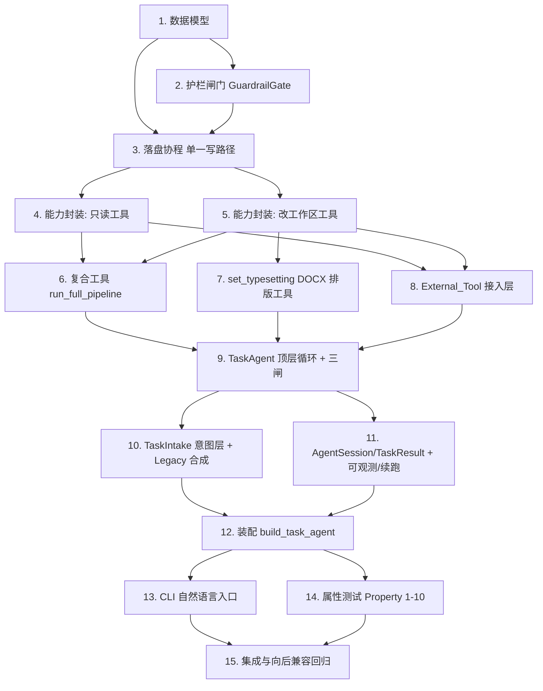

# Implementation Plan

## Overview

本任务列表按「先建骨架与写路径护栏 → 再封装能力工具 → 后接顶层 agent 与入口 → 最后属性测试与兼容回归」的顺序推进。每个任务只做编码/测试，可增量验证，且尽量复用既有实现（`tool_loop`、`registry`、`Orchestrator`、护栏智能体）。核心不变式是「护栏不可绕过 + 单一写路径」，故任务 2、3 先于所有能力工具落地。

## Task Dependency Graph

```json
{
  "waves": [
    { "wave": 1, "tasks": ["1"] },
    { "wave": 2, "tasks": ["2", "3"] },
    { "wave": 3, "tasks": ["4", "5"] },
    { "wave": 4, "tasks": ["6", "7", "8"] },
    { "wave": 5, "tasks": ["9"] },
    { "wave": 6, "tasks": ["10", "11"] },
    { "wave": 7, "tasks": ["12"] },
    { "wave": 8, "tasks": ["13", "14"] },
    { "wave": 9, "tasks": ["15"] }
  ]
}
```



## Tasks

- [x] 1. 定义新数据模型
  - 在 `src/paper_agent/agent_platform/models.py` 新建 `WritingTask`、`AgentSession`、`TaskResult`、`TaskAgentConfig`、`GateOutcome`、`RejectedChange`、`ToolSpec`、`Typesetting`
  - `Typesetting` 各字段默认 `None`（=「未指定」）；提供 `to_dict`/`from_dict` 以便存入 `ws.profile`
  - `TaskAgentConfig` 带取值范围注释（max_iters 等），越界校验留待装配层
  - 编写数据模型的单元测试（构造、序列化、默认值）
  - _Requirements: 1, 9.1_

- [x] 2. 实现护栏闸门 GuardrailGate
  - 在 `src/paper_agent/agent_platform/guardrail_gate.py` 实现 `GuardrailGate.screen(ws, proposed) -> GateOutcome`
  - 复用既有 `CitationFaithfulnessAgent`/`FaithfulnessJudge`、`QualityGate`、`CitationVerifier`；缺省注入 None 的护栏视为「恒通过」以保持可选性
  - 未通过的意图归入 `rejected` 并附 `reason`/`dimension`；差额/降级写入 `notes`
  - 引用增补类改动：逐条经 `CitationVerifier` 校验可核验性，仅保留可核验者，产差额 `notes`
  - 编写单元测试：随机意图集合下，`accepted + rejected` 划分完备且不重叠
  - _Requirements: 4.2, 4.3, 4.4, 5.1, 5.3, 5.4_

- [x] 3. 实现落盘协程（单一写路径）
  - 在 `src/paper_agent/agent_platform/apply.py` 实现 `apply_screened(repo, ws, outcome)`，仅落盘 `outcome.accepted_mutations`，复用既有 `WorkspaceRepository.update` 原子语义
  - 提供一个统一的 `commit(tool_mutations)` 协程：`screen → apply_screened`，作为改工作区工具的唯一落盘出口
  - 编写单元测试：未过闸门的意图不出现在持久化结果中；批量中途失败保持一致状态（无部分写入）
  - _Requirements: 5.2, 6.1, 6.2, 6.3_

- [x] 4. 封装只读能力为工具
  - 在 `src/paper_agent/agent_platform/tools/` 实现 `locate_section`（复用 `infer_section_type` + 工作区投影）、`export_paper`（复用 `export/factory` + 格式闸）、`ask_user`（复用 `ask_user_tool` → `Elicitor`）
  - 每个工具提供准确的 description 与参数 JSON Schema，注册进 `ToolRegistry`
  - `locate_section` 命中不唯一时返回「需澄清」信号（供 agent 决定调 `ask_user`）
  - 编写契约测试：schema 合法、handler 行为、只读工具不产生 `Mutation_Intent`
  - _Requirements: 2.1, 3.3, 8.1_

- [x] 5. 封装改工作区能力为工具（只产意图）
  - 实现 `rewrite_section`、`polish_section`、`edit_section_anchor`（复用 `SectionEditTool`）、`search_literature`、`add_references`（复用 `literature_tool`/`reference_enrichment`/`citation`）
  - 所有改工作区工具**只返回 `Mutation_Intent`**，经任务 3 的 `commit` 出口落盘，绝不直接写工作区
  - `Section_Scope_Task` 类工具把改动严格限定在目标章节，范围外不产生意图
  - 编写契约测试：每个工具只产意图不直接写；范围外章节无意图产生
  - _Requirements: 2.1, 3.1, 3.2, 3.4, 4.1, 6.1_

- [x] 6. 封装完整管线为复合工具 run_full_pipeline
  - 在 `agent_platform/tools/` 实现 `run_full_pipeline`，内部调用既有 `Orchestrator.run`（整段复用规划→检索→写审循环→导出→护栏）
  - 工具 description 明确其适用场景（从主题写整篇 / 整篇重渲染修订）
  - 编写集成测试（Mock LLM）：复合工具产出与直接调 `Orchestrator.run` 等价
  - _Requirements: 2.2, 11.1, 11.2_

- [x] 7. 实现 set_typesetting（DOCX 排版应用）
  - 在 `export/docx` 相关模块新增按 `Typesetting` 设置正文段落 `line_spacing`/`alignment`/`first_line_indent`/`font`（python-docx 原生 API）
  - `None` 字段沿用既有默认导出行为；封装为 `set_typesetting` 工具（改产物文件）
  - 编写单元测试：设置后重新读取 docx，断言对应段落属性等于设定值；未指定字段保持默认
  - _Requirements: 2.1_

- [x] 8. 实现 External_Tool 接入层（MCP / skills）
  - 在 `src/paper_agent/agent_platform/external_tools.py` 定义 `ExternalToolProvider` 协议与 `register_external_tools(registry, provider)`
  - 以与内建工具一致的 schema 形态 upsert 进 `ToolRegistry`；外部工具改工作区时同样经任务 3 的 `commit` 出口
  - 外部工具不可用/出错 → 按普通工具失败（不终止会话）
  - 编写测试：伪 provider 注册 + 可见可调 + 失败回灌 + 护栏一致性（外部改动同样受闸门约束）
  - _Requirements: 7.1, 7.2, 7.3, 7.4, 7.5_

- [x] 9. 实现 TaskAgent 顶层循环 + 有界性三闸
  - 在 `src/paper_agent/agent_platform/task_agent.py` 基于 `run_tool_loop` 实现顶层 `TaskAgent.run(session) -> TaskResult`
  - 抽取 `Orchestrator` 的 `_deadline_exceeded`/`_budget_exceeded` 为共享工具函数，接入每轮前的三闸检查（轮数/token/deadline）
  - 触达上限 → 停止工具调用、让 LLM 收尾、`TaskResult.bound_hit` 标注类型
  - 编写系统提示（澄清优先、超能力如实说、部分完成如实报）
  - 编写单元测试：随机 max_iters/budget/deadline 下必然终止且正确标注 `bound_hit`
  - _Requirements: 2.1, 2.2, 2.3, 2.4, 2.5, 8.1, 8.2, 8.3, 8.5, 9.1, 9.2, 10.4_

- [x] 10. 实现 TaskIntake 意图层 + Legacy 合成
  - 在 `src/paper_agent/agent_platform/intake.py` 实现 `TaskIntake.start(task)`/`resume(session_id)`
  - 空/纯空白 instruction 拒绝并提示；含 draft/topic 无 instruction → 合成默认任务（初稿→修订润色；主题→从零撰写）
  - 复用 `Orchestrator._init_workspace` 初始化工作区上下文
  - 编写单元测试：空任务拒绝；Legacy 合成任务正确；带工作区续跑正确
  - _Requirements: 1.1, 1.2, 1.3, 1.4, 1.5, 11.1, 11.2, 11.3_

- [x] 11. 实现 AgentSession/TaskResult 持久化、可观测与续跑
  - `session_id` 复用 `workspace_id`；transcript 与任务处理状态存入 `ws.profile`，经 `WorkspaceRepository` 落盘
  - 每次工具调用/关键决策经 `EventSink` 发事件；`before/after_tool_call` 钩子记 transcript
  - `resume` 经 `repo.load` 基于已持久化工作区继续；不存在 → `InputValidationError`
  - 编写测试：续跑基于已持久化状态而非从零；事件序列完整
  - _Requirements: 8.5, 9.3, 9.4, 9.5_

- [x] 12. 装配 build_task_agent
  - 在 `app.py` 新增 `build_task_agent(config, ...)`：复用 `build_orchestrator` 已构造的 `faithfulness_agent`/`quality_gate`/`verifier` 注入 `GuardrailGate`，构造 `ToolRegistry` 并注册全部能力工具（含 `run_full_pipeline` 内含的 Orchestrator）
  - 装配层做 `TaskAgentConfig` 越界校验（复用 `Config.validate` 风格）
  - Mock provider 下各能力沿用既有 no-op 语义
  - 编写装配测试：Mock provider 下可构造并跑通一个最小任务
  - _Requirements: 5.2, 9.1, 10.1, 10.3_

- [x] 13. CLI 自然语言任务入口
  - 在 `scripts/run_real.py` 新增自然语言任务入口（如 `--task "..."` 或位置参数扩展）；无 instruction 时走 Legacy 合成，行为与现状一致
  - 输出 `TaskResult`：实际决策、完成/未完成部分、护栏通过情况、差额说明、产出文件
  - 编写 CLI 层测试（参数解析、Legacy 分支）
  - _Requirements: 1.1, 8.2, 8.3, 8.5, 11.1, 11.2, 11.3_

- [x] 14. 属性测试（Property 1-10）
  - 用 hypothesis 为设计文档的 10 条正确性属性各写至少一条 property
  - 重点：护栏不可绕过（随机意图序列，落盘 ⊆ 通过集合）、单一写路径、原子一致性、引用真实性单调、有界终止、局部任务隔离、不可信数据安全、上下文有界、向后兼容等价、External_Tool 一致性
  - _Requirements: 3.2, 4.2, 4.3, 5.1, 5.2, 6.1, 6.3, 7.4, 7.5, 9.1, 9.2, 10.2, 10.3, 10.4, 11.1, 11.2_

- [x] 15. 集成测试与向后兼容回归
  - 端到端（Mock LLM + ScriptedElicitor）跑典型任务：改章节叙述、加 N 篇文献（含不足差额）、局部 DOCX 排版、`run_full_pipeline` 全流程
  - 向后兼容等价性测试：`Legacy_Entry`（仅初稿/主题）产物与既有 `Orchestrator.run` 路径对齐
  - 断言 `TaskResult` 字段、事件序列、护栏报告正确
  - _Requirements: 3.4, 4.3, 5.4, 8.3, 8.5, 9.2, 11.1, 11.2_

## Notes

- **护栏优先**：任务 2（GuardrailGate）与任务 3（单一写路径）是全局不可绕过约束的结构性保证，必须先于所有改工作区的能力工具（任务 5+）完成。
- **零回归复用**：任务 6 的 `run_full_pipeline` 整段复用既有 `Orchestrator.run`，确保「从主题写整篇 / 整篇修订」等重任务与现状等价（Property 9）。
- **Mock 稳定性**：所有新组件在 `MockLLMProvider` 下沿用既有 no-op 语义，保证既有测试不回归。
- **可选护栏**：`GuardrailGate` 各护栏缺省注入 None 时视为恒通过，保持与既有「护栏可选装配」一致的向后兼容策略。
- 每个任务完成后运行相关单元/属性测试；任务 15 做端到端与兼容回归收口。
