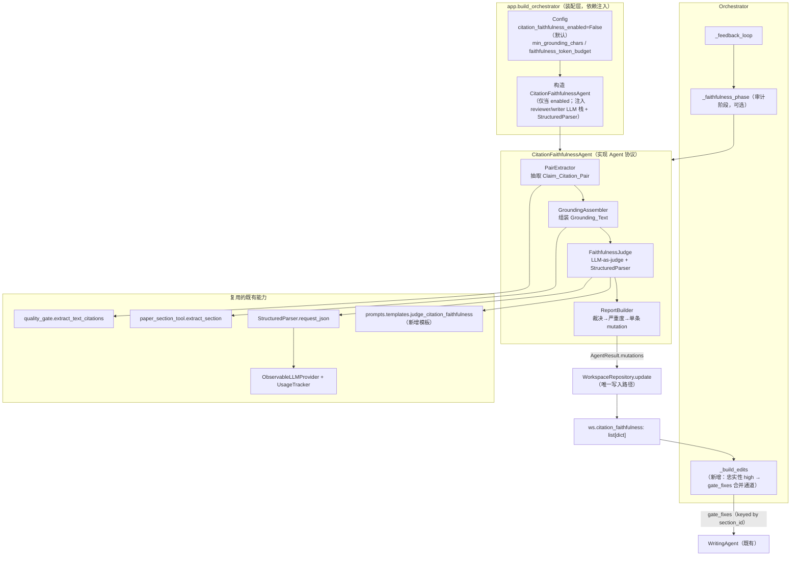
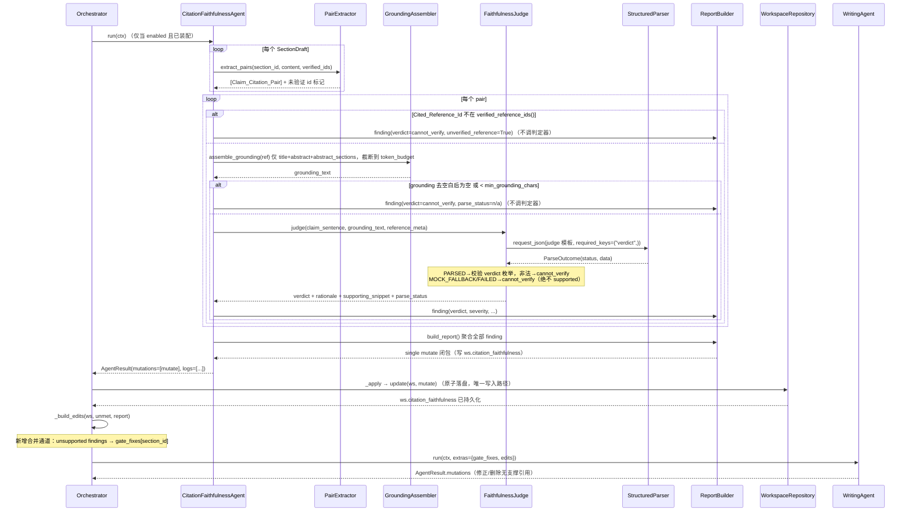

# 设计文档：citation-faithfulness-audit（引用忠实性审计 · 声明级 grounded 引用校验）

## Overview

本特性在既有多智能体论文写作系统（`src/paper_agent/`）之上新增一个 **声明级、检索-grounded 的引用忠实性审计**，补齐当前只做「引用存在性 / 元数据 / 正文-文献对应」而**不判定被引文献是否真正支撑其挂靠声明句**的能力缺口（`CitationAuditAgent` 已把「引用恰当性 ④」显式列为范围外）。

核心思路（对齐需求 Introduction）：对每一处正文 `[id]` 引用，取出其所在声明句，**仅**用被引文献可获得的检索文本（`title` + `abstract` + `abstract_sections`）组装 grounding，交给 LLM-as-judge 在「只看 grounding」的约束下裁决 `{supported, weak_support, unsupported, cannot_verify}`，并把结果作为客观质量信号接入既有写作—评审反馈闭环。

设计遵守既有全部契约，且**默认关闭**以保证向后兼容：

- **单一写入路径**：智能体绝不直接写工作区，只返回 `AgentResult.mutations`，由 `Orchestrator._apply` → `WorkspaceRepository.update` 原子落盘（见 `orchestrator.py`、`repository.py`）。
- **依赖倒置**：`LLMProvider` / `StructuredParser` 经构造注入；不在组件内部实例化具体 provider。
- **复用而非重造**：引用扫描复用 `quality_gate.extract_text_citations`；段落抽取复用 `paper_section_tool.extract_section`；结构化解析复用 `StructuredParser.request_json`；文献字段复用 `ReferenceEntry`。
- **grounding-only 不变量**：判定器输入只含「声明句 + grounding」，grounding 为空/不足或解析未成功一律落 `cannot_verify`，**永不**在无 grounding / 未 PARSED 时给出 `supported`。
- **优雅降级 + 可观测**：LLM 不可用 / mock / 单对异常 → `cannot_verify` 且不中止管线；LLM 调用经既有 Observable 包装记录用量。
- **开关默认关闭**：`config.citation_faithfulness_enabled=False` 时不装配 agent、不接入反馈闭环，系统行为逐字节不变。

### 与既有组件的边界（不重复实现）

| 关注点 | 拥有者（既有） | 本特性 |
| --- | --- | --- |
| 引用存在性 / 元数据 / 悬空-冗余 | `CitationAuditAgent` + `CitationVerifier` | 不改动 |
| 引用真实性（DOI/arXiv/标题回查） | `CitationVerifier` | 不改动 |
| 正文数字 grounding / 体裁必备元素 / 占位空章节 | `QualityGate` | 不改动 |
| 主观评分 / 对抗式评审 | `ReviewRecord` / `AdversarialReviewRecord` | 不改动 |
| **声明级引用忠实性（④ 恰当性）** | — | **本特性新增** |

## Architecture

新增一个 `CitationFaithfulnessAgent`（实现既有 `Agent` 协议），内部由三个纯逻辑子步骤 + 一个受注入的判定器组成，全部产出收敛为**单条** mutation 写入 `ws.citation_faithfulness`。反馈闭环接入通过在 `Orchestrator._build_edits` 增加一个「忠实性 high 发现 → gate_fixes」的合并通道实现，不改动 `QualityGate` / `ReviewRecord` 契约。

### 组件图



### 时序图（extraction → grounding → judge → report → feedback）



### 关键设计决策与理由

1. **审计放在反馈闭环内、写作—评审之后**：忠实性只对「已写出的正文 `[id]`」有意义，故必须在写作产出草稿之后运行；放在每轮评审后、`_build_edits` 之前，使无支撑引用能在下一轮作为 `gate_fixes` 驱动修订。默认关闭时该阶段整体跳过（Req 8.1）。
2. **一个 agent + 内部纯函数子步骤**：抽取 / 组装 / 严重度映射都是**纯函数**，可独立做属性测试；只有判定器有 I/O。这样既满足单一写入路径（agent 汇聚为一条 mutation），又让绝大部分逻辑可确定性验证。
3. **判定器复用 reviewer LLM 栈**：忠实性判定本质是「评审型」任务，复用 `reviewer_llm_stack` + `reviewer_parser`（已 Observable 包装），避免自评 reward-hack 并自动获得用量统计（Req 7.2）。
4. **接入点选 `_build_edits` 而非新判定分支**：`_build_edits` 已是「把各类客观/主观问题按 section_id 归并成 edits/gate_fixes」的唯一汇聚点，在此并入忠实性 high 发现最小侵入、天然复用既有 `gate_fixes` 语义（Req 6.1/6.4）。

## Components and Interfaces

### 1. 数据模型（`workspace/models.py` 或新模块 `workspace/faithfulness.py`）

新增 `FaithfulnessVerdict` 枚举、`ClaimCitationPair`（瞬态）、`CitationFaithfulnessFinding`（可序列化 dataclass），并在 `PaperWorkspace` 增加 `citation_faithfulness: list[dict]` 字段。详见 [Data Models](#data-models)。

### 2. PairExtractor（声明-引用对抽取，纯函数）

位置建议：`agents/citation_faithfulness_agent.py` 内的模块级函数，或 `tools/faithfulness_extract.py`。

```python
def split_sentences(text: str) -> list[tuple[int, int, str]]:
    """确定性句子切分：返回每个句子的 (start, end, sentence_text)。
    句子边界 = CJK 。！？ + ASCII .!? + 换行；连续边界折叠；保留原文切片。"""

def extract_pairs(
    section_id: str,
    content: str,
    verified_ids: set[str],
) -> tuple[list[ClaimCitationPair], list[ClaimCitationPair]]:
    """复用 quality_gate.extract_text_citations 的同一 [id] 扫描规则定位每个标注，
    再用 split_sentences 找到包含该标注**字符位置**的完整句子作为 Claim_Sentence。
    - 同一句含多个不同 id → 每个不同 (sentence, ref_id) 产一个 pair（Req 1.4）。
    - 返回 (verified_pairs, unverified_pairs)：ref_id ∉ verified_ids 的进入
      unverified_pairs，标 unverified_reference，后续不调判定器（Req 1.5）。
    - content 为空或无 [id] → 两个空列表（Req 1.6）。"""
```

职责契约：
- **必须**复用 `quality_gate.extract_text_citations` 的扫描（不新增第二套正则，Req 1.1 / 9.3）。实现上：用其正则 `_TEXT_CITATION` 定位标注的**字符位置**（`extract_text_citations` 本身只返回去重 id，故本模块直接复用同一 `re.Pattern` 对象 `quality_gate._TEXT_CITATION` 做 `finditer` 取位置，语义与之逐字一致）。
- 句子切分为**确定性**、纯函数、无 LLM。
- 去重：同一 `(Claim_Sentence, Cited_Reference_Id)` 只产一个 pair（Req 1.2/1.4）。

### 3. GroundingAssembler（grounding 文本组装，纯函数 + 复用 extract_section）

```python
def assemble_grounding(
    ref: ReferenceEntry,
    *,
    token_budget: int,
    section_hints: tuple[str, ...] = ("method", "results", "motivation", "conclusion"),
) -> str:
    """仅从 ref.title + ref.abstract + ref.abstract_sections 组装 grounding。
    - 复用 paper_section_tool.extract_section(ref, name) 抽取可用段落（Req 2.2），
      不新增第二套段落抽取实现（Req 9.3）。
    - 绝不引入被引文献之外文本、绝不使用 LLM 参数化记忆（Req 2.1/2.4）。
    - 组装顺序确定性：title → 命中的 abstract_sections 段落 → abstract 整段兜底。
    - 去重拼接后 strip，再截断至 token_budget 上限字符数（Req 2.6 / 7.4）。"""
```

`pdf_url` / 结构化分段可选纳入：MVP 通过 `extract_section` 命中 `abstract_sections` 键即覆盖 Req 2.3 的「结构化分段某段落」；`pdf_url` 全文抓取不在本期实现范围（保持 grounding 仅来自已在工作区的文本，避免新增网络 I/O），设计预留 `section_hints` 扩展位。

**grounding 不足判定**（Req 2.5）：`assemble_grounding` 结果 `strip()` 后为空或 `len < config.min_grounding_chars` → 由 agent 直接赋 `cannot_verify`，**不调判定器**。

### 4. FaithfulnessJudge（LLM-as-judge，注入 LLMProvider + StructuredParser）

```python
class FaithfulnessJudge:
    def __init__(self, parser: StructuredParser) -> None: ...

    def judge(
        self, *, claim: str, grounding: str, reference_meta: str,
    ) -> tuple[FaithfulnessVerdict, str, str, ParseStatus]:
        """返回 (verdict, rationale, supporting_snippet, parse_status)。
        输入仅含 claim + grounding + reference_meta（title/年份等元信息），
        不含其它章节正文或记忆提示（Req 3.1）。
        经 parser.request_json(templates.judge_citation_faithfulness(...),
            required_keys=("verdict",))：
          - PARSED → 取 data['verdict']，校验属于枚举，否则 cannot_verify（Req 3.3）
          - MOCK_FALLBACK / FAILED → cannot_verify，记 reason（Req 3.4/3.5）
        永不在非 PARSED 或 grounding 不足时返回 supported（Req 3.6）。"""
```

新增 prompt 模板（`prompts/templates.py`）：

```python
FAITHFULNESS_JUDGE_SYSTEM = (
    "你是严格的引用忠实性判定器。你只能依据【给定的 grounding 文本】判断被引文献"
    "是否支撑该声明句，严禁使用你自己的知识或记忆。"
    "若 grounding 不足以判断，必须选择 cannot_verify，不得臆测 supported。"
    "仅输出要求的 JSON，不要附加说明。"
)

def judge_citation_faithfulness(
    *, claim: str, grounding: str, reference_meta: str,
) -> list[Message]:
    """产出判定消息。稳定段=system+判定规范；易变段=claim+grounding。
    要求输出 JSON：{"verdict": "supported|weak_support|unsupported|cannot_verify",
                   "rationale": "简短理由", "supporting_snippet": "grounding 中的片段或空"}。"""
```

### 5. CitationFaithfulnessAgent（编排三步 → 单条 mutation）

```python
class CitationFaithfulnessAgent(Agent):
    name = "citation_faithfulness_agent"

    def __init__(
        self, judge: FaithfulnessJudge, *,
        min_grounding_chars: int, token_budget: int,
        is_mock: bool = False, sink: EventSink | None = None,
    ) -> None: ...

    def run(self, ctx: AgentContext) -> AgentResult:
        """extraction → grounding → judge → report。
        - 遍历 ws.section_drafts，抽取 pairs；未验证 id 直接成 finding（不判定）。
        - 每个 pair：组装 grounding；不足→cannot_verify；否则调 judge。
        - 逐 pair 异常 try/except → cannot_verify 并 continue（Req 7.6）。
        - 聚合所有 finding，返回 **单条** mutate 闭包写 ws.citation_faithfulness
          （单一写入路径，Req 5.2 / 9.1；替换而非累加，Req 5.5）。
        - 观测日志经 self._sink；LLM 用量由注入的 Observable LLM 栈自动记录。"""
```

严重度映射（Req 4）——纯函数、全函数（对枚举四值全覆盖）：

```python
def severity_for(verdict: FaithfulnessVerdict) -> str:
    return {
        FaithfulnessVerdict.UNSUPPORTED: "high",
        FaithfulnessVerdict.WEAK_SUPPORT: "medium",
        FaithfulnessVerdict.CANNOT_VERIFY: "low",   # ∈ {low, info}
        FaithfulnessVerdict.SUPPORTED: "none",       # 不计为需修订问题（Req 4.5）
    }[verdict]
```

### 6. Orchestrator 接入（反馈闭环）

改动点集中在 `orchestrator.py`，均**加法式**、默认关闭安全：

1. **新增可选构造参数** `faithfulness_agent: Agent | None = None`（缺省 `None` → 现状行为，向后兼容）。
2. **新增审计阶段** `_faithfulness_phase(ws)`：在 `_feedback_loop` 内、每轮 `_review` 之后调用 `self._faithfulness.run`，经 `_run_agent` 走单一写入路径。仅当 `self._faithfulness is not None` 时执行。
3. **`_build_edits` 增加合并通道**：读 `ws.citation_faithfulness`，把 `verdict == unsupported`（severity `high`）的发现按 `section_id` 并入 `gate_fixes`（复用既有 `gate_fixes.setdefault(sid, []).append(msg)` 路径，Req 6.1）。
4. **达标判据增加一项** `faithfulness_ok`：无 `unsupported` 发现（或未装配）才算「引用忠实性达标」；与既有 `llm_ok / gate_ok / adversarial_ok` **AND** 合并（Req 6.3）。未装配 agent 时 `faithfulness_ok` 恒为 `True`（不改变既有达标路径，Req 6.4/8.1）。

```python
def _faithfulness_ok(self, ws) -> bool:
    if self._faithfulness is None:
        return True
    return not any(
        f.get("verdict") == "unsupported" for f in ws.citation_faithfulness
    )
```

关键：`_build_edits` 现为 `@staticmethod`；接入忠实性需读 `ws.citation_faithfulness`，该数据已在 `ws` 上，签名不变即可读取（保持既有调用点不动）。

### 7. 装配（`app.build_orchestrator` + `config.py`）

`config.py` 新增字段：

```python
citation_faithfulness_enabled: bool = False   # 默认关闭，保证向后兼容
min_grounding_chars: int = 40                 # grounding 充足性阈值
faithfulness_token_budget: int = 4000         # 单次判定 grounding 截断上限（字符）
```

`Config.validate()` 增加范围校验：`min_grounding_chars >= 0`、`faithfulness_token_budget >= 1`，非法则回退文档化默认并记录（Req 8.4）。

`app.build_orchestrator`：仅当 `config.citation_faithfulness_enabled` 为真时构造 agent 并注入；复用 `reviewer_llm_stack` + `reviewer_parser`（判定属评审型任务）：

```python
faithfulness_agent = None
if config.citation_faithfulness_enabled:
    faithfulness_agent = CitationFaithfulnessAgent(
        FaithfulnessJudge(reviewer_parser),
        min_grounding_chars=config.min_grounding_chars,
        token_budget=config.faithfulness_token_budget,
        is_mock=reviewer_is_mock,
        sink=sink,
    )
# 注入 Orchestrator（新增可选参数，默认 None）
```

## Data Models

新增到 `workspace/models.py`（或新模块 `workspace/faithfulness.py` 再于 `models.py` 复用；下述以 `models.py` 内联描述）。

### FaithfulnessVerdict（枚举）

```python
class FaithfulnessVerdict(str, Enum):
    SUPPORTED = "supported"
    WEAK_SUPPORT = "weak_support"
    UNSUPPORTED = "unsupported"
    CANNOT_VERIFY = "cannot_verify"
```

### ClaimCitationPair（瞬态，不序列化）

```python
@dataclass
class ClaimCitationPair:
    section_id: str
    claim_sentence: str
    cited_reference_id: str
```

### CitationFaithfulnessFinding（可序列化）

```python
@dataclass
class CitationFaithfulnessFinding:
    section_id: str
    cited_reference_id: str
    claim_excerpt: str            # Claim_Sentence 的截断摘要
    verdict: FaithfulnessVerdict
    severity: str                 # high | medium | low | none
    rationale: str = ""
    supporting_snippet: str = ""
    parse_status: str = ""        # ParseStatus.value；未调判定器时为 "" 或 "n/a"
    unverified_reference: bool = False

    def to_dict(self) -> dict: ...
    @classmethod
    def from_dict(cls, data: dict) -> "CitationFaithfulnessFinding": ...
```

存储形态：与 `citation_audit` / `quality_report` 一致，`PaperWorkspace` 上以 **`list[dict]`** 持久化（每个 finding 一个 dict），保证经既有工作区序列化路径可持久化/反序列化（Req 5.3）。

### PaperWorkspace 变更

```python
@dataclass
class PaperWorkspace:
    ...
    citation_faithfulness: list[dict] = field(default_factory=list)  # 引用忠实性报告
    ...
```

- `to_dict()`：新增 `"citation_faithfulness": list(self.citation_faithfulness)`（镜像 `citation_audit` / `quality_report` 的写法）。
- `from_dict()`：`citation_faithfulness=list(data.get("citation_faithfulness", []))` —— **缺字段默认空列表**，旧版本 JSON 反序列化不失败（Req 5.4 向后兼容）。

数据流：agent 内部用 `ClaimCitationPair`（瞬态）驱动流程，最终把每个 `CitationFaithfulnessFinding.to_dict()` 汇成 `list[dict]`，经**单条** mutate 写 `ws.citation_faithfulness`（替换整表，Req 5.5）。

## Correctness Properties

*属性（property）是应在系统所有合法执行中恒成立的特征或行为——一条关于「系统应当做什么」的形式化陈述。属性是人类可读规格与机器可验证正确性保证之间的桥梁。*

下列属性由需求验收标准经 prework 分类、归并去冗后得到。可属性化测试的逻辑集中在**纯函数子步骤**（抽取 / 组装 / 严重度映射 / 序列化）与**判定安全不变量**上；I/O（可观测、用量统计）与架构约束（复用、依赖注入、不改既有职责）以集成/示例测试覆盖，不在此列。

### Property 1: 引用扫描规则复用一致性

*对任意*章节正文字符串，`PairExtractor` 抽取到的被引 id 集合应逐一等于 `quality_gate.extract_text_citations(content)` 返回的 id 集合——不存在第二套引用扫描实现。

**Validates: Requirements 1.1, 9.3**

### Property 2: 声明句包含其标注且为完整句子

*对任意*含 `[id]` 标注的正文，为每个标注产出的 `ClaimCitationPair` 的 `claim_sentence` 应包含该 `[id]` 子串，且该句是由确定性句子切分（CJK `。！？` + ASCII `.!?` + 换行）得到的、覆盖该标注字符位置的完整句子。

**Validates: Requirements 1.2, 1.3**

### Property 3: 同句多引用逐一成对且去重

*对任意*声明句，`PairExtractor` 应为该句中每个**不同**的 `Cited_Reference_Id` 恰产出一个 `ClaimCitationPair`；重复的 `(claim_sentence, cited_reference_id)` 只保留一个。

**Validates: Requirements 1.4**

### Property 4: 未验证引用标记且不触发判定器

*对任意*正文与 `verified_reference_ids()` 集合，凡 `Cited_Reference_Id` 不在该集合中的对，其 finding 应标 `unverified_reference=True` 并纳入报告，且不为该对调用 `Faithfulness_Judge`。

**Validates: Requirements 1.5**

### Property 5: grounding-only 不变量

*对任意* `ReferenceEntry` 与声明句，喂入 `Faithfulness_Judge` 的输入内容应只由该对的 `claim_sentence`、其 `Grounding_Text` 与该文献元信息构成，且 `Grounding_Text` 的每一部分都来自该 `ReferenceEntry` 的 `title` / `abstract` / `abstract_sections`——修改被引文献之外的任何字段或其它章节正文，都不改变判定器输入；组装过程不调用 `LLMProvider`。

**Validates: Requirements 2.1, 2.4, 3.1**

### Property 6: grounding 不足即安全落 cannot_verify

*对任意* `ReferenceEntry`，若其组装后的 `Grounding_Text` 去除空白后为空或长度低于 `min_grounding_chars`，则该对的 `Faithfulness_Verdict` 应为 `cannot_verify`，且不调用 `Faithfulness_Judge`。

**Validates: Requirements 2.5**

### Property 7: 喂入判定器的文本受 token_budget 上限约束

*对任意* `ReferenceEntry`、声明句与正整数 `token_budget`，喂入 `Faithfulness_Judge` 的 `Grounding_Text`（及受限的 `Claim_Sentence`）经防御式截断后长度不超过配置的 `token_budget` 上限字符数。

**Validates: Requirements 2.6, 7.4**

### Property 8: PARSED 采用合法枚举，非法值降级

*对任意* `StructuredParser` 返回 `PARSED` 且 `data['verdict']` 为任意字符串的情形，若该字符串属于枚举 `{supported, weak_support, unsupported, cannot_verify}` 则采用之，否则该对判定为 `cannot_verify`。

**Validates: Requirements 3.3**

### Property 9: 非 PARSED 或 grounding 不足绝不 supported（核心安全属性）

*对任意*判定路径，若某对最终 `Faithfulness_Verdict` 为 `supported`，则其解析来源必为 `PARSED` **且** 其 `Grounding_Text` 充足（非空且 ≥ `min_grounding_chars`）。等价地：`FAILED`、`MOCK_FALLBACK`、LLM 不可用、grounding 不足、单对异常等一切非 PARSED/不足情形都落 `cannot_verify`，绝不产出 `supported` 或 `weak_support`。

**Validates: Requirements 3.4, 3.5, 3.6, 7.1**

### Property 10: verdict 全域属于枚举且严重度映射为全函数

*对任意*产出的 finding，其 `verdict` 恰取枚举四值之一；且严重度映射 `severity_for` 对四个枚举值全覆盖：`unsupported→high`、`weak_support→medium`、`cannot_verify→{low|info}`、`supported→none`（不计为需修订问题）。

**Validates: Requirements 4.1, 4.2, 4.3, 4.4, 4.5**

### Property 11: 报告与对一一对应且字段完备

*对任意*正文集合，`Citation_Faithfulness_Report` 中的发现条数应等于抽取到的对总数（含未验证对），且每条发现均含 `section_id`、`cited_reference_id`、`claim_excerpt`、`verdict`、`severity` 与解析来源状态字段。

**Validates: Requirements 5.1**

### Property 12: 单一写入路径

*对任意*工作区输入，`CitationFaithfulnessAgent.run` 应恰返回一条 `AgentResult.mutation`，且执行 `run` 本身不改动传入工作区的 `citation_faithfulness`（写入只发生在 `WorkspaceRepository.update` 应用该 mutation 时）。

**Validates: Requirements 5.2, 9.1**

### Property 13: 报告序列化 round-trip 与向后兼容默认

*对任意*忠实性发现列表，写入 `PaperWorkspace.citation_faithfulness` 后经 `to_dict` → `from_dict` 应得到相等的列表；且对**不含** `citation_faithfulness` 键的旧版本工作区 JSON，`from_dict` 应回落为空列表且不抛异常。

**Validates: Requirements 5.3, 5.4, 9.5**

### Property 14: 再次运行替换而非累加

*对任意*两次连续运行（正文可不同），依次应用其 mutation 后，`ws.citation_faithfulness` 只反映**最后一次**运行的结果，其条数等于最后一次抽取到的对总数，不与上一次发现累加。

**Validates: Requirements 5.5, 9.5**

### Property 15: unsupported 驱动定位式 high 修订项

*对任意*含 `verdict == unsupported` 发现的工作区，`Orchestrator._build_edits` 的输出应在 `gate_fixes` 中为对应 `section_id` 增加一条修订项；且当且仅当不存在 `unsupported` 发现（或未装配审计）时 `_faithfulness_ok` 为真。

**Validates: Requirements 6.1, 6.3**

### Property 16: 停用时逐字节不变

*对任意*工作区，当 `citation_faithfulness_enabled=False`（或 Orchestrator 未装配 `faithfulness_agent`）时，`_build_edits` 的输出与达标判定结果应与「本特性不存在」时逐字节相同——不注入任何忠实性修订项、`_faithfulness_ok` 恒为真。

**Validates: Requirements 6.4, 6.5, 8.1**

### Property 17: 单对异常隔离

*对任意*对集合，若判定某一对时抛出异常，则该对记为 `cannot_verify` 并记录原因，其余对照常判定，报告总条数不变、审计不中止。

**Validates: Requirements 7.6**

### Property 18: 不可信文本纯字符串处理

*对任意* `Grounding_Text` 与 `Claim_Sentence`（含形如 `__import__`、`eval(...)`、模板注入等内容），审计全程仅做字符串处理，不执行 `eval` / `exec`，不产生任何副作用。

**Validates: Requirements 7.3**

### Property 19: 阈值可配置且被采用

*对任意*合法 `min_grounding_chars` 与 `faithfulness_token_budget` 取值，grounding 充足性判定的边界与喂入判定器文本的长度上限应随所配置的取值变化（阈值边界处 `cannot_verify` 判定发生翻转，截断长度随 budget 变化）。

**Validates: Requirements 8.3**

## Degradation Matrix（降级矩阵）

审计始终「优雅降级、绝不假 supported、绝不中止管线」。下表枚举各触发条件下的行为：

| 触发条件 | verdict | severity | 是否调判定器 | parse_status | 是否中止 |
| --- | --- | --- | --- | --- | --- |
| `Cited_Reference_Id` 不在 `verified_reference_ids()`（Req 1.5） | `cannot_verify` | low | 否 | `n/a`（`unverified_reference=True`） | 否 |
| grounding 去空白后为空 / < `min_grounding_chars`（Req 2.5） | `cannot_verify` | low | 否 | `n/a` | 否 |
| LLM 不可用 / 超时 / 识别为 Mock（Req 7.1） | `cannot_verify` | low | 是（→ MOCK_FALLBACK/FAILED） | `mock_fallback`/`failed` | 否 |
| `StructuredParser` 返回 `FAILED`（Req 3.4） | `cannot_verify` | low | 是 | `failed`（记 reason） | 否 |
| `StructuredParser` 返回 `MOCK_FALLBACK`（Req 3.5） | `cannot_verify` | low | 是 | `mock_fallback` | 否 |
| `PARSED` 但 verdict 非法枚举值（Req 3.3） | `cannot_verify` | low | 是 | `parsed` | 否 |
| 单对判定抛异常（Req 7.6） | `cannot_verify` | low | 是（异常） | `failed`（记异常类别） | 否，继续其余对 |
| 非法阈值配置（Req 8.4） | — | — | — | — | 回退文档化默认并记录 |
| 本特性停用（Req 8.1） | 不产出任何 finding | — | 否 | — | 阶段整体跳过，行为逐字节不变 |
| grounding 充足 + `PARSED` + 合法枚举 | 采用 LLM verdict | 按映射 | 是 | `parsed` | 否 |

**唯一能产出 `supported` / `weak_support` 的路径**是最后一行（Property 9）。

## Error Handling

- **逐对异常隔离**：`CitationFaithfulnessAgent.run` 对每个 pair 的组装+判定包 `try/except`，捕获后记 `cannot_verify` 并写入 `rationale`/reason，`continue` 处理其余对（Req 7.6 / Property 17）。整次审计不向 Orchestrator 抛异常。
- **解析失败**：完全交由 `StructuredParser` 治理，`FAILED` / `MOCK_FALLBACK` 一律映射 `cannot_verify`（Req 3.4/3.5）。判定器不自行解析原始文本（Req 3.2）。
- **grounding 不足前置短路**：在调用 LLM 前判定 grounding 充足性，省一次无意义 LLM 调用并保证 `cannot_verify`（Req 2.5）。
- **落盘失败**：沿用 `WorkspaceRepository.update` 的既有语义——落盘失败时回滚内存状态并抛出，保证内存与磁盘一致（Req 9.5 的重启恢复由既有仓储保证）。
- **配置非法**：`Config.validate()` 对 `min_grounding_chars` / `faithfulness_token_budget` 做范围校验，越界回退文档化默认并记录（Req 8.4）。
- **可观测脱敏**：经既有 `EventSink` 发结构化日志，文本片段施加长度上限，绝不打印 API 密钥或完整请求体（Req 7.5）。LLM 用量由注入的 `ObservableLLMProvider` + `UsageTracker` 自动记录（Req 7.2），审计组件不自造 tracker。
- **不中止管线**：无论何种降级，`run` 始终返回合法 `AgentResult`；Orchestrator 审计阶段不因忠实性异常终止反馈循环。

## Testing Strategy

采用**双轨测试**：属性测试覆盖普遍不变量，单元/示例测试覆盖具体场景、边界与集成点。

### 属性测试（Property-Based Testing）

- **库**：`hypothesis`（仓库已在用，见 `.hypothesis/` 缓存目录）。**不**自行实现属性测试框架。
- **迭代次数**：每个属性测试至少 100 次迭代（hypothesis 默认满足；对生成成本高者显式设 `max_examples>=100`）。
- **标签**：每个属性测试以注释标注对应设计属性，格式：
  `# Feature: citation-faithfulness-audit, Property {number}: {property_text}`
- **一属性一测试**：Property 1–19 各以一个属性测试实现。
- **生成器要点**：
  - 正文生成器覆盖 CJK / ASCII 句子边界、含/不含 `[id]`、含非引用方括号（如 `[表格 第1页]`）、同句多 id、重复 id、空串。
  - `ReferenceEntry` 生成器覆盖空/短/长 `abstract`、有/无 `abstract_sections`、含注入样文本（`__import__`、`eval(` 等）用于 Property 18。
  - stub / spy 版 `StructuredParser` 与 `Faithfulness_Judge`：可参数化返回 `PARSED`（任意 verdict 字符串）/`MOCK_FALLBACK`/`FAILED`/抛异常，并记录调用次数与收到的输入（支撑 Property 4/5/8/9/17）。
  - 阈值 `min_grounding_chars` / `token_budget` 作为生成参数（Property 7/19）。

### 单元 / 示例测试

- **grounding 复用**：构造带 `abstract_sections` 的 ref，断言 `assemble_grounding` 含 `extract_section` 命中的段落（Req 2.2/2.3）。
- **判定器解析复用**：spy `StructuredParser`，断言 `judge` 以 `required_keys=("verdict",)` 调用 `request_json`（Req 3.2/9.2）。
- **rationale 透传**：stub parser 返回带 `rationale`/`supporting_snippet`，断言透传到 `unsupported`/`weak_support` 发现（Req 4.6）。
- **非法阈值回退**：负数/非数值阈值 → `Config.validate()` 回退默认并记录（Req 8.4）。
- **端到端 smoke**：`citation_faithfulness_enabled=True` + Mock LLM 跑一轮反馈循环，断言 `ws.citation_faithfulness` 被写入、mock 路径全 `cannot_verify`、管线正常导出（Req 8.2）。

### 集成测试

- **可观测/用量**：注入带 `UsageTracker` 的 Observable LLM 栈，运行一次审计，断言记录了 `LLM_USAGE`（Req 7.2）；断言事件文本受长度上限、不含密钥（Req 7.5）。
- **反馈闭环接入**：构造含 `unsupported` 发现的工作区，跑 `_feedback_loop`，断言 `WritingAgent` 收到 `gate_fixes[section_id]` 且该轮不判「忠实性达标」（Req 6.1/6.3）。
- **契约不破坏**：对比 `enabled=False` 与「无本特性」两条路径，断言 `_build_edits` 输出与达标判定逐字节一致（Req 6.4/6.5/8.1，与 Property 16 互补）。

### 覆盖映射小结

| 需求 | 主要覆盖 |
| --- | --- |
| 1.1–1.6 | Property 1/2/3/4；边界单测（空/无标注/非引用方括号） |
| 2.1–2.6 | Property 5/6/7；示例（extract_section 复用、结构化分段） |
| 3.1–3.6 | Property 5/8/9；示例（request_json 复用） |
| 4.1–4.6 | Property 10；示例（rationale 透传） |
| 5.1–5.5 | Property 11/12/13/14 |
| 6.1–6.5 | Property 15/16；集成（写作接入、契约不破坏） |
| 7.1–7.6 | Property 9/17/18；集成（可观测/用量/脱敏） |
| 8.1–8.4 | Property 16/19；示例（smoke、非法阈值回退） |
| 9.1–9.5 | Property 1/12/13/14；代码审查（依赖注入、不改既有职责） |
