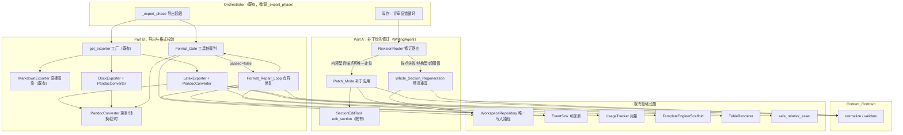
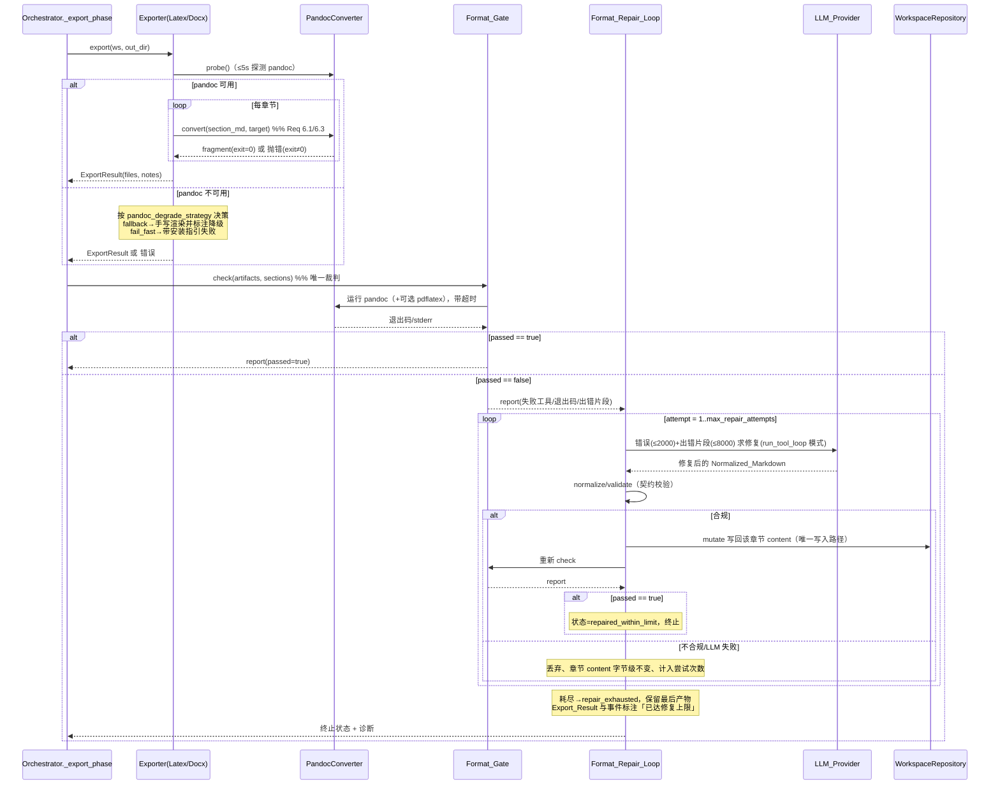

# 设计文档：format-pipeline-and-diff-revision

差量修订（Part A）+ Markdown 内容契约与 pandoc 导出管线（Part B）

## Overview

本特性在既有多智能体论文写作系统（`src/paper_agent/`）之上做两项互补增强，二者共享同一「Normalized_Markdown 内容契约」，且严格沿用系统既有核心契约：依赖倒置、`Agent`/`AgentResult`/`WorkspaceMutation` 协议、`WorkspaceRepository` 为唯一原子写入路径、断点续跑、优雅降级、事件可观测性（`EventSink`）与用量统计（`UsageTracker`）。

- **Part A（Req 1–4）——补丁优先的增量修订**：把 `WritingAgent` 的修订流程从「整章重写优先」改为「最小化局部补丁优先」。复用既有 `edit_section` 工具与 `SectionEdit` 模型（`anchor` + `replacement` + `mode∈{replace,insert_after,insert_before}`），产出可审阅的干净 diff、保证未触及文本的字节级保留，并降低 token 消耗。仅在锚点无法唯一定位、补丁累计影响过大（> `patch_size_limit`）或结构型改动时回退到 `Whole_Section_Regeneration`（既有 `_revise_content`）。每轮修订的路径与 diff 决策全程可观测。

- **Part B（Req 5–11）——内容契约 + pandoc 管线 + 确定性格式闸 + 有界修复循环**：确立 `Content_Contract`——`SectionDraft.content` 必须是受约束的 Normalized_Markdown（明确数学、图表、引用约定，且 `normalize()` 字节级幂等）。导出 LaTeX/docx 时用真实转换器 pandoc 转换章节正文，取代 `latex.py` 的盲目逐字符转义与 `docx.py` 的「整段塞进单段落」。新增 `Format_Gate`：以实际运行的工具链（pandoc 转换退出码 + 可选 pdflatex 编译退出码）作为格式正确性的**唯一裁判**（AI 不得充当格式裁判），与既有 `Quality_Gate`（内容层）互补。格式闸报错时进入有界 `Format_Repair_Loop`（复用 `run_tool_loop` 模式），把工具错误 + 出错片段交给 LLM 修复后再校验；重试耗尽则带可诊断原因优雅降级。

- **Req 12——契约保持**：所有新增组件仅经 `AgentResult.mutations` → `WorkspaceRepository` 落盘，依赖抽象接口，支持断点续跑，把外部工具/LLM 输出视为不可信数据（不 `eval`/`exec`，8000 字符防御式截断），并经既有可观测性/用量系统记录。

### 与上游 sibling 特性（venue-templates-figures-tables）的关系

sibling 特性是本特性的**上游生产者**，已实现并拥有：`VenueProfile`/`TemplateEngine`（前导脚手架 `Scaffold`）、图片嵌入（`\includegraphics`）、`TableRenderer`、`FigureRenderer`、`GroundingChecker`、`asset_paths.safe_relative_asset`、`ExportResult.notes`、`EventKind.DEGRADATION`/`EXPORT_ASSET`。本特性**不重新设计**这些组件——`LatexExporter` 今天已经能产出完整 `.tex`（venue 前导 + 章节 + 图 + 表）与 `.bib`，`DocxExporter` 已产出原生 docx。本特性只在这些既有产出流程中，把「章节正文的渲染」这一段从手写转义替换为 pandoc 转换，其余（前导、图、表、`.bib`）原样保留。下文「pandoc 接缝」一节明确定义这条边界。

## Architecture

### 组件总览



### 导出 + 格式闸 + 修复 时序



### pandoc 接缝（关键设计决策）

本特性对「pandoc 如何融入既有导出器」的决策如下，明确边界以保护 sibling 行为：

**LaTeX（片段组合 into 既有 exporter）**：`LatexExporter` 继续拥有文档组合职责——venue `Scaffold` 前导（`TemplateEngine`）、`\section{title}`、图 `figure` 环境（`safe_relative_asset` + `\includegraphics`）、`TableRenderer` 的 `tabular` 片段、`.bib` 生成、章节末 `\cite` 回退，全部原样保留。**唯一被替换的是章节正文体的渲染**：当前 `_render_tex` 里 `_escape(draft.content)`（会破坏数学/LaTeX）改为经 `PandocConverter.convert(section_md, target=latex)` 把该章节的 Normalized_Markdown 正文转成 LaTeX 片段，再插入 `\section` 之后。数学 `$...$`/`$$...$$` 由 pandoc 正确转换而非被逐字符转义。引用 `[id]` 沿用既有「占位符保护」技巧：转换前把 `[id]` 替换为 alnum 占位符（pandoc 原样透传），转换后还原为 `\cite{key}`；章节末 `\cite` 回退逻辑不变。

**docx（pandoc 产出结构化正文 + 既有 exporter 追加原生图/表）**：`DocxExporter` 用 pandoc 一次性把「全部章节正文组合成的 Normalized_Markdown 文档」（各章节以 ATX 标题 + 正文拼接）转换为结构化 docx 主体（`pandoc -f markdown -t docx`），从而让标题/段落/列表/数学各自映射为 docx 原生结构元素——修掉「整段塞进单段落」。随后 exporter 以 python-docx 重新打开该 docx，按 sibling 既有逻辑**原生追加**图（`add_picture` + 图题，`safe_relative_asset` 定位）、表（`TableRenderer.render_docx`）与参考文献。即：pandoc 负责散文结构，sibling 的原生图/表嵌入保持不变。

**Markdown（不变）**：`MarkdownExporter` 保持零依赖直接渲染，不调用 pandoc/pdflatex（Req 7）。

**Format_Gate 的裁判对象**：对 LaTeX，格式闸对 exporter 组合出的最终 `.tex` 运行可选 `pdflatex` 编译（强裁判），并把管线中各章节 pandoc 转换的退出码纳入判据；对 docx，格式闸以 pandoc 转换退出码为判据。工具退出码是唯一真相，不引入 LLM 裁判。

## Components and Interfaces

### Part A：补丁优先修订（`agents/writing_agent.py` 重构）

改造集中在 `_localized_revision` 与其下游，新增一个「修订路由」决策，既有 `_materialize_edits`/`_apply_section_edit`/`_revise_content` 被复用与增强。

- **`RevisionRouter`（新增，WritingAgent 内部方法族）**
  - `_route_revision(ws, section_id, suggestion) -> RevisionRoute`：判定本章节走 `PATCH_MODE` 还是 `WHOLE_SECTION`。判据（Req 1.1 / 3.1 / 3.2）：
    - `extras["structural"]` 指向本章节 → `WHOLE_SECTION`（结构型，Req 3.2）；
    - 否则默认 `PATCH_MODE`（内容型，Req 1.1/1.7 默认启用 `patch_first_enabled`）。
    - 运行期若补丁全部锚点失败（Req 3.1）或补丁累计影响字符占比 > `patch_size_limit`（Req 3.2）→ 回退 `WHOLE_SECTION`。
  - 决策与回退原因经 `EventSink` 发出（复用 `EventKind.AGENT_LOG`，`data` 含 `section_id`、`route`、`fallback_reason`），正文片段截断 ≤ 2000 字符（Req 4）。

- **`SectionEditTool.edit_section`（既有，`tools/section_edit_tool.py`）**：保持不变——校验 `mode` 合法性（Req 1.3）、`section_id` 存在性、锚点唯一命中（Req 1.4/1.5），仅累积 `SectionEdit` 意图，不直接写工作区（Req 1.6）。

- **`_materialize_edits`（增强，Req 2.3/2.5）**：逐条在「当前内容」上重新定位锚点并应用，新增**改动区间重叠检测**：维护已成功补丁改动的字符区间集合，若某条补丁锚点区间与任一已应用区间重叠则跳过并记日志（Req 2.5「锚点区间冲突已跳过」）。`_apply_section_edit` 的字节级语义（replace/insert_after/insert_before、空 `replacement` 语义）已满足 Req 2.7/2.8，保持不变。

- **`Whole_Section_Regeneration`（`_revise_content`，增强 Req 3.4/3.6）**：整章重写后必须经 `Content_Contract.normalize/validate` 校验；不合规则丢弃输出、章节 `content` 字节级不变并记录可诊断原因（Req 3.6）；LLM 调用失败/超时则不改动工作区并记录原因（Req 3.7）。

- **写回**：Patch_Mode 与 Whole_Section_Regeneration 均仅经 `AgentResult.mutations` → `WorkspaceRepository`（Req 1.6/3.3/12.1），未涉及章节字节级不变（Req 2.2）。

- **用量与可观测（Req 4.5）**：每轮修订经既有 `UsageTracker` 记录 token 用量，支持 Patch_Mode 与 Whole_Section_Regeneration 的用量对比。

### Part B：内容契约与导出

- **`Content_Contract`（新增 `export/content_contract.py`）**
  - `normalize(content: str) -> NormalizeResult`：把输入归一化为受约束 Normalized_Markdown 子集（Req 5.1）；数学定界符内部内容不施加任何转义（Req 5.4）；字节级幂等 `normalize(normalize(x)) == normalize(x)`（Req 5.7）。
  - `validate(content, ws) -> list[ContractViolation]`：检查引用 `[id]` 是否在 `ws.verified_reference_ids()`（不存在 → 诊断但保留原文，Req 5.5）、`figure_id` 是否唯一对应一条 `FigureRecord`（Req 5.6）、长度是否超过 1,000,000 字符（超限 → 诊断但不截断，Req 5.8）、是否含契约外构造（Req 5.9：归一化为等价表示或以含字符偏移/行列的诊断标识，绝不静默丢弃）。
  - 契约「不静默丢弃内容」为强约束：所有分支要么归一化保留，要么诊断保留原文。

- **`PandocConverter`（新增 `export/pandoc_pipeline.py`）**
  - `probe(timeout=5.0) -> bool`：探测 pandoc 可执行且能返回版本号（Req 8.1，5 秒内未完成 → 判不可用）。
  - `convert(markdown, target: "latex"|"docx", out_path=None, timeout) -> ConversionResult`：调用 pandoc；非零退出 → `ConversionResult(ok=False, exit_code, stderr≤2000)`（Req 6.4）。
  - 子进程调用用参数列表（非 shell 字符串）避免注入；输出视为不可信数据（Req 12.9）。

- **`LatexExporter`（重构，`export/latex.py`）**：保留 `format=LATEX`、`Scaffold` 前导、图/表/`.bib`/`\cite` 全部逻辑；仅把 `_render_tex` 内章节正文的 `_escape(content)` 替换为 pandoc 片段转换（见 pandoc 接缝）。pandoc 不可用时按降级矩阵处理。

- **`DocxExporter`（重构，`export/docx.py`）**：保留 `format=DOCX`、venue docx 约定、原生图/表/参考文献；章节散文体改由 pandoc 一次性转换为结构化 docx 主体后再以 python-docx 追加图/表/refs（见 pandoc 接缝）。

- **`MarkdownExporter`（基本不变，`export/markdown.py`）**：直接渲染，不调用外部工具（Req 7.1/7.2）；数学/代码/`[id]` 原样保留（Req 7.6）；空章节集合产出仅骨架 `.md`（Req 7.7）。

- **工厂接入（Req 6.8）**：`get_exporter`/`DocumentExporter` 协议与注册表不变；Orchestrator 调用导出的方式不变。降级/pandoc 由 exporter 内部与 `_export_phase` 的 gate/repair 处理。

- **`Format_Gate`（新增 `export/format_gate.py`）**
  - `check(artifacts: ExportArtifacts, sections) -> FormatGateReport`：对 LaTeX/docx 产物实际运行 pandoc（+ 可选 pdflatex）；全部退出码 0 → `passed=True`（Req 9.3）；任一非 0 → `passed=False` 且结构化报告含失败工具名/退出码/错误片段（≤2000）/出错定位片段（≤500×最多 10，含行号或偏移）（Req 9.4）。超时 → `passed=False`、终止进程、记录超时工具与阈值（Req 9.7）。工具缺失 → `passed=False` 记缺失工具（Req 9.8）。**绝不调用 LLM**（Req 9.5）。不修改/删除原始产物（Req 9.9）。与 `Quality_Gate` 独立互补（Req 9.6）。

- **`Format_Repair_Loop`（新增 `export/format_repair.py`）**
  - `run(ws, report, exporter, gate) -> RepairOutcome`：复用 `run_tool_loop` 模式驱动 LLM；把工具错误（≤2000）+ 出错 Markdown 片段（防御式截断 ≤8000）交给 LLM 产出修复后的 Normalized_Markdown（Req 10.1），经 `Content_Contract` 校验（Req 10.6），合规则仅经 `AgentResult.mutations` 写回对应章节（Req 10.5），重新导出并 `Format_Gate.check`（Req 10.2）。受 `max_repair_attempts` 约束，工具链运行总次数 ≤ `max_repair_attempts + 1`（Req 10.3/11.6）。首次 `passed=True` 即终止并采用该结果（Req 10.4）。LLM 失败/不合规 → 丢弃、章节字节级不变、计入尝试次数（Req 10.6/10.7）。每次尝试记录工具错误类别与尝试序号（Req 10.8）。终止状态 ∈ `{repaired_within_limit, repair_exhausted}`（Req 11.1）；耗尽时 Orchestrator 不中止管线、输出最近一次产物（Req 11.2）、标注「格式未通过：已达修复上限」+ 最后错误片段（Req 11.3）、持久化诊断（Req 11.4）。

- **`Orchestrator._export_phase`（微调）**：注入可选 `format_gate` 与 `format_repair_loop`（依赖抽象，Req 12.2）。导出后运行格式闸；未过则运行修复循环；修复循环经 `WorkspaceRepository` 写回（Req 12.1）。exporter 调用签名 `exporter.export(ws, dir)` 不变（Req 6.8）。多格式导出时某格式失败不回滚其他已成功格式（Req 8.3/8.5）。

### pandoc 不可用时的降级矩阵（Req 8，DEC-1 已定：默认 `fallback`）

| 输出格式 | 策略 | pandoc 可用 | 手写渲染器可用 | 行为 |
|---|---|---|---|---|
| LaTeX/docx | fallback | 是 | — | pandoc 转换（正常路径） |
| LaTeX/docx | fallback | 否 | 是 | 回退内置手写渲染器，`ExportResult.notes` 与事件一致标注「已降级：pandoc 不可用」（Req 8.2） |
| LaTeX/docx | fallback | 否 | 否 | 该格式以 1–500 字符错误失败并在 `ExportResult` 标注该格式失败，**保留其他已成功格式**（Req 8.3） |
| LaTeX/docx | fail_fast | 否 | — | 以含 pandoc 安装指引、1–500 字符错误快速失败（Req 8.4） |
| Markdown | 任意 | — | — | 从不调用 pandoc，始终成功、不标注降级（Req 7.2） |
| 任意 | 非法值 | — | — | Pipeline 以 1–500 字符错误拒绝配置并指明允许取值 `{fallback, fail_fast}`（Req 8.6） |

其中 LaTeX 的「内置手写渲染器」即当前 `latex.py` 的 `_render_tex`（venue 前导 + 逐字符转义正文 + 图/表/`.bib`），docx 的即当前 `docx.py` 的段落渲染——二者作为降级回退保留，仅在此分支使用。

## Data Models

新增/扩展的数据模型（纯 dataclass / Enum，零外部依赖，便于测试与序列化）。

### Content_Contract 相关

```python
@dataclass
class ContractViolation:
    kind: str                # "unknown_construct" | "unknown_citation" | "unknown_figure" | "length_exceeded"
    message: str             # 可诊断描述
    offset: int | None = None      # 字符偏移（可定位）
    line: int | None = None        # 行（可定位，二选一）
    column: int | None = None
    excerpt: str = ""        # 出错片段（≤500 字符）

@dataclass
class NormalizeResult:
    content: str                     # 归一化后的 Normalized_Markdown（绝不静默丢弃原内容）
    violations: list[ContractViolation] = field(default_factory=list)
    changed: bool = False            # 是否发生归一化改写
```

Normalized_Markdown 受约束子集（Req 5.1）：段落、ATX 标题 `#`–`######`、有序/无序列表、强调 `*`/`_`、行内代码与围栏代码块、行内数学 `$...$`、块级数学 `$$...$$`、图片/图表引用、表格、方括号文献引用 `[id]`。数学定界符内部不转义（Req 5.4）。

### 修订路由相关（Part A）

```python
class RevisionRoute(str, Enum):
    PATCH_MODE = "patch_mode"
    WHOLE_SECTION = "whole_section_regeneration"

class FallbackReason(str, Enum):
    ANCHOR_NOT_UNIQUE = "锚点未唯一命中"      # Req 4.2 枚举
    STRUCTURAL_CHANGE = "结构型改动"
    PATCH_SIZE_EXCEEDED = "超过补丁适用上限"

@dataclass
class PatchApplication:
    section_id: str
    applied: int                 # 成功应用补丁数
    skipped: int                 # 跳过补丁数
    route: RevisionRoute
    fallback_reason: FallbackReason | None = None
    changed_intervals: list[tuple[int, int]] = field(default_factory=list)  # 重叠检测用（Req 2.5）
```

`SectionEdit`（既有，`workspace/models.py`）保持不变：`section_id`/`anchor`/`replacement`/`mode`（Req 1.2）。

### Format_Gate 报告

```python
@dataclass
class ToolRunResult:
    tool_name: str               # "pandoc" | "pdflatex"
    exit_code: int | None        # None 表示未运行/工具缺失
    stderr_excerpt: str = ""     # ≤2000 字符（Req 9.4）
    duration_s: float = 0.0
    timed_out: bool = False       # Req 9.7
    missing: bool = False         # 工具不可用/不可执行（Req 9.8）

@dataclass
class OffendingFragment:
    section_id: str | None
    location: str                # 行号或字符偏移（可定位）
    excerpt: str                 # ≤500 字符，最多 10 段（Req 9.4）

@dataclass
class FormatGateReport:
    passed: bool
    output_format: OutputFormat
    tool_results: list[ToolRunResult] = field(default_factory=list)
    offending_fragments: list[OffendingFragment] = field(default_factory=list)  # ≤10
    timeout_used_s: int | None = None
    missing_tools: list[str] = field(default_factory=list)
```

判定规则（Req 9.3/9.4）：`passed == all(t.exit_code == 0 for t in tool_results if 参与判定) and not any(timed_out) and not missing_tools`。

### 修复循环状态

```python
class RepairTerminalStatus(str, Enum):
    REPAIRED_WITHIN_LIMIT = "repaired_within_limit"
    REPAIR_EXHAUSTED = "repair_exhausted"

@dataclass
class RepairAttempt:
    index: int                   # 1..max_repair_attempts（Req 10.8）
    tool_error_category: str     # 工具错误类别（不含密钥/请求体）
    accepted: bool               # 本次修复是否被采纳（合规且写回）
    gate_passed: bool            # 本次重校验是否通过

@dataclass
class RepairOutcome:
    status: RepairTerminalStatus
    attempts: list[RepairAttempt] = field(default_factory=list)
    tool_runs: int = 0           # 工具链运行总次数，恒 ≤ max_repair_attempts + 1（Req 11.6）
    last_report: FormatGateReport | None = None
    mutations: list = field(default_factory=list)  # 仅经 AgentResult.mutations 写回
```

### Config 新增字段（`config.py`）

```python
@dataclass
class Config:
    # ... 既有字段 ...

    # --- format-pipeline-and-diff-revision ---
    # Part A：补丁优先修订
    patch_first_enabled: bool = True        # Req 1.7 默认启用补丁优先
    patch_size_limit: float = 0.5           # Req 3.2，取值 0.0–1.0；补丁累计影响占比超过即整章重写

    # Part B：pandoc 管线与降级
    pandoc_degrade_strategy: str = "fallback"   # Req 8.6，取值 {fallback, fail_fast}
    pandoc_probe_timeout: float = 5.0            # Req 8.1，pandoc 可用性探测超时（秒）

    # 格式闸
    enable_pdflatex_check: bool = False          # Req 9.2，LaTeX 额外 pdflatex 编译校验
    format_gate_timeout: int = 60                # Req 9.7，取值 1–600 秒

    # 修复循环
    max_repair_attempts: int = 3                 # Req 10.3 / 11.1，取值 0–10
```

越界/非法值校验由装配层（provider/config 构建处）负责：`patch_size_limit∈[0,1]`、`format_gate_timeout∈[1,600]`、`max_repair_attempts∈[0,10]`、`pandoc_degrade_strategy∈{fallback,fail_fast}`（非法则按 Req 8.6 拒绝）。

## Correctness Properties

*属性（property）是应在系统所有合法执行中恒成立的特征或行为——即对系统「应当做什么」的形式化陈述。属性是人类可读规约与机器可验证正确性保证之间的桥梁。*

下列属性由需求验收标准经 prework 分类与去冗余反射（见 prework）推导而来。每条以「for all / for any」显式全称量化，供 property-based testing 实现（Python 项目使用 Hypothesis，仓库已有 `.hypothesis/`）。

### Property 1: 未触及文本的字节级保留

*For any* 章节内容与任意一组「成功应用」的 `SectionEdit` 补丁（含整章重写场景下的目标/非目标章节划分），凡未被任何成功补丁的锚点区间覆盖的字符序列，在修订前后逐字节比较均完全相同；未被本轮选为修订目标的章节 `content` 亦逐字节不变。

**Validates: Requirements 2.1, 2.2, 3.3**

### Property 2: 锚点唯一性门控

*For any* 章节当前内容与任意补丁，仅当该补丁锚点在应用时刻的当前内容中命中次数恰为 1 时方被应用；命中 0 或 >1 时该补丁被跳过、已成功应用的补丁结果保持不变，并在 logs 中记录含实际命中次数的原因。

**Validates: Requirements 1.4, 1.5, 2.4**

### Property 3: 补丁改动区间不重叠

*For any* 施加于同一章节的补丁序列，若某条补丁的锚点区间与任一已成功应用补丁所改动的字符区间重叠，则该条补丁被跳过、当前内容字节级不变，并记录「锚点区间冲突已跳过」。

**Validates: Requirements 2.5**

### Property 4: 精确编辑的字节语义

*For any* 唯一命中锚点的补丁：`mode==replace` 仅以 `replacement` 置换锚点片段；`insert_after` 在锚点后紧邻插入；`insert_before` 在锚点前紧邻插入；`replacement` 为空串时 `replace` 删除锚点片段、`insert_*` 不改变字节序列；上述每种情形下除被置换/新增字符外章节内其余字符序列字节级不变。

**Validates: Requirements 2.7, 2.8**

### Property 5: 非法 mode 拒绝且内容不变

*For any* 取值不属于 `{replace, insert_after, insert_before}` 的 `mode`，`edit_section` 拒绝应用该补丁、目标章节内容字节级不变，并返回指示 mode 非法的错误。

**Validates: Requirements 1.3**

### Property 6: 修订路由完备且终止

*For any* 修订目标输入，写作智能体在有限步内恰达成 `{已应用补丁, 完成整章重写, 无可应用变更且不改动工作区}` 三态之一且仅其一；且当本轮全部补丁锚点失败、或补丁累计影响占比 > `patch_size_limit`、或判定为结构型改动时，路由回退到 `Whole_Section_Regeneration`，否则内容型修订默认走 `Patch_Mode`。

**Validates: Requirements 1.1, 3.1, 3.2, 3.5**

### Property 7: 整章重写不合规则保留原文

*For any* 整章重写产物，若其不符合 `Content_Contract`，则该输出被丢弃、目标章节 `content` 字节级不变，并记录可诊断原因。

**Validates: Requirements 3.6**

### Property 8: 修订可观测载荷正确且脱敏

*For any* 一轮修订，可观测事件记录本轮修订路径（取值于 `{Patch_Mode, Whole_Section_Regeneration}`）；Patch_Mode 应用 ≥1 补丁时载荷含 `section_id` 与正确的成功/跳过计数；回退时标识回退原因（取值于 `{锚点未唯一命中, 结构型改动, 超过补丁适用上限}`）；任何载荷不含 API 密钥或完整请求体，且其中任何正文片段长度 ≤ 2000 字符。

**Validates: Requirements 4.1, 4.2, 4.3, 4.4**

### Property 9: normalize 字节级幂等

*For any* 输入 `x`，`normalize(normalize(x))` 与 `normalize(x)` 的结果字节级完全相同。

**Validates: Requirements 5.7**

### Property 10: 归一化保留内容、绝不静默丢弃

*For any* 输入 `content`，规范化要么将契约外构造归一化为契约内等价表示，要么以含字符偏移或行列位置的可诊断项标识不合规位置；对不在已验证文献库中的引用 `[id]` 以及超过 1,000,000 字符上限的输入，均以可诊断项标识且保留原始内容不截断、不丢弃。

**Validates: Requirements 5.5, 5.8, 5.9**

### Property 11: 产物符合内容契约

*For any* 经初次生成或修订路径产出并归一化后的 `content`，其构造严格落在受约束子集内（`validate` 不产生 `unknown_construct` 诊断）。

**Validates: Requirements 5.1, 5.2, 5.3**

### Property 12: 数学定界符内部不被破坏

*For any* 含行内/块级数学（`$...$` / `$$...$$`）的内容，经规范化与 pandoc 管线转换后，数学定界符与其内部符号被保留为与源等价的数学标记，而非被替换为逐字符转义后的纯文本。

**Validates: Requirements 5.4, 6.3**

### Property 13: figure 引用唯一对应

*For any* 内容中的图表引用 `figure_id`，规范化校验要求其唯一对应到工作区中一条 `FigureRecord`；无对应或多重对应时以可诊断项标识。

**Validates: Requirements 5.6**

### Property 14: Markdown 直接渲染保真且零外部依赖

*For any* 工作区，`MarkdownExporter` 在不调用任何外部可执行程序的前提下产出 `<id>.md`，保留章节顺序、标题层级与正文字节，并原样保留数学/代码/`[id]` 标记不转义；即使 PATH 缺失 pandoc/pdflatex 仍成功且不标注降级；参考文献与图题的引用编号取值与排列顺序保持一致。

**Validates: Requirements 7.1, 7.2, 7.4, 7.5, 7.6**

### Property 15: .bib 恰为已验证文献集合

*For any* 工作区，LaTeX 导出产出的 `.bib` 所含条目集合恰等于工作区已验证文献集合（与既有 Req 10.5 一致）。

**Validates: Requirements 6.5**

### Property 16: 导出产物路径均存在

*For any* 成功导出，`ExportResult.files` 列出的每一个路径在文件系统中均实际存在。

**Validates: Requirements 6.7**

### Property 17: 格式闸以工具退出码为唯一裁判（无 LLM）

*For any* 一组工具运行结果，`Format_Gate` 判定 `passed == true` 当且仅当全部参与判定的工具退出码为 0 且无超时、无缺失工具；任一非 0 退出码、超时或工具缺失均使 `passed == false`；判定结果不依赖内容语义、全程不调用任何 LLM。

**Validates: Requirements 9.1, 9.3, 9.4, 9.5, 9.8**

### Property 18: 格式闸报告字段有界

*For any* 判定 `passed == false` 的结构化报告，其错误消息片段 ≤ 2000 字符、出错定位片段每段 ≤ 500 字符且至多 10 段（含产物行号或字符偏移），并含失败工具名与退出码。

**Validates: Requirements 9.4**

### Property 19: 格式闸超时判负并记录

*For any* 超过配置超时上限（1–600 秒）的工具运行，`Format_Gate` 判定 `passed == false`、终止该工具进程，并在报告中记录超时工具名与所用超时阈值。

**Validates: Requirements 9.7**

### Property 20: 格式闸保留原始产物

*For any* `passed == false` 的判定，原始产物文件不被修改或删除（判定前后字节级一致且仍存在）。

**Validates: Requirements 9.9**

### Property 21: 修复循环终止性

*For any* `max_repair_attempts ∈ [0,10]` 与任意格式闸失败序列，`Format_Repair_Loop` 的工具链运行总次数 ≤ `max_repair_attempts + 1` 且循环必然终止，终止状态取值于 `{repaired_within_limit, repair_exhausted}`；某次修复使 `passed == true` 时在该次尝试后即终止并采用该结果。

**Validates: Requirements 10.3, 10.4, 11.1, 11.6**

### Property 22: 修复输入防御式截断

*For any* 交给 LLM 修复的输入，工具错误消息片段 ≤ 2000 字符、出错 Markdown 片段经防御式截断 ≤ 8000 字符；且任意外部工具或 LLM 输出在解析前均被截断至 ≤ 8000 字符。

**Validates: Requirements 10.1, 12.8**

### Property 23: 无效修复被丢弃且章节不变

*For any* 无法解析或不符合 `Content_Contract` 的 LLM 修复输出，`Format_Repair_Loop` 丢弃该次输出、不写回工作区、目标章节 `content` 字节级不变，并将该次计入尝试次数。

**Validates: Requirements 10.6**

### Property 24: 修复可观测脱敏

*For any* 修复尝试序列，每次尝试经既有可观测系统记录工具错误类别与尝试序号（取值 1..`max_repair_attempts`），且不打印 API 密钥或完整请求体。

**Validates: Requirements 10.8**

### Property 25: 修复耗尽优雅降级

*For any* 以 `repair_exhausted` 终止的修复，管线不中止并输出最近一次生成的产物（`max_repair_attempts == 0` 时为原始产物），在 `ExportResult` 与事件日志中以一致措辞标注「格式未通过：已达修复上限」及最后一次工具错误片段（≤2000 字符），并保留可定位诊断（失败工具名、退出码、出错片段各 ≤2000 字符）持久化。

**Validates: Requirements 11.2, 11.3, 11.4**

### Property 26: pandoc 不可用时降级隔离且标注一致

*For any* 多格式导出，当 pandoc 不可用且策略为 `fallback` 时管线不中止：能以手写渲染产出的格式产出并在 `ExportResult.notes` 与事件中以一致措辞标注「已降级：pandoc 不可用」；无法产出的格式以 1–500 字符错误标注失败，且不回滚其他已成功产出的格式。

**Validates: Requirements 8.2, 8.3, 8.5**

### Property 27: 非法降级策略被拒

*For any* 不属于 `{fallback, fail_fast}` 的降级策略配置值，`Pandoc_Pipeline` 以 1–500 字符错误拒绝该配置并指明允许的取值。

**Validates: Requirements 8.6**

### Property 28: 单一原子写入路径

*For any* 本特性新增逻辑（补丁应用、整章重写、修复写回）产生的工作区写入，100% 经 `AgentResult.mutations` → `WorkspaceRepository`，不经任何绕过仓储的写入接口；且写回仅涉及目标章节。

**Validates: Requirements 1.6, 3.3, 10.5, 12.1**

### Property 29: 落盘失败原子回滚

*For any* 落盘失败，`WorkspaceRepository` 回滚并恢复到写入前的字节级状态，不留部分写入中间产物；断点重启时已完成章节 `content` 逐字节不变且不重复落盘。

**Validates: Requirements 12.3, 12.5**

### Property 30: 修复终止后产物与工作区一致

*For any* 修复循环终止路径，工作区保留最后一次成功写回的章节 `content`、字节级不回滚，使最终产物与工作区状态一致。

**Validates: Requirements 11.5**

## Error Handling

错误处理遵循系统既有原则：优雅降级、绝不静默丢弃、把外部输入视为不可信数据、所有失败可诊断。

- **补丁应用错误（Part A）**：非法 `mode`、锚点命中 0/多、区间重叠——均**跳过该补丁**、保持当前内容字节级不变、记录含定位信息的日志，绝不部分写入（Req 1.3/1.5/2.4/2.5）。整章重写产物不合规则丢弃并保留原文（Req 3.6）；LLM 失败/超时则不改动工作区并记录原因（Req 3.7）。

- **内容契约错误（Part B）**：`normalize`/`validate` 对契约外构造、库外引用、超长内容一律「诊断 + 保留原文」，绝不静默截断或丢弃（Req 5.5/5.8/5.9）。诊断项含字符偏移或行列位置以便定位。

- **pandoc 不可用**：按 `pandoc_degrade_strategy` 决策——`fallback` 回退手写渲染并一致标注降级；手写也无法产出则该格式以 1–500 字符错误失败但**不回滚其他格式**；`fail_fast` 以含安装指引的错误快速失败（Req 8.2/8.3/8.4）。非法策略值以 1–500 字符错误拒绝（Req 8.6）。

- **pandoc 转换失败**：某章节非零退出则终止本次导出、不写部分/损坏文件、错误含失败章节标识（Req 6.4）。

- **格式闸工具错误**：工具非零退出、超时、缺失均判 `passed=false` 并产出结构化报告（失败工具/退出码/错误片段/出错定位），**绝不以 LLM 替代裁判**（Req 9.4/9.5/9.7/9.8）；判负时保留原始产物供诊断与重试（Req 9.9）。

- **修复循环错误**：LLM 失败/超时或修复输出不合规——丢弃该次、章节字节级不变、计入尝试次数（Req 10.6/10.7）；达上限仍不过则 `repair_exhausted` 优雅降级、输出最近产物、标注并持久化诊断（Req 11.2/11.3/11.4）。

- **持久化错误**：`WorkspaceRepository.update` 落盘失败则回滚内存到写前状态（既有实现，Req 12.5）；回滚自身失败则以可诊断错误报告不一致风险、不静默继续（Req 12.6）；重启时最近提交损坏不可恢复则可诊断报错、不产部分/损坏状态（Req 12.4）。

- **不可信数据**：外部工具输出与 LLM 输出均视为不可信——不 `eval`/`exec`（Req 12.9），解析前防御式截断至 ≤ 8000 字符（Req 12.8），子进程调用用参数列表而非 shell 字符串以防注入。

## Testing Strategy

采用单元测试与属性测试互补的双层策略。

### 属性测试（property-based，Hypothesis）

- 库：**Hypothesis**（仓库已有 `.hypothesis/` 缓存，为既有约定）。不自行实现属性测试框架。
- 每条属性测试**最少 100 次迭代**（Hypothesis `max_examples>=100`）。
- 每条测试以注释标注其对应设计属性，标签格式：
  `# Feature: format-pipeline-and-diff-revision, Property {number}: {property_text}`
- 每条 Correctness Property 用**单个**属性测试实现。
- 生成器要点：
  - 章节内容与锚点：生成含 Unicode、数学 `$...$`/`$$...$$`、代码、`[id]`、空 `replacement`、锚点 0/1/多命中、区间重叠等边界（覆盖 Property 1–5、Req 2.8/5.8 边界）。
  - 工具运行结果：生成任意退出码、超时标志、缺失标志、超长 stderr（覆盖 Property 17–19、22）。
  - 修复失败序列与 `max_repair_attempts∈[0,10]`：验证终止性与状态（Property 21、23、30）。
  - 文献集合与 figure 引用组合（Property 13、15）。
- 外部工具与 LLM 在属性测试中以**可控 stub/mock** 注入（按退出码/超时/输出驱动），使「工具为唯一裁判」「终止性」「单一写入路径」等属性可低成本运行 100+ 次，无需真实 pandoc/pdflatex。

### 单元 / 示例测试

- 路由与降级分支的具体示例：pandoc 探测超时判不可用（Req 8.1）、`fail_fast` 安装指引错误（Req 8.4）、某章节转换失败终止（Req 6.4）、初次生成/整章重写产物契约校验被调用（Req 3.4/5.2）。
- 架构契约示例：exporter 满足 `DocumentExporter` 协议、`get_exporter` 返回实例、`export(ws, dir)` 签名不变、Orchestrator 经注入获取 gate/repair 不实例化具体类（Req 6.8/12.2）。
- 错误路径示例：整章重写 LLM 抛错不写工作区（Req 3.7）、修复 LLM 抛错计入尝试（Req 10.7）、仓储回滚失败可诊断（Req 12.6）、损坏状态不可恢复报错（Req 12.4）。

### 集成测试（1–3 例，不做属性化）

- 真实 pandoc 可用环境：LaTeX/docx 由 pandoc 生成、数学正确保留、docx 含多结构元素而非单段落（Req 6.1/6.6）。
- 可选 `pdflatex` 编译校验纳入格式闸判据（Req 9.2）。
- 可观测与用量接线：事件与 token 用量被既有系统记录（Req 4.5/12.7）。

集成测试仅用少量代表性样例，因其验证外部工具行为与接线、成本高且行为不随输入显著变化——不适合属性化。
