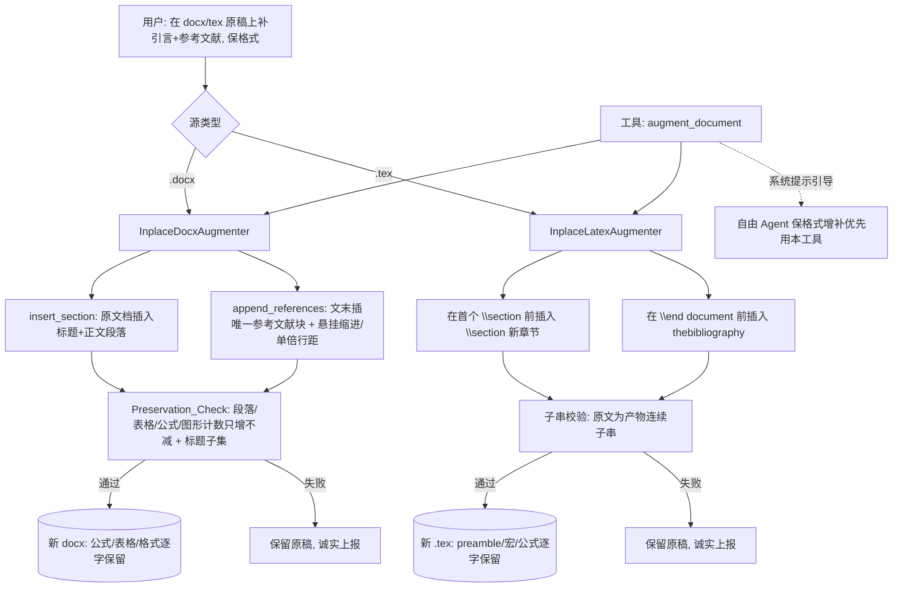

# Design Document

设计文档：inplace-augment-sections（方案 C：原稿就地增补新章节 + 参考文献，保结构）

## Overview

在既有保结构范式（`InplaceDocxPolisher` / `InplaceLatexPolisher`「只改不加」）之上，新增一层
**「只增不改」的就地增补**：直接在用户原文件（.docx/.tex）上**插入**新章节与参考文献，**从不
re-emit 原有内容**，因此原稿的公式（OMML / `\begin{equation}`）、表格、字体/样式/编号/页眉页脚、
preamble/宏等**逐字保留**；参考文献只有插入的唯一一份、套学术排版。

核心取舍：
- **只增不改（Additive_Only）**：只往原文档新增元素，绝不重写/删除原有段落/表格/公式。
- **无损校验 + 保留原稿**：产物必须包含原稿全部原有结构（docx 计数只增不减 + 标题子集；tex 原文为
  产物连续子串），否则判失败、保留原稿。
- **正确选路**：源为 docx/tex 且要保格式增补 → 走本能力，不再走 import→rebuild（丢公式的根因）。
- **复用**：docx 结构对比用 `docx_structural`；tex 插入点用 `latex_inplace` 的 preamble/postamble 正则；
  参考文献排版用 `format_reference_paragraph`；文件写出用 `atomic_write`/`atomic_finalize`。

## Architecture



## Components and Interfaces

### 1. 数据模型

```python
@dataclass
class AugmentResult:
    ok: bool
    out_path: str = ""
    inserted_sections: int = 0
    inserted_references: int = 0
    notes: list[str] = field(default_factory=list)
    error: str = ""
```

新章节输入统一为 `SectionSpec`（title + body 文本 + position）；参考文献输入为已格式化的字符串列表
或 `ReferenceEntry`（复用现有），由增补器渲染为段落 / `\bibitem`。

### 2. InplaceDocxAugmenter（docx 就地增补）

```python
class InplaceDocxAugmenter:
    def insert_section(self, in_path, out_path, *, title, body, position="start", anchor=None) -> AugmentResult: ...
    def append_references(self, in_path, out_path, *, entries, heading="参考文献") -> AugmentResult: ...
    def augment(self, in_path, out_path, *, sections=(), references=()) -> AugmentResult: ...  # 组合，一次写出
```

做法（python-docx，Additive_Only）：
- 打开原 docx（`docx.Document(in_path)`）——**不重写任何既有 run**。
- **插入新章节**：新建标题段落（Heading 样式）+ 正文段落（按空行切分为多段），用
  `paragraph.insert_paragraph_before(...)` 插到目标位置（`position="start"` → 插到第一个 body 段落前；
  `anchor` → 插到匹配锚文本的段落前）。
- **追加参考文献**：文末 `add_paragraph` 标题（受保护「参考文献」样式，复用 docx 导出器的
  `_ensure_reference_style` 思路）+ 逐条 `add_paragraph` 并 `format_reference_paragraph`（悬挂缩进 +
  单倍行距）。已存在同名参考文献标题则不重复插标题（Req 2.4）。
- **Preservation_Check**：比对 pre/post 的 `structural_fields`——`paragraphs`/`tables`/`drawings`/
  `footnote_refs` 计数**只增不减**，且 pre 的 `headings` 集合 ⊆ post 的 `headings` 集合（新增的标题
  是超集新增项）。不满足 → 丢弃产物、复制原稿、`ok=False`（Req 4.1/4.2）。
- 原子写出到独立 out_path（`atomic_finalize`），原稿只读。

### 3. InplaceLatexAugmenter（tex 就地增补）

```python
class InplaceLatexAugmenter:
    def augment(self, source: str, *, sections=(), references=()) -> tuple[str, AugmentResult]: ...
```

做法（纯文本插入，Additive_Only）：
- **插入新章节**：在**首个** `\section`（或指定锚点）前插入 `\section{title}\n{body}\n`；无 `\section`
  则插到 `\begin{document}` 之后。复用 `latex_inplace` 的 preamble 正则定位 `\begin{document}`。
- **追加参考文献**：在 `\end{document}` 前插入 `\begin{thebibliography}{99}\n\bibitem{..} ...\n\end{thebibliography}`；
  已有 `thebibliography` / `\bibliography` 则不重复插入（Req 2.4 的 tex 对应）。
- **子串校验**：断言原 `source`（去插入点外）作为**连续子串**保留于产物——实现上校验「产物 = 前缀 +
  插入内容 + 后缀」且前缀后缀拼接 == 原文（Req 4.3）。不满足 → 返回原文 + `ok=False`。

### 4. 工具接入（augment_document）

在 `agent_platform/tools/augment_tool.py` 注册 `augment_document`：
- 参数：`sections`（[{title, body, position}]）、`references`（[已格式化字符串] 或空）、`path`（缺省用
  会话导入的原文件）。
- 据源扩展名分派 docx / latex 增补器；产物写 `output/{stem}_augmented.{ext}`；`session.record(..., files=[out])`。
- 工具描述明确：**当用户给 .docx/.tex 且要「保留原格式补写章节/加参考文献」时用本工具**，不要用
  import_draft + add_section + export_paper（那会重建、丢公式）。

### 5. 选路引导

- 更新 `task_agent` 系统提示的「保格式红线」：源为 .docx/.tex 且诉求含「补/加 章节·引言·参考文献」且
  要保格式 → 用 `augment_document`（就地增补），不走重建。
- 「交付即停」终止工具集加入 `augment_document`（产出文件即收尾，与 convert/export 同级）。

## Data Models

新增：`AugmentResult` / `SectionSpec` / `InplaceDocxAugmenter` / `InplaceLatexAugmenter`。
复用：`docx_structural.structural_fields`、`latex_inplace` 的段/preamble 正则、
`export.typesetting.format_reference_paragraph`、`export.atomic_write`、`ReferenceEntry`。
不改工作区核心模型、不改护栏、不改既有润色/导出算法。

## Correctness Properties

### Property 1: 原有内容无损（docx）

增补后产物的段落/表格/公式（OMML）/图形计数均 ≥ 原稿，且原稿标题集合 ⊆ 产物标题集合。

**Validates: Requirements 1.2, 1.3, 4.1**

### Property 2: 原稿只读

任一增补执行后，用户原稿输入文件字节不变。

**Validates: Requirements 1.5, 3.4, 4.4**

### Property 3: 新章节恰好插入一次

对给定 SectionSpec，产物中该章节标题恰新增一次（无重复标题）。

**Validates: Requirements 1.1, 2.4**

### Property 4: 参考文献单份且学术排版

追加参考文献后产物中参考文献块恰一份；每条参考文献段落为悬挂缩进 + 单倍行距。

**Validates: Requirements 2.1, 2.2, 2.3**

### Property 5: latex 原文为产物子串

tex 增补后，原 `source` 拆成的前缀与后缀在产物中原位保留（产物 = 前缀 + 插入 + 后缀，且前缀+后缀
== 原文），即 preamble/宏/公式逐字保留、只在插入点新增。

**Validates: Requirements 3.1, 3.2, 3.3, 4.3**

### Property 6: 失败诚实且不毁原稿

Preservation_Check / 子串校验失败或任一步异常时，`AugmentResult.ok=False`、原稿输入文件字节不变、
不产出破坏性文件。

**Validates: Requirements 4.2, 4.4, 6.1, 6.2**

### Property 7: 向后兼容

未调用 `augment_document` 时，既有导出/润色/重建路径行为逐字节不变。

**Validates: Requirements 6.3**

## Error Handling

- python-docx 不可用 → docx 增补抛可诊断 `RuntimeError`（写盘前），不产半损坏文件（Req 6.4）。
- 找不到插入点（tex 无 `\end{document}`）→ 安全回退到末尾追加，notes 标注（Req 6.2）。
- Preservation_Check 失败 → 复制原稿到 out_path（或不产出）、`ok=False` 附原因，绝不交付破坏性产物。
- 工具层任何异常 → 捕获转为工具失败文本回灌，不崩溃（Req 6.1）。
- 新章节正文为不可信 LLM 文本 → 作为纯文本/段落插入，不 eval、不执行；长度防御式处理。

## Testing Strategy

- **单元测试**：docx 插入章节（原段落/表格/公式计数保留、标题新增一次）、追加参考文献（单份 + 悬挂
  缩进/单倍行距）、Preservation_Check 失败路径（人为破坏 → ok=False 保留原稿）；latex 插入章节/参考
  文献（原文子串保留、preamble/宏逐字）。
- **属性测试（PBT）**：Property 1（计数只增不减）、Property 2（原稿字节不变）、Property 5（tex 子串）、
  Property 6（注入失败 → 不毁原稿）、Property 3（标题恰一次）。docx 用例在无 python-docx 时跳过。
- **集成测试**：`augment_document` 工具端到端——给含公式/表格的临时 docx，补引言 + 参考文献，产物
  仍含原公式（OMML）与表格、参考文献一份且悬挂缩进；latex 同理保 preamble。
- **回归**：未调用增补时既有测试全绿、逐字节一致。

## Migration & Sequencing

加法式落地：
1. `AugmentResult`/`SectionSpec` + `InplaceLatexAugmenter`（纯文本、易测、无 docx 依赖）。
2. `InplaceDocxAugmenter`（python-docx 插入 + Preservation_Check + 参考文献排版）。
3. `augment_document` 工具接入 + 装配注册。
4. 选路引导（系统提示保格式红线 + 交付即停工具集）。
5. 属性/集成/回归收口。
