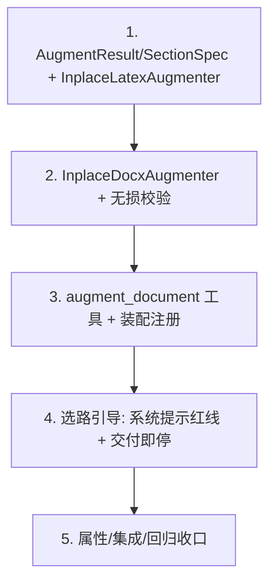

# Implementation Plan

## Overview

加法式落地"原稿就地增补新章节 + 参考文献（保结构）"：先做纯文本、易测的 LaTeX 增补器与共享
数据模型，再做 docx 增补器（python-docx 插入 + 无损校验 + 参考文献排版），然后接入
`augment_document` 工具与装配，最后加选路引导并做属性/集成/回归收口。全程复用既有件、只增不改、
失败保留原稿、不走拍平重建。

## Task Dependency Graph

```json
{
  "waves": [
    { "wave": 1, "tasks": ["1"] },
    { "wave": 2, "tasks": ["2"] },
    { "wave": 3, "tasks": ["3"] },
    { "wave": 4, "tasks": ["4"] },
    { "wave": 5, "tasks": ["5"] }
  ]
}
```



## Tasks

- [x] 1. 数据模型 + InplaceLatexAugmenter（纯文本，只增不改）
  - 在 `src/paper_agent/inplace_augment.py` 定义 `AugmentResult`、`SectionSpec`（title/body/position）
  - 实现 `InplaceLatexAugmenter.augment(source, *, sections, references)`：首个 `\section` 前（无则
    `\begin{document}` 后）插入新 `\section{...}` + 正文；`\end{document}` 前插入唯一 `thebibliography`；
    已有 bib 则不重复
  - 子串校验：产物 = 前缀 + 插入 + 后缀 且 前缀+后缀 == 原文；不满足 → 返回原文 + `ok=False`
  - 安全回退：无 `\end{document}` → 末尾追加 + notes 标注；异常不抛
  - 单元测试：插入章节/参考文献后 preamble/宏/公式逐字保留、原文为产物子串、bib 单份、无 section 的回退
  - _Requirements: 3.1, 3.2, 3.3, 3.4, 4.3, 6.2_

- [x] 2. InplaceDocxAugmenter（python-docx 插入 + Preservation_Check + 参考文献排版）
  - 在 `src/paper_agent/inplace_augment.py` 实现 `InplaceDocxAugmenter`：`insert_section`（标题段 +
    正文多段，`position="start"` 用 `insert_paragraph_before`，`anchor` 定位）、`append_references`
    （文末唯一参考文献块，复用 `format_reference_paragraph` 悬挂缩进+单倍行距、`_ensure_reference_style`
    受保护样式；同名标题去重）、`augment`（组合一次写出）
  - **只增不改**：绝不重写既有 run；Preservation_Check 用 `docx_structural.structural_fields` 断言
    段落/表格/图形/脚注计数只增不减 + 原标题集合 ⊆ 产物标题集合；失败 → 复制原稿、`ok=False`
  - 原子写出独立 out_path（`atomic_finalize`），原稿只读；python-docx 不可用抛可诊断 RuntimeError
  - 单元测试：插入章节后原段落/表格/公式(OMML)计数保留、标题新增一次；参考文献单份+悬挂缩进；
    人为破坏触发 Preservation_Check 失败 → 保留原稿；原稿字节不变（python-docx 缺失跳过）
  - _Requirements: 1.1, 1.2, 1.3, 1.4, 1.5, 2.1, 2.2, 2.3, 2.4, 4.1, 4.2, 4.4, 6.4_

- [x] 3. augment_document 工具 + 装配注册
  - 在 `src/paper_agent/agent_platform/tools/augment_tool.py` 注册 `augment_document`：参数
    `sections`/`references`/`path`（缺省用 profile 源文件）；按扩展名分派 docx/latex 增补器；产物写
    `output/{stem}_augmented.{ext}`；`session.record(..., files=[out])`；异常转工具失败文本
  - 在 `app._build_registry` 注册该工具（inplace_llm 无关，纯结构操作）
  - 单元测试：docx/tex 分派正确、产物为新文件、缺源报错、异常隔离
  - _Requirements: 5.1, 5.3, 6.1_

- [x] 4. 选路引导（系统提示红线 + 交付即停）
  - 更新 `task_agent._SYSTEM_PROMPT` 保格式红线：源为 .docx/.tex 且要「保格式补写章节/加参考文献」→
    用 `augment_document`（就地增补），不用 import_draft+add_section+export_paper（会重建丢公式）
  - 把 `augment_document` 加入 `_TERMINAL_TOOLS`（产出文件即收尾）
  - 单元测试：`augment_document` 命中交付即停（产出文件后本轮收尾，不越界）
  - _Requirements: 5.1, 5.2, 6.3_

- [x] 5. 属性测试与集成/回归收口
  - hypothesis 覆盖 Property 1-7 各至少一条：docx 计数只增不减、原稿字节不变、章节标题恰一次、
    参考文献单份+排版、tex 原文子串、失败不毁原稿、向后兼容
  - 集成：给含公式/表格的临时 docx，`augment_document` 补引言+参考文献 → 产物仍含 OMML 公式与表格、
    参考文献一份且悬挂缩进；tex 同理保 preamble
  - 回归：未调用增补时既有导出/润色测试全绿、逐字节一致
  - _Requirements: 1.2, 1.3, 2.1, 3.3, 4.1, 4.3, 6.3_

## Notes

- **只增不改**：增补只新增元素，绝不 re-emit 原有内容 → 公式/表格/格式逐字保留（治本，非缝补）。
- **失败保留原稿**：无损校验/子串校验不过即判失败、保留原稿，绝不交付破坏性产物。
- **正确选路**：源为成品稿且要保格式增补 → 走本能力，不再拍平重建（公式丢失的根因）。
- **复用而非重写**：docx 结构对比 / tex 插入点 / 参考文献排版 / 原子写出全部复用现成件。
- **加法式**：未调用 `augment_document` 时平台行为逐字节不变。
