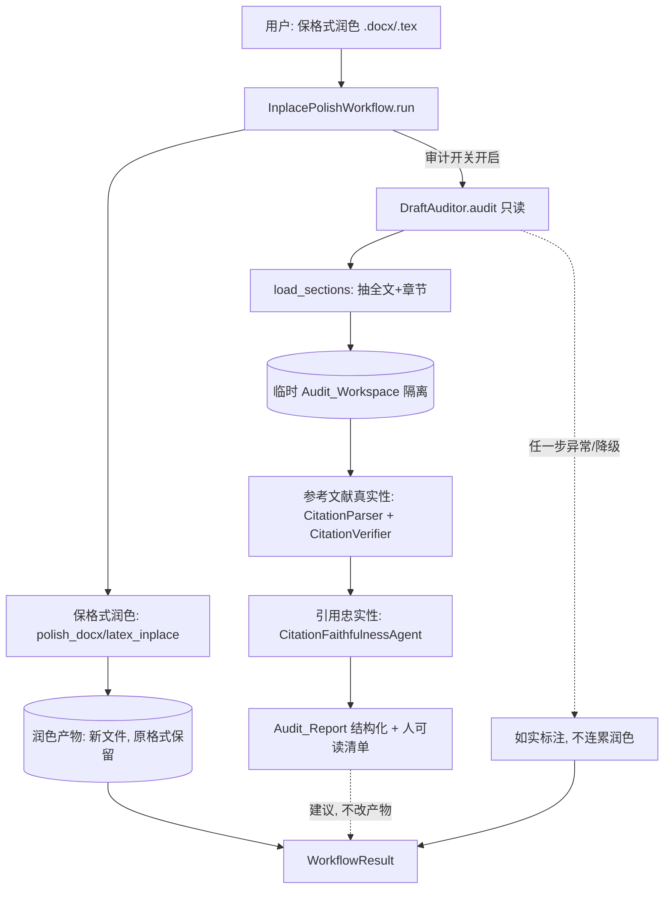

# Design Document

设计文档：inplace-polish-audit（方案 B：保格式润色 + 只读审计旁路）

## Overview

在既有 `InplacePolishWorkflow`（保格式润色）之上**并行挂一条只读审计旁路**：润色照常产出
保原格式的新文件；审计另起一个**临时、隔离**的 `Audit_Workspace`，把原稿抽成结构化内容，
复用现成的两项能力——参考文献真实性核验（`CitationParser` + `CitationVerifier`）与引用忠实性
核验（`CitationFaithfulnessAgent` + `FaithfulnessJudge`）——产出一份**建议性** `Audit_Report`
随润色结果返回。

核心取舍：
- **只读、隔离**：审计走独立临时工作区，绝不写用户真实工作区、绝不改润色产物（Req 2）。
- **复用而非重写**：文本抽取用 `load_sections`，文献解析/核验/忠实性判定全部复用既有件
  （不新造第二套）。
- **加法式、故障隔离**：审计任何异常/降级都不连累润色产物；开关关闭时行为逐字节不变（Req 6/7）。
- **诚实**：查不到 / grounding 不足 / 检索不可用 → 一律 cannot_verify，绝不假判 supported（Req 3/4）。

## Architecture



审计与润色在数据上完全分离：润色只碰用户原文件与其产物；审计只碰临时工作区与被引文献元数据。
二者唯一的汇合点是把 `Audit_Report` 附到 `WorkflowResult`（建议性文本），不产生任何反向写入。

## Components and Interfaces

### 1. 数据模型

```python
@dataclass
class ReferenceAuthenticityFinding:
    index: int                 # 原文编号
    title: str
    verdict: str               # "real" | "unverifiable" | "retrieval_unavailable"
    note: str = ""             # 如"年份可能有误：原文2019，真实2020"

@dataclass
class AuditReport:
    ran: bool                                  # 审计是否实际执行（开关/依赖）
    reference_total: int = 0
    reference_real: int = 0
    reference_unverifiable: int = 0
    authenticity: list[ReferenceAuthenticityFinding] = field(default_factory=list)
    faithfulness: list[dict] = field(default_factory=list)   # 复用 CitationFaithfulnessFinding.to_dict()
    notes: list[str] = field(default_factory=list)           # 降级/未完成说明（诚实）
    def render(self) -> str: ...                              # 人可读问题清单（脱敏、标"建议"）
    def has_findings(self) -> bool: ...
```

### 2. DraftAuditor（只读审计器，新增）

```python
class DraftAuditor:
    def __init__(
        self,
        verifier: CitationVerifier,
        faithfulness_agent_factory,   # () -> CitationFaithfulnessAgent | None
        *,
        retrieval_available: bool,
        claim_excerpt_max: int = 200,
    ): ...

    def audit(self, source_path: str) -> AuditReport:
        """只读审计一个原稿文件；全程异常隔离，绝不抛出（Req 6.1）。"""
```

流程（写死、无 LLM 编排）：
1. `text, triples = load_sections(source_path)`；无内容 → `AuditReport(ran=True, notes=["无法解析"])`（Req 6.2）。
2. 构造临时 `Audit_Workspace`（内存对象，不经 `repo`）：`original_draft=text`、
   `section_drafts` 来自 `triples`（Req 2.1/2.2）。
3. **真实性**：`CitationParser().parse(text)` → 逐条 `verifier.verify_by_metadata`；据结果
   填 `authenticity` 与统计，真实者以「保留原文编号」纳入临时工作区 `verified_references`
   （仅供后续忠实性判定用，绝不落用户工作区）。`retrieval_available=False` → 全标
   `retrieval_unavailable`，跳过网络（Req 3.4 / 7.2）。
4. **忠实性**：若判定器可用，构造 `CitationFaithfulnessAgent`（注入 `FaithfulnessJudge`），
   在临时工作区上 `run`，取其产出的 finding 列表填 `faithfulness`（Req 4）。判定器不可用
   （mock）→ 跳过并在 notes 标注（Req 7.2）。
5. 汇总为 `AuditReport`。任一步异常 → 捕获、记 notes、继续（Req 6.1/6.3）。

依赖注入：`verifier` 与判定器工厂由装配层传入（与既有 `add_references` / faithfulness
装配同源），`DraftAuditor` 不自行实例化 provider（依赖倒置）。

### 3. InplacePolishWorkflow 接入

`InplacePolishWorkflow` 增加可选 `auditor: DraftAuditor | None`：

```python
class InplacePolishWorkflow:
    def __init__(self, llm, *, auditor: DraftAuditor | None = None): ...
    def run(self, ctx, params) -> WorkflowResult:
        # 1) 既有保格式润色（不变）→ 得到产物文件
        # 2) 若 auditor 且润色成功 → report = auditor.audit(src)
        #    把 report.render() 追加到 WorkflowResult.notes（建议性），report 也存 result 供程序读
```

- 审计**在润色产物已生成之后**运行，且只读原稿；不改产物（Req 1.3）。
- `auditor=None`（开关关闭/未装配）→ 与现状逐字节一致（Req 7.3）。

### 4. 装配（app / build_agent_app）

- 新增 `DraftAuditor`：`verifier` 复用既有 `CitationVerifier`；判定器工厂用 reviewer_llm
  （无则 base_llm）+ `StructuredParser` 构造 `FaithfulnessJudge` → `CitationFaithfulnessAgent`。
- `retrieval_available`：据 config（真实 provider 且非 mock）判定。
- 开关 `inplace_audit_enabled`（Config，默认 True；mock/无检索时自动降级为不可核验报告）。
- 仅当开关开启且依赖可用时把 `auditor` 注入 `InplacePolishWorkflow`；否则注入 None。

## Data Models

新增：`ReferenceAuthenticityFinding` / `AuditReport` / `DraftAuditor`。
复用：`load_sections`、`CitationParser`、`CitationVerifier`、`CitationFaithfulnessAgent`、
`FaithfulnessJudge`、`StructuredParser`、`PaperWorkspace`（临时实例）、`WorkflowResult`、
既有 `Intent.INPLACE_POLISH` 工作流装配路径。不改工作区核心模型、不改护栏、不改润色算法。

## Correctness Properties

### Property 1: 审计不改润色产物

对任意原稿，运行带审计的 Inplace_Polish 后，润色产物文件的字节与「关闭审计时」产出的同一
产物字节一致。

**Validates: Requirements 1.3, 6.4**

### Property 2: 审计不污染用户工作区

审计运行前后，用户真实工作区（`repo` 中的 `PaperWorkspace`）的 `section_drafts` /
`verified_references` / `original_draft` 均不被审计改变。

**Validates: Requirements 2.1, 2.2, 2.3**

### Property 3: 原稿只读

审计运行后，用户原稿输入文件字节不变。

**Validates: Requirements 2.4**

### Property 4: 绝不假判 supported

对任意输入，`AuditReport.faithfulness` 中裁决为 supported / weak_support 的条目，其被引文献
必已通过真实性核验且 grounding 充足；检索不可用 / 未核验 / grounding 不足的引用一律为
cannot_verify。

**Validates: Requirements 3.4, 4.2, 4.4**

### Property 5: 故障隔离与诚实降级

审计任一子步骤抛异常或依赖不可用时，`audit` 不抛出、返回带 notes 标注的 `AuditReport`，且
Inplace_Polish 产物仍正常返回（`WorkflowResult.files` 非空、`ok` 不因审计失败翻转）。

**Validates: Requirements 6.1, 6.2, 6.3, 6.4**

### Property 6: 检索不可用即全不可核验

当 `retrieval_available=False`，`authenticity` 中每条裁决为 `retrieval_unavailable`，且
`faithfulness` 不含 supported/weak_support（无可信 grounding）。

**Validates: Requirements 3.4, 4.4, 7.2**

### Property 7: 向后兼容

`auditor=None` 时 `InplacePolishWorkflow.run` 的 `WorkflowResult`（files/ok/notes）与本特性
引入前逐字节一致。

**Validates: Requirements 7.3, 1.2**

### Property 8: 报告摘录脱敏有界

`AuditReport.render()` 及各 finding 的文本摘录长度均不超过配置上限。

**Validates: Requirements 5.4**

## Error Handling

- `load_sections` 失败 / 无内容 → `AuditReport(ran=True, notes=["无法解析原稿，未能审计"])`，不抛。
- `CitationParser` 解析不出文献 → 真实性统计为 0，notes 说明「未发现参考文献表」。
- `verify_by_metadata` 抛 `RetrievalError` / 超时 → 该条标 unverifiable/retrieval_unavailable，继续。
- 判定器不可用（mock provider）→ 跳过忠实性、notes 标注「判定器不可用，未做忠实性核验」。
- 忠实性单对异常 → 由 `CitationFaithfulnessAgent` 既有逐对隔离兜底（cannot_verify）。
- 审计整体异常 → 捕获，`WorkflowResult` 仍带润色产物，notes 追加「审计异常，未完成」。
- 外部/LLM 输出一律不可信：复用既有防御式解析，不 eval，摘录截断。

## Testing Strategy

- **单元测试**：`DraftAuditor.audit` 各分支——有/无参考文献、检索可用/不可用（fake verifier）、
  判定器可用/mock；`AuditReport.render` 脱敏与「无问题」文案。
- **隔离测试**：审计后断言用户工作区 `repo` 内容不变、原稿文件字节不变、润色产物字节与
  「关闭审计」一致（Property 1/2/3）。
- **属性测试（PBT）**：Property 4（绝不假 supported）、Property 6（检索不可用全 cannot_verify）、
  Property 5（注入抛异常的子步骤 → 不抛且产物仍在）、Property 7（auditor=None 逐字节一致）。
- **集成测试**：`InplacePolishWorkflow(auditor=...)` 端到端——用 fake verifier + fake judge 的
  临时 tex/docx，产物为新文件、报告含真实性统计与忠实性发现；`auditor=None` 回归既有测试全绿。
- 真实 pandoc/检索用例在不可用时跳过；核心分支用注入的 fake 依赖，确定可测。

## Migration & Sequencing

加法式落地（每步未启用即行为不变）：
1. 数据模型 `AuditReport` / `ReferenceAuthenticityFinding` + `render`（纯逻辑，可单测）。
2. `DraftAuditor`（复用 load_sections/CitationParser/CitationVerifier/CitationFaithfulnessAgent，
   临时工作区隔离，故障隔离）。
3. `InplacePolishWorkflow` 接入可选 `auditor`（默认 None → 行为不变）。
4. 装配开关 `inplace_audit_enabled` + 依赖装配 + 降级；意图路由 `INPLACE_POLISH` 注入 auditor。
5. 属性/隔离/集成/回归收口。
