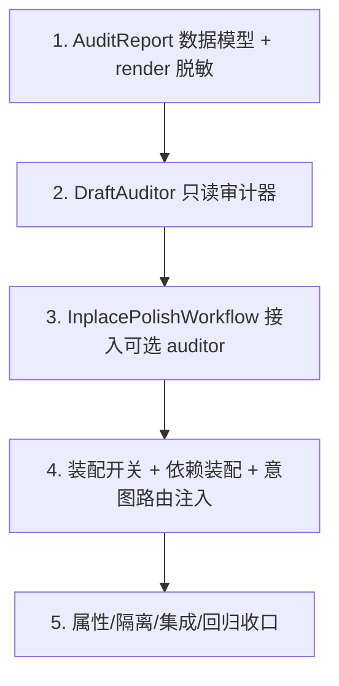

# Implementation Plan

## Overview

加法式落地"保格式润色 + 只读审计旁路"：先做纯逻辑的报告数据模型，再做隔离的
`DraftAuditor`（复用现有文献解析/真实性核验/忠实性核验），然后把它作为可选依赖接进
`InplacePolishWorkflow`（默认 None → 行为不变），最后经装配开关接线并做属性/隔离/回归收口。
全程复用既有件、不改护栏、不改润色算法、不走脆弱的文本往返回写。

## Task Dependency Graph

```json
{
  "waves": [
    { "wave": 1, "tasks": ["1"] },
    { "wave": 2, "tasks": ["2"] },
    { "wave": 3, "tasks": ["3"] },
    { "wave": 4, "tasks": ["4"] },
    { "wave": 5, "tasks": ["5"] }
  ]
}
```



## Tasks

- [x] 1. Audit 报告数据模型 + 人可读渲染（脱敏）
  - 在 `src/paper_agent/agent_platform/audit.py` 定义 `ReferenceAuthenticityFinding` 与
    `AuditReport`（字段见设计）：真实性统计、`authenticity` 列表、`faithfulness` 列表（存
    `CitationFaithfulnessFinding.to_dict()`）、`notes`、`ran`
  - 实现 `AuditReport.render()`：渲染简洁人可读问题清单，标明"建议"；无问题时输出明确的
    "均可核验、未发现明显不支撑"文案；对一切文本摘录施加 `claim_excerpt_max` 长度上限
  - 实现 `has_findings()`
  - 单元测试：有问题/无问题两种渲染；摘录超限被截断；空报告文案
  - _Requirements: 5.1, 5.2, 5.3, 5.4_

- [x] 2. DraftAuditor：只读、隔离、故障隔离的审计器
  - 在 `audit.py` 实现 `DraftAuditor.audit(source_path) -> AuditReport`：`load_sections` 抽全文+
    章节 → 构造**临时** `PaperWorkspace`（不经 repo）→ `CitationParser` 解析文献 →
    `CitationVerifier.verify_by_metadata` 逐条核验真实性（保留原文编号纳入临时工作区
    verified_references，仅供忠实性用）→ 若判定器可用则 `CitationFaithfulnessAgent.run` 做
    忠实性 → 汇总 `AuditReport`
  - `retrieval_available=False` → 真实性全标 `retrieval_unavailable`、跳过网络；判定器不可用
    → 跳过忠实性并在 notes 标注
  - 全程异常隔离：任一步 try/except，记 notes、继续，`audit` 绝不抛出
  - 依赖注入：`verifier` 与判定器工厂经构造传入，不在内部实例化 provider
  - 单元测试（fake verifier + fake/None judge）：有/无文献、检索可用/不可用、判定器可用/不可用；
    断言临时工作区不经 repo、原稿文件字节不变
  - _Requirements: 2.1, 2.2, 2.3, 2.4, 3.1, 3.2, 3.3, 3.4, 4.1, 4.2, 4.3, 4.4, 6.1, 6.2, 6.3_

- [x] 3. InplacePolishWorkflow 接入可选 auditor
  - 给 `InplacePolishWorkflow.__init__` 加可选 `auditor: DraftAuditor | None = None`
  - `run`：既有保格式润色不变；**产物生成成功后**，若 `auditor` 非空则对原稿 `audit`，把
    `report.render()` 追加到 `WorkflowResult.notes`（建议性），并把结构化 report 暴露供程序读取
  - 审计不改产物、不翻转 `ok`；`auditor=None` 时逐字节保持现状
  - 单元测试：注入 fake auditor → notes 含报告且 files/ok 不变；`auditor=None` → 与现状一致
  - _Requirements: 1.1, 1.3, 1.4, 6.4, 7.3_

- [x] 4. 装配开关 + 依赖装配 + 意图路由注入
  - `Config` 加 `inplace_audit_enabled`（默认 True）；`build_agent_app`/`app` 构造 `DraftAuditor`
    （复用 `CitationVerifier`；判定器用 reviewer_llm 否则 base_llm + `StructuredParser` +
    `FaithfulnessJudge` → `CitationFaithfulnessAgent`），据 config 与检索可用性决定注入 auditor 或 None
  - `_build_routing` 里把 auditor 注入 `Intent.INPLACE_POLISH` 的 `InplacePolishWorkflow`
  - mock/无检索 provider → 自动降级为不可核验报告，不崩溃、不阻断润色
  - 集成测试（Mock LLM + fake retrieval）：开关开→润色产物 + 审计报告；开关关→仅润色、行为不变
  - _Requirements: 7.1, 7.2, 7.3, 1.2_

- [x] 5. 属性测试与回归收口
  - 用 hypothesis 覆盖 Property 1-8 各至少一条：产物字节不受审计影响、工作区不被污染、原稿只读、
    绝不假判 supported、检索不可用全 cannot_verify、故障隔离（注入抛异常子步骤仍不抛且产物在）、
    向后兼容（auditor=None 逐字节一致）、报告摘录有界
  - 向后兼容回归：`inplace_audit_enabled=False` / `auditor=None` 时既有 inplace 测试全绿、逐字节一致
  - 端到端：给一份含真/假参考文献的临时 tex，走带审计的 InplacePolishWorkflow，报告如实区分真伪
    并列出不支撑引用
  - _Requirements: 1.2, 1.3, 2.1, 2.4, 3.4, 4.2, 4.4, 5.4, 6.1, 7.3_

## Notes

- **只读旁路**：审计只生成报告，绝不驱动对润色产物的字节级改写；不走"文本往返回写"。
- **隔离**：审计用临时 `PaperWorkspace`，不经 `repo`、不落用户工作区。
- **复用而非重写**：`load_sections` / `CitationParser` / `CitationVerifier` /
  `CitationFaithfulnessAgent` / `FaithfulnessJudge` 全部复用现成实现。
- **诚实**：查不到 / grounding 不足 / 检索不可用 → cannot_verify；绝不假判 supported。
- **加法式**：`auditor=None` 或开关关闭时，平台行为与本特性引入前逐字节一致。
