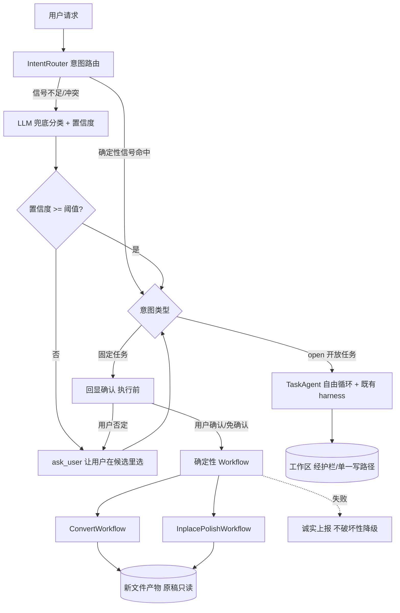

# Design Document

设计文档：intent-routing-and-workflows

## Overview

在既有 `agent_platform`（`ChatController` / `TaskAgent` / 工具 / 护栏 / acceptance）之上，
**前置一个分层执行层**，把"固定流程任务"从自由智能体手里拿走：

1. **意图路由**（`IntentRouter`）：确定性信号（文件后缀 + 关键词）优先判定意图；不足/冲突才用
   LLM 兜底并给置信度；意图限定有限枚举。
2. **澄清 + 回显确认**（复用既有 `Elicitor` / `ask_user`）：低置信 → 让用户在候选里选；命中固定
   任务 → 执行前回显意图供纠正。
3. **确定性工作流**（`Workflow` 协议 + `ConvertWorkflow` / `InplacePolishWorkflow`）：步骤/工具/
   参数写死，复用已有的 `convert_document` / `polish_docx_inplace` / `polish_latex_inplace` 能力，
   顶层 LLM 不参与编排。
4. **自由智能体兜底**：意图为 `open` → 走既有 `TaskAgent`（保留护栏/有界性/交付即停）。

核心取舍：**能用确定性规则判的意图不用 LLM；能写死流程的任务不用自由编排。** LLM 只在两处
出现——"信号模糊时的兜底分类"（有置信度 + 低置信必问）与"开放式写作本身"。误判有四层防御
（信号优先 / 低置信问 / 执行前回显 / 产物无损可回退），最坏情况只是一次可纠正的小摩擦。

## Architecture



## Components and Interfaces

### 1. 数据模型

```python
class Intent(str, Enum):
    CONVERT_FORMAT = "convert_format"     # 跨格式转换（.tex↔docx↔md）
    INPLACE_POLISH = "inplace_polish"     # 保结构语言润色（原 .tex/.docx）
    OPEN = "open"                         # 开放任务 → 自由智能体

@dataclass
class RouteDecision:
    intent: Intent
    confidence: float                     # 0..1；确定性信号命中记为 1.0
    params: dict                          # 抽出的参数（to_format / source_path / two_column ...）
    signals: list[str]                    # 命中的确定性信号（可观测/可解释）
    needs_confirmation: bool              # 是否需要执行前回显确认
    candidates: list[Intent]              # 低置信时供用户选择的候选
```

### 2. IntentRouter（确定性信号优先）

```python
class IntentRouter:
    def __init__(self, *, llm=None, confidence_threshold=0.6, always_confirm_fixed=True): ...
    def route(self, request_text: str, ws) -> RouteDecision: ...
```

判定流程（严格按序，越靠前越不依赖模型）：
1. **确定性信号**：
   - 源文件扩展名（`ws.profile['source_document_ext']` 或请求中的路径）：`.tex`/`.docx`/`.md`。
   - 关键词表：转格式（`转|转成|convert|导出为|docx|word|latex|pdf`）、保结构润色
     （`润色|保留格式|保结构|不改格式|原样`）。
   - 规则命中唯一意图 → `confidence=1.0`，不调 LLM（Req 1.2）。
   - 规则命中多个互相冲突意图 → 低置信，进澄清（Req 2.2）。
3. **LLM 兜底**（仅信号不足时）：给出 `intent ∈ 枚举` + `confidence`；限定单选（Req 1.4）。
4. 置信度 < 阈值 → `needs_confirmation` 经候选澄清（Req 2.1）。
- 参数抽取（`to_format` / `two_column` 等）同样优先用确定性信号（关键词/后缀），LLM 不自由决定。

### 3. 澄清与回显确认（复用 Elicitor）

- **低置信澄清**：`ask_user("你是想①转格式 ②保结构润色 ③其它？")`，用户选择后确定意图。
- **执行前回显**：固定任务执行前 `ask_user("我理解你要把 X.tex 转成 docx（双栏），开始？")`；
  用户否定 → 回到澄清（Req 3.1/3.2）。`always_confirm_fixed=False` 且高置信时可跳过（Req 3.3）。
- 复用既有 `Elicitor`（`CLIElicitor` 交互读终端 / `AutoElicitor` 非交互默认）。

### 4. Workflow 抽象与实现

```python
@dataclass
class WorkflowResult:
    ok: bool
    files: list[str]
    notes: list[str]
    unresolved: list[str]                 # 失败/未达成项（诚实上报）

class Workflow(Protocol):
    intent: Intent
    def run(self, ctx: ToolContext, params: dict) -> WorkflowResult: ...
```

- **ConvertWorkflow**（`Intent.CONVERT_FORMAT`）：固定步骤 = 解析源 → pandoc 直转（保公式）→
  修表格列宽 → 三线表 → 双栏（按 params）→ 套排版。**直接复用** `convert_tool` 里已实现的
  `PandocConverter.convert_file` + `_fix_table_widths` + `_apply_three_line_table_style` +
  `_set_two_columns` + 排版应用——这些已经是确定性的，工作流只是把它们按固定序编排。
- **InplacePolishWorkflow**（`Intent.INPLACE_POLISH`）：按源扩展名选 `InplaceDocxPolisher` /
  `InplaceLatexPolisher`（保结构润色，已有守卫/结构 diff 闸/回滚）。
- 二者产物写新文件、原稿只读（Req 5.1）；失败经 `unresolved` 上报、不降级重建（Req 5.2）；
  任何写工作区步骤仍经护栏/单一写路径（Req 5.4）。

### 5. 编排接入（ChatController）

- `ChatController.send` 前置路由：`decision = router.route(user_text, ws)`。
  - 固定任务 → （回显确认后）执行对应 `Workflow`，把结果渲染为答复；**不进** `TaskAgent`。
  - `open` 或路由回退 → 走既有 `agent.converse`（Req 6.1，行为不变）。
- 路由开关 `routing_enabled`（默认可配）；关闭 → 全部走既有 `converse`（Req 7.1）。
- 收尾建议（缺章节提议等）与既有 acceptance 仍适用于两条分支的产出。

## Data Models

新增：`Intent` / `RouteDecision` / `WorkflowResult` / `Workflow`（协议）。
复用：`ToolContext`、`Elicitor`、`PandocConverter`、`InplaceDocxPolisher` / `InplaceLatexPolisher`、
`convert_tool` 的后处理函数、护栏与单一写路径。不改工作区核心模型。

## Correctness Properties

### Property 1: 确定性信号路由可复现

给定相同的 `request_text` 与工作区信号（后缀/关键词），`route` 在"确定性信号命中"路径上的
判定结果确定、不依赖 LLM。

**Validates: Requirements 1.1, 1.2, 5.3**

### Property 2: 意图取值封闭

`route` 返回的 `intent` 恒在有限枚举内（固定任务类型 ∪ `open`），不产生枚举外意图。

**Validates: Requirements 1.4**

### Property 3: 低置信必问、问前不动手

当置信度低于阈值或信号冲突时，`route` 结果要求澄清；在澄清完成前不执行任何工作流或工具。

**Validates: Requirements 2.1, 2.2, 2.3**

### Property 4: 固定任务不经模型编排

命中固定任务时，工具调用序列由 `Workflow` 代码决定；顶层 LLM 不参与该序列的工具选择/排序。

**Validates: Requirements 4.1, 4.2**

### Property 5: 原稿无损

任一工作流执行后，用户原始输入文件字节不变；产物写入独立新文件。

**Validates: Requirements 5.1**

### Property 6: 失败诚实、不破坏性降级

工作流某步失败时，结果 `ok=False` 且 `unresolved` 非空；不产出"看似成功实则破坏格式/丢公式"的
降级产物。

**Validates: Requirements 5.2**

### Property 7: 写入仍经护栏

工作流中任何改工作区的步骤经既有护栏与单一写路径，不绕过反幻觉/引用真实性。

**Validates: Requirements 5.4**

### Property 8: 向后兼容

路由未启用或未命中固定任务时，请求走既有 `TaskAgent`/`converse` 路径，行为逐字节不变。

**Validates: Requirements 7.1, 7.2, 6.3**

### Property 9: 回显可拦截误判

固定任务执行前回显确认；用户否定时工作流不执行。

**Validates: Requirements 3.1, 3.2**

## Error Handling

- 路由内部异常（含 LLM 兜底失败）→ 安全回退为 `Intent.OPEN`（走自由智能体），绝不因路由失败拒绝服务。
- 工作流步骤失败 → `WorkflowResult(ok=False, unresolved=[...])` 诚实上报；不 fallback 到破坏性重建。
- 缺外部依赖（pandoc 不可用）→ 明确提示（含 `PANDOC_PATH` 指引），不静默改走重建。
- Elicitor 在非交互（`AutoElicitor`）下：低置信默认取最保守选项或回退 `open`，不擅自执行高风险固定任务。
- 外部/LLM 输出一律不可信：防御式解析、限定枚举、不 eval。

## Testing Strategy

- **单元测试**：`IntentRouter` 确定性信号（各后缀+关键词组合 → 期望意图）、冲突→低置信、参数抽取；
  `ConvertWorkflow` / `InplacePolishWorkflow` 的固定步骤序列与产物（真实 pandoc 用例在无 pandoc 时跳过）。
- **属性测试（PBT）**：Property 1-9 各至少一条。重点：确定性信号可复现、意图封闭、低置信必问、
  原稿无损（断言输入文件字节不变）、向后兼容（未命中时走既有路径）。
- **集成测试（Mock LLM + ScriptedElicitor）**：
  - "转格式"请求 → 走 ConvertWorkflow、不进 TaskAgent、产物为新文件；
  - 模糊请求 → 触发澄清、用户选择后执行；
  - 回显否定 → 不执行；
  - `open` 请求 → 走既有 TaskAgent（行为不变）。
- **向后兼容回归**：`routing_enabled=False` 时既有测试全绿、逐字节一致。

## Migration & Sequencing

按依赖与价值排序、加法式落地（未启用即行为不变）：
1. `IntentRouter`（数据模型 + **LLM 单选分类**为主 + 确定性信号加速/校验 + 置信度；异常回退 open）。
2. 澄清 + 回显确认（复用 Elicitor）：低置信/冲突抛确认问题让用户选。
3. `Workflow` 抽象 + `ConvertWorkflow`（复用现有 convert 能力）——最痛的转格式先落地。
4. `InplacePolishWorkflow`。
5. 接入 `ChatController`（路由分流 + 开关），open/回退走既有 `TaskAgent`。
6. 属性/集成/回归收口。

各步均加法式：任一步未启用时平台行为与现状一致。
