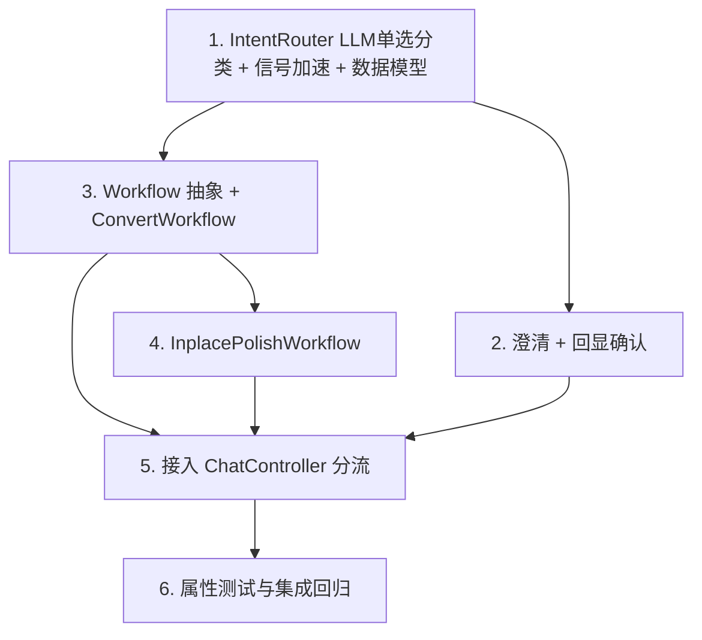

# Implementation Plan

## Overview

按"确定性优先、加法式接入、未启用即行为不变"落地分层执行架构：先做纯规则的意图路由（不接
LLM），再做澄清/回显确认，然后把最痛的"转格式"固化成确定性工作流并接入对话分流，最后补保结构
润色工作流、LLM 兜底分类与属性/回归收口。全程复用既有 `convert_tool` / inplace 润色 / 护栏 /
Elicitor 能力，不侵入 `TaskAgent` 循环核心。

## Task Dependency Graph

```json
{
  "waves": [
    { "wave": 1, "tasks": ["1"] },
    { "wave": 2, "tasks": ["2", "3"] },
    { "wave": 3, "tasks": ["4"] },
    { "wave": 4, "tasks": ["5"] },
    { "wave": 5, "tasks": ["6"] }
  ]
}
```



## Tasks

- [x] 1. IntentRouter：LLM 单选分类（主）+ 确定性信号加速/校验 + 数据模型
  - 在 `src/paper_agent/agent_platform/routing.py` 定义 `Intent`（枚举：convert_format / inplace_polish / open）、`RouteDecision`
  - 实现 `IntentRouter.route(request_text, ws)`：**LLM 单选分类为主**——把请求 + 可用信号交给 LLM，要求从有限枚举里选一个意图 + `confidence` + 一句意图复述（结构化输出、防御式解析、限定枚举、LLM 只分类不编排）
  - **确定性信号作加速/校验**：源文件后缀 + 少量强关键词；明显命中唯一意图可高置信/省一次 LLM 调用；与 LLM 冲突则降置信；信号不追求覆盖所有说法
  - 参数抽取（to_format / two_column / source_path）：信号能定的用信号，其余随 LLM 结构化产出；LLM/信号异常 → 回退 `Intent.OPEN`
  - 单元测试（Mock LLM）：LLM 分类归一到枚举；枚举外输出→回退/归一；信号明显命中→高置信可复现；信号与 LLM 冲突→降置信；无信号→依 LLM；异常→open
  - _Requirements: 1.1, 1.2, 1.3, 1.4_

- [x] 2. 澄清 + 回显确认（复用 Elicitor）
  - 在 `routing.py` 实现低置信澄清（`ask_user` 在候选意图里选）与固定任务执行前回显确认（复述意图+参数，用户否定则回澄清）
  - 复用既有 `Elicitor`（CLIElicitor/AutoElicitor）；非交互默认取最保守项或回退 open，不擅自执行固定任务
  - `always_confirm_fixed` 可配（默认对固定任务回显）
  - 单元测试（ScriptedElicitor）：低置信→问且问前不执行；回显否定→不执行；确认→放行
  - _Requirements: 2.1, 2.2, 2.3, 3.1, 3.2, 3.3_

- [x] 3. Workflow 抽象 + ConvertWorkflow（转格式，最痛先做）
  - 在 `src/paper_agent/agent_platform/workflows/` 定义 `Workflow` 协议与 `WorkflowResult`
  - 实现 `ConvertWorkflow`：固定步骤 = 解析源 → `PandocConverter.convert_file` 直转 → `_fix_table_widths` → `_apply_three_line_table_style` → `_set_two_columns`（按 params）→ 套排版；**复用** convert_tool 现有函数，工具序列写死、不经 LLM 编排
  - 产物写新文件、原稿只读；失败经 `unresolved` 诚实上报、不降级重建；缺 pandoc 明确提示（含 PANDOC_PATH）
  - 单元测试：固定步骤序列；产物为新文件、原稿字节不变；失败上报（真实 pandoc 用例无 pandoc 时跳过）
  - _Requirements: 4.1, 4.2, 4.3, 5.1, 5.2, 5.3, 5.4_

- [x] 4. InplacePolishWorkflow（保结构润色）
  - 实现 `InplacePolishWorkflow`：按源扩展名选 `InplaceDocxPolisher` / `InplaceLatexPolisher`（保结构、守卫、结构 diff 闸/回滚已有）
  - 产物写新文件、原稿只读；失败诚实上报
  - 单元测试：docx/tex 分派正确；产物为新文件、原稿不变；守卫拦截逻辑复用验证
  - _Requirements: 4.1, 4.2, 5.1, 5.2, 5.4_

- [x] 5. 接入 ChatController 分流 + 路由开关
  - `ChatController.send` 前置 `router.route`：固定任务→（回显确认后）执行对应 Workflow、渲染答复、**不进** TaskAgent；`open`/回退→既有 `agent.converse`
  - 加 `routing_enabled` 开关（默认可配）；关闭或未命中→全部走既有 converse（向后兼容）
  - 装配层（app / build_agent_app）构造 IntentRouter + Workflow 注册表并注入 ChatController
  - 集成测试（Mock LLM + ScriptedElicitor）：转格式→走 ConvertWorkflow 不进 agent；模糊→澄清；回显否定→不执行；open→走既有 agent
  - _Requirements: 4.1, 6.1, 6.2, 6.3, 7.1, 7.2, 7.3_

- [x] 6. 属性测试与集成回归
  - 用 hypothesis 为 Property 1-9 各写至少一条：信号加速可复现+冲突降置信、意图封闭、低置信必问、固定任务不经模型编排、原稿无损（断言输入字节不变）、失败诚实、写入经护栏、向后兼容、回显拦截
  - 向后兼容回归：`routing_enabled=False` 时既有测试全绿、逐字节一致
  - 端到端（Mock LLM + ScriptedElicitor）：一条"转格式"请求全链路（LLM 分类→确认→ConvertWorkflow→产物）
  - _Requirements: 1.1, 1.4, 2.1, 3.1, 4.1, 5.1, 5.2, 5.4, 6.3, 7.1_

## Notes

- **依赖降在执行层**：LLM 负责"理解意图"（单选分类，鲁棒兼容各种说法），但流程执行写死、不由模型编排——这才是"降低模型依赖"的核心，而非用脆弱的关键词规则做意图主判定。
- **误判多层防御**：LLM 理解 + 用户确认 + 确定性信号交叉校验 + 产物无损可回退——误判最坏是一次可纠正的小摩擦。
- **加法式**：`routing_enabled=False` 或未命中固定任务时，平台行为与现状逐字节一致（Property 8）。
- **复用而非重写**：ConvertWorkflow/InplacePolishWorkflow 复用既有 convert_tool 与 inplace 润色能力，工作流只负责"按固定序编排 + 诚实上报"。
- **不侵入自由分支**：开放任务仍走既有 `TaskAgent`，保留护栏/有界性/交付即停。
