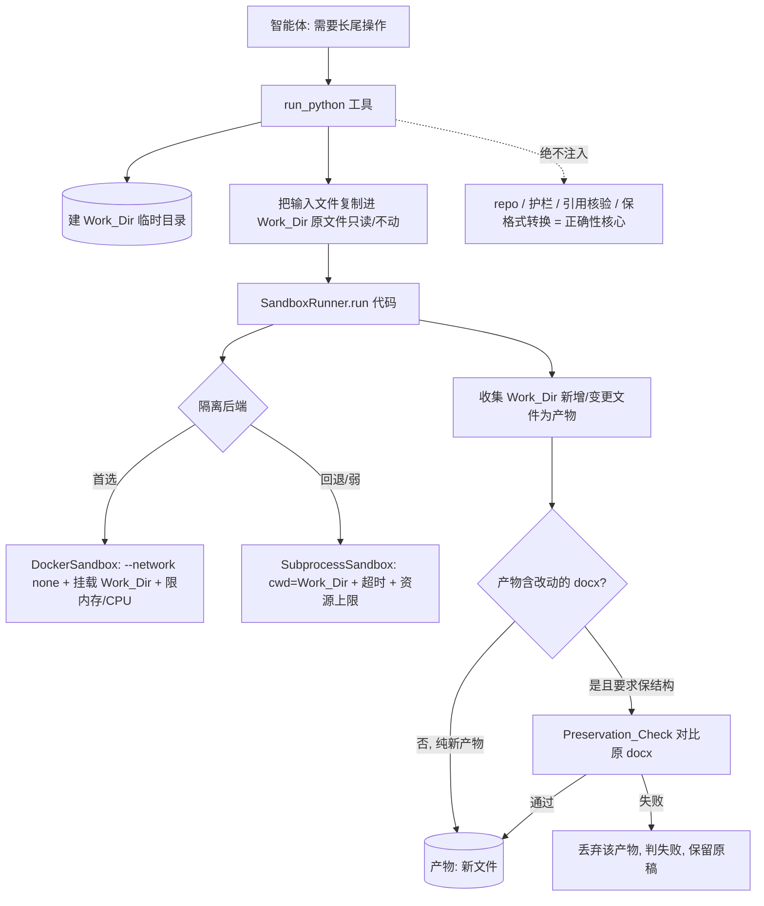

# Design Document

设计文档：sandboxed-run-python（低风险长尾工具层：受沙箱约束的通用代码执行）

## Overview

新增**一个通用工具 `run_python`**：上层智能体写一小段 Python（预装 Pillow/matplotlib/pandas/
python-docx/PyPDF），在**隔离沙箱**里跑，覆盖"拼图/裁剪/缩放/画图/合并 PDF/docx 段落微调"等
**低风险长尾**，替代"一个需求一个窄工具"的增生模式。

四条不可逾越的边界：
1. **只服务低风险长尾**——绝不替代/触碰正确性核心（引用真伪、内容护栏、忠实性、保格式转换/就地增补）。
2. **沙箱隔离**——可写范围锁定 Work_Dir、默认断网、限时/限内存。
3. **不暴露工作区写路径**——代码拿不到 `repo`/护栏落盘通道，改不了 `section_drafts`/`verified_references`。
4. **docx 微操走副本 + 复用 `Preservation_Check`**——改坏原有结构即判失败、保留原稿。

隔离方案**可插拔**：优先 Docker（跨平台、隔离强，Windows 首选）；无 Docker 时可退到"子进程 +
工作目录限定 + 限时/限资源"的**弱隔离**（默认断网靠去除代理/环境，best-effort），且**按配置可要求
强隔离不可用即拒绝运行**（不静默降级）。

## Architecture



## Components and Interfaces

### 1. 数据模型

```python
@dataclass
class SandboxResult:
    ok: bool
    exit_code: int | None = None
    stdout: str = ""
    stderr: str = ""
    files: list[str] = field(default_factory=list)   # Work_Dir 内新增/变更的产物
    error: str = ""                                   # 沙箱层错误（超时/越权/后端不可用）
```

### 2. SandboxRunner（可插拔隔离后端）

```python
@runtime_checkable
class SandboxRunner(Protocol):
    name: str
    def available(self) -> bool: ...
    def run(
        self, code: str, work_dir: str, *,
        timeout_s: float, memory_mb: int, allow_network: bool,
    ) -> SandboxResult: ...
```

- **DockerSandbox**（推荐、强隔离、跨平台）：`docker run --rm --network none`（除非 allow_network）
  `--memory {memory_mb}m --cpus ... -v {work_dir}:/work -w /work {image} python /work/_snippet.py`；
  超时用宿主侧 `timeout`/`subprocess` timeout 杀容器。镜像预装所需库。
- **SubprocessSandbox**（弱隔离、无 Docker 时回退）：`subprocess.run([python, snippet], cwd=work_dir,
  timeout=..., env=最小化/去代理)`；Unix 用 `resource` 设内存/CPU 上限；**明确标注隔离弱**
  （无法真正阻断网络与越目录写——仅约定 cwd + 不暴露其它目录路径）。
- **选择策略**：装配层据配置 `sandbox_backend`（auto/docker/subprocess）选；`auto` → 有 Docker 用
  Docker，否则 Subprocess 并告警；配置要求 docker 但不可用 → **拒绝注册/执行**（Req 6.3）。

### 3. run_python 工具

```python
# 参数：
#   code: str                     要执行的 Python 源
#   input_files: list[str] = []   需要读取的输入文件绝对路径（复制进 Work_Dir，原文件只读）
#   preserve_docx: list[str] = [] 声明"这些输出 docx 应相对同名输入 docx 保结构"（触发 Preservation_Check）
#   timeout_s / memory_mb / allow_network  # 由配置给默认，工具可收窄不可放宽
```

流程：
1. 建临时 Work_Dir；把 `input_files` **复制**进去（原文件全程只读、不动 → Req 4.1 天然满足）。
2. 记录 Work_Dir 执行前文件快照。
3. `SandboxRunner.run(code, work_dir, ...)`。
4. 收集执行后**新增/变更**的文件为产物。
5. **docx 保结构校验**：对 `preserve_docx` 声明（或产物中与某输入 docx 同基名的 docx），复用
   `inplace_augment` / `docx_structural` 的 `Preservation_Check` 与原输入 docx 比对；不过 → 丢弃该
   产物、`ok=False` 上报（Req 4.2/4.3）。
6. 防御式截断 stdout/stderr/产物清单；`session.record("run_python", files=[...])`。
7. 全程异常隔离：沙箱层失败 → `ok=False` + 诊断，不崩溃、不裸跑（Req 5.2）。

### 4. 与正确性核心的隔离

- `run_python` **不接收 `ToolContext` 的 `repo`/`gate` 写能力**——它只拿 `output_dir` 与输入文件路径；
  代码无法调用工作区写路径，改不了 `section_drafts`/`verified_references`（Req 3.2）。
- 工具描述 + 系统提示明确：仅低风险长尾用它；改章节/引用/忠实性/保格式转换走既有工具（Req 3.3）。

### 5. 装配

- `Config` 加 `run_python_enabled`（默认关，opt-in）、`sandbox_backend`（auto/docker/subprocess）、
  `sandbox_timeout_s`、`sandbox_memory_mb`、`sandbox_image`（docker 镜像名）。
- `app._build_registry`：仅当 `run_python_enabled` 且所选后端可用时注册工具；不可用按配置拒绝或告警。

## Data Models

新增：`SandboxResult` / `SandboxRunner`（协议）/ `DockerSandbox` / `SubprocessSandbox` / `run_python` 工具。
复用：`inplace_augment` / `docx_structural` 的 `Preservation_Check`（结构无损）、既有结果截断口径、
`session.record`。不改工作区核心模型、不改护栏、不接触正确性核心工具。

## Correctness Properties

### Property 1: 可写范围锁定

沙箱内代码对文件系统的写入只落在 Work_Dir 内；Work_Dir 之外路径的写入尝试失败（Docker 后端由内核/
挂载保证；Subprocess 后端至少不主动暴露其它目录路径且以 cwd 约束）。

**Validates: Requirements 2.1, 2.6**

### Property 2: 输入原文件不变

`run_python` 执行后，`input_files` 指向的原文件字节不变（因输入以复制进 Work_Dir 的方式提供）。

**Validates: Requirements 2.5, 4.1**

### Property 3: 默认断网

未显式 `allow_network` 时，Docker 后端 `--network none` 保证无网络；配置/后端不满足断网要求时不静默放行。

**Validates: Requirements 2.2, 2.6**

### Property 4: 有界终止

超过 `timeout_s` 的执行被终止并上报"超时"；不无限挂起。

**Validates: Requirements 2.3, 2.4**

### Property 5: 不暴露工作区写路径

`run_python` 工具不持有 `repo`/`gate` 落盘能力；执行前后工作区 `section_drafts`/`verified_references`
不被其改变。

**Validates: Requirements 3.1, 3.2**

### Property 6: docx 微操保结构

对声明保结构的 docx 产物，Preservation_Check 通过才交付；破坏原有结构（计数下降/原标题丢失）即
`ok=False`、保留原稿、不交付破坏性文件。

**Validates: Requirements 4.2, 4.3**

### Property 7: 失败诚实、故障隔离

代码非零退出/异常/沙箱不可用 → `ok=False` + 截断诊断，不谎报成功、不裸跑、不影响其它工具。

**Validates: Requirements 5.1, 5.2, 5.3**

### Property 8: 向后兼容

未启用 `run_python` 时，工具集与平台行为逐字节不变。

**Validates: Requirements 6.1, 6.2**

## Error Handling

- 所选后端不可用（无 Docker）：`auto` → 回退 Subprocess 并告警；配置指定 docker → 装配/执行期明确
  拒绝，不降级（Req 6.3）。
- 超时/内存超限 → 杀进程/容器，`ok=False, error="timeout"/"memory"`。
- 代码非零退出 → `ok=False`，返回 exit_code + 截断 stderr。
- Preservation_Check 失败 → 丢弃该 docx 产物、`ok=False`，保留原稿。
- 沙箱层异常 → 捕获转 `SandboxResult(ok=False, error=...)`，绝不冒泡崩溃。
- 代码与其 stdout/stderr 一律视为不可信：截断、不 eval 其输出、不据其输出改工作区。

## Testing Strategy

- **单元测试（SubprocessSandbox，跨平台可测）**：正常产出文件、非零退出诚实上报、超时被杀、
  Work_Dir 外写不产生越权产物、输入原文件字节不变。
- **属性测试（PBT）**：Property 2（输入不变）、Property 4（超时有界）、Property 7（失败诚实）、
  Property 8（未启用逐字节不变）。
- **docx 保结构测试**：给一个含表格的 docx，代码给某段设悬挂缩进 → 产物过 Preservation_Check；
  人为让代码删段落 → Preservation_Check 失败、保留原稿。
- **Docker 后端测试**：标记为需要 Docker 的用例，无 Docker 时跳过（断网/内存/挂载隔离）。
- **隔离测试**：`run_python` 工具不持有 repo 写能力（构造断言）；执行前后工作区不变。
- **回归**：未启用时既有测试全绿、逐字节一致。

## Migration & Sequencing

加法式落地（未启用即行为不变）：
1. `SandboxResult` + `SandboxRunner` 协议 + `SubprocessSandbox`（跨平台基线，含超时/资源/cwd）。
2. `run_python` 工具（Work_Dir 生命周期、输入复制、产物收集、截断、异常隔离）+ 不暴露 repo。
3. docx 保结构集成（`preserve_docx` → 复用 `Preservation_Check`）。
4. `DockerSandbox`（强隔离，断网/内存/挂载）+ 后端选择策略。
5. 装配开关 + 系统提示"仅低风险长尾"引导。
6. 属性/隔离/回归收口。

## Windows 说明（本项目主力平台）

- **Subprocess 后端**在 Windows 上：可锁 cwd、可超时；但**内存上限**（`resource` 仅 Unix）与**真正断网**
  难保证 → 隔离**弱**，仅适合完全可信/本地调试。
- **Docker 后端**在 Windows 上（Docker Desktop）：`--network none` + 挂载 + `--memory` 一致可用 →
  **Windows 上的推荐强隔离方案**。
- 结论：生产/多用户 → 用 Docker；本地单人调试可用 Subprocess，但需知隔离弱。
