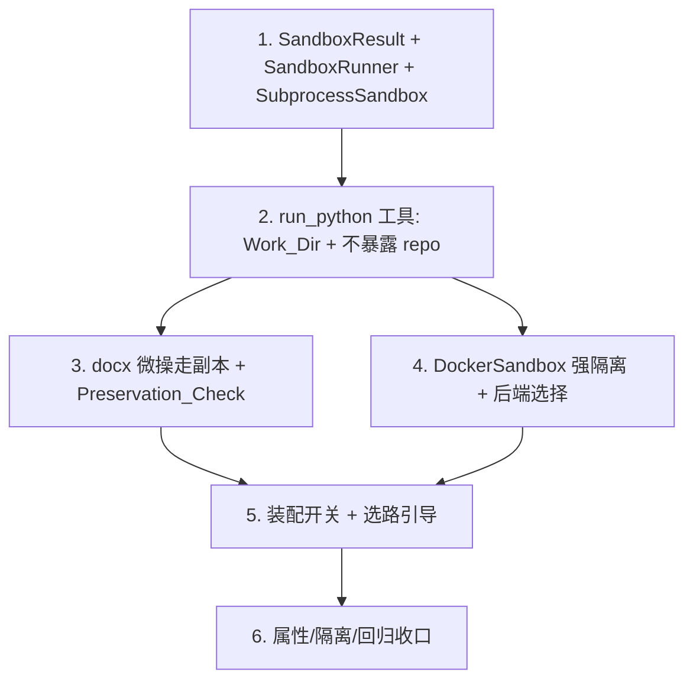

# Implementation Plan

## Overview

加法式落地"受沙箱约束的通用代码执行工具 `run_python`"作为低风险长尾工具层：先做跨平台可测的
子进程沙箱基线与数据模型，再做 `run_python` 工具（Work_Dir 生命周期 + 不暴露工作区写路径），
接入 docx 微操的无损校验，再补强隔离的 Docker 后端与后端选择，最后装配开关 + 选路引导 + 属性/回归
收口。全程：只服务低风险长尾、绝不触碰正确性核心、未启用即行为不变。

## Task Dependency Graph

```json
{
  "waves": [
    { "wave": 1, "tasks": ["1"] },
    { "wave": 2, "tasks": ["2"] },
    { "wave": 3, "tasks": ["3", "4"] },
    { "wave": 4, "tasks": ["5"] },
    { "wave": 5, "tasks": ["6"] }
  ]
}
```



## Tasks

- [x] 1. 数据模型 + SandboxRunner 协议 + SubprocessSandbox（跨平台基线）
  - 在 `src/paper_agent/agent_platform/sandbox.py` 定义 `SandboxResult` 与 `SandboxRunner` 协议
    （`available()` / `run(code, work_dir, *, timeout_s, memory_mb, allow_network)`）
  - 实现 `SubprocessSandbox`：把 code 写成 `_snippet.py`、`subprocess.run(cwd=work_dir, timeout=...)`、
    最小化 env（去代理）、Unix 下 `resource` 设内存/CPU 上限；超时/非零退出/异常 → `SandboxResult`
    诚实上报；stdout/stderr 防御式截断
  - 明确标注 Subprocess 隔离**弱**（不真正断网、内存上限仅 Unix）
  - 单元测试：正常产出、非零退出上报、超时被杀、异常隔离（跨平台可测）
  - _Requirements: 1.1, 1.4, 2.3, 2.4, 5.1, 5.3, 5.4_

- [x] 2. run_python 工具（Work_Dir 生命周期 + 不暴露工作区写路径）
  - 在 `src/paper_agent/agent_platform/tools/run_python_tool.py` 注册 `run_python`：参数
    `code`/`input_files`/`preserve_docx`/`timeout_s`/`memory_mb`/`allow_network`
  - 建临时 Work_Dir → 复制 input_files 进去（**原文件只读、不动**）→ 记录前置文件快照 →
    调注入的 `SandboxRunner.run` → 收集新增/变更文件为产物 → 截断结果 → `session.record(files=[...])`
  - **不接收 repo/gate**：工具仅拿 `output_dir` 与 sandbox runner，代码无法改工作区
  - 预置库（Pillow/matplotlib/pandas/python-docx/PyPDF）说明写入工具描述
  - 单元测试：产出新文件、输入原文件字节不变、结果截断、代码失败诚实回灌
  - _Requirements: 1.1, 1.2, 1.3, 2.1, 2.5, 3.2, 5.1, 5.4_

- [x] 3. docx 微操走副本 + Preservation_Check 集成
  - `run_python` 对 `preserve_docx`（或产物中与输入 docx 同基名的 docx）复用 `inplace_augment` /
    `docx_structural` 的 Preservation_Check 与原输入 docx 比对
  - 不过 → 丢弃该 docx 产物、`ok=False`、保留原稿、诚实上报；纯新产物（无同名输入）不强制校验
  - 单元测试（python-docx，缺失跳过）：某段设悬挂缩进 → 过校验；代码删原段落 → 校验失败、保留原稿
  - _Requirements: 4.1, 4.2, 4.3, 4.4_

- [x] 4. DockerSandbox（强隔离）+ 后端选择
  - 实现 `DockerSandbox`：`docker run --rm --network none --memory {m}m -v {work_dir}:/work -w /work
    {image} python /work/_snippet.py`；宿主侧超时杀容器；`allow_network` 才去掉 `--network none`
  - 后端选择：`sandbox_backend` = auto/docker/subprocess；auto → 有 docker 用 docker，否则 subprocess
    并告警；指定 docker 但不可用 → 拒绝（不静默降级）
  - 单元测试（需 Docker，标记，无 Docker 跳过）：断网、内存上限、挂载隔离、Work_Dir 外不可写
  - _Requirements: 2.1, 2.2, 2.6, 6.3_

- [x] 5. 装配开关 + 选路引导
  - `Config` 加 `run_python_enabled`（默认 False）、`sandbox_backend`、`sandbox_timeout_s`、
    `sandbox_memory_mb`、`sandbox_image`
  - `app._build_registry`/`build_agent_app`：仅当启用且后端可用时注册 `run_python`（注入选定 runner）；
    不可用按配置拒绝或告警
  - 系统提示：`run_python` 仅用于低风险长尾（图像/数据/文件/docx 微操）；改章节/引用/忠实性/保格式
    转换走既有受控工具（绝不用 run_python 碰正确性核心）
  - 集成测试（Mock/Subprocess）：启用→注册且可跑；未启用→工具集不变
  - _Requirements: 3.1, 3.3, 6.1, 6.2, 6.3_

- [x] 6. 属性测试与回归收口
  - hypothesis 覆盖 Property：输入原文件不变、超时有界、失败诚实、未启用逐字节不变
  - 隔离测试：`run_python` 不持有 repo 写能力；执行前后工作区 `section_drafts`/`verified_references` 不变
  - 端到端（Subprocess）：写一段 Pillow 拼图代码 → 产出 combined.png；写一段 python-docx 设悬挂缩进 →
    过 Preservation_Check
  - 回归：`run_python_enabled=False` 时既有测试全绿、逐字节一致
  - _Requirements: 2.5, 3.2, 4.2, 5.1, 6.2_

## Notes

- **只服务低风险长尾**：图像/数据/文件/docx 微操；正确性核心（引用/内容/忠实性/保格式转换）绝不经此。
- **不暴露写路径**：`run_python` 不持有 repo/gate，代码改不了工作区，天然隔离正确性核心。
- **输入只读**：输入文件复制进 Work_Dir，原文件字节不变。
- **docx 微操走副本 + 无损校验**：复用既有 Preservation_Check，破坏结构即失败、保留原稿。
- **隔离可插拔**：Docker（强，Windows 首选）/ Subprocess（弱，本地调试）；强隔离不可用不静默降级。
- **加法式**：未启用 `run_python` 时平台行为逐字节不变。
