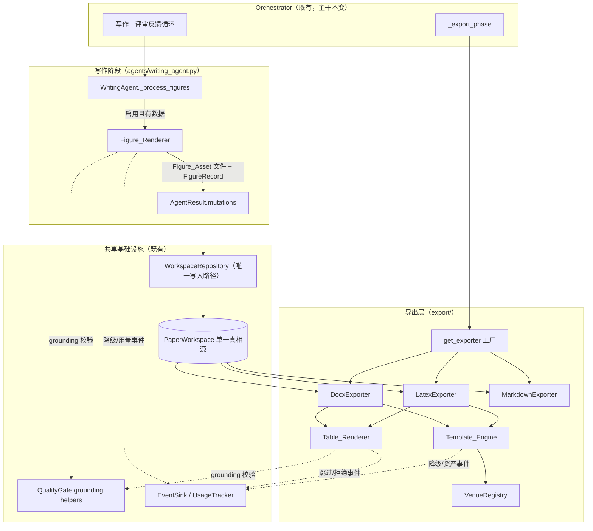
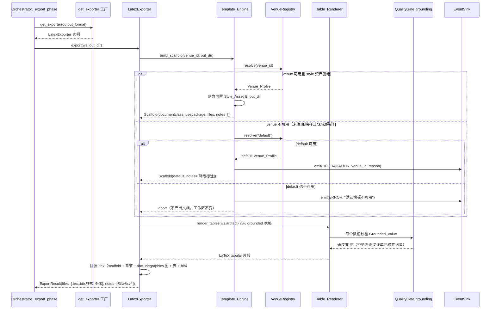

# Design Document

设计文档：venue-templates-figures-tables（会议模板 + 真实图片嵌入 + 结果表生成 + 数据出图）

## Overview

本设计在既有多智能体论文写作系统（`src/paper_agent/`）之上补齐四项可发表性缺口，且严格复用现有契约，不重复 `format-pipeline-and-diff-revision` spec 拥有的 pandoc 转换 / `Format_Gate` / 修复循环 / Normalized Markdown 契约。

四项能力与其落点：

1. **会议模板（Template_Engine + Venue_Profile 注册表）**：新增一个纯数据驱动的模板引擎，按 `Venue_Id`（`neurips`/`icml`/`acl`/`ieee`/`default`）解析出 `Venue_Profile`，产出模板脚手架（文档类声明、`Style_Asset` 引用、标题/作者/正文骨架），替换 `export/latex.py` 中硬编码的 `\documentclass{article}`。多级优雅回退到 `default`，并覆盖 `default` 自身不可用时的中止分支。
2. **真实图片嵌入**：扩展 `LatexExporter._render_tex` 的图块，在 `\caption`/`\label` **之前**生成 `\includegraphics`；扩展 `DocxExporter` 以内联图片嵌入。含路径穿越防御（仅允许导出目录内的相对路径）与缺资产回退。
3. **结果表（Table_Renderer）**：把 `ResearchArtifact.experiments[].results_data.stats`（mean/std/min/max + baselines/metrics/dataset）渲染为 LaTeX `tabular` / docx 原生表格。所有数值必须是 `Grounded_Value`，复用既有 `quality_gate` 的 grounding 容差；无数据时优雅跳过。
4. **数据出图（Figure_Renderer，P1）**：从实验数据生成图像文件（`Figure_Asset`）与 `FigureRecord`，在写作阶段经 `AgentResult.mutations` 写回工作区；matplotlib 为**可选依赖**，缺失时优雅降级为既有文字图题行为（`writing_agent._process_figures`）。

### 关键设计原则（承接既有契约）

- **单一写入路径**：所有新增的工作区写入（`FigureRecord`、新入库图像的记录）只经 `AgentResult.mutations` 由 `WorkspaceRepository.update` 原子落盘（`agents/base.py` / `workspace/repository.py`）。渲染器本身是纯函数式组件，不直接写工作区。
- **依赖倒置**：`Template_Engine` / `Table_Renderer` 经 `DocumentExporter` 协议与 `get_exporter` 工厂接入（`export/base.py` / `export/factory.py`），不改变 Orchestrator 调用导出的方式；`Figure_Renderer` 依赖注入的绘图后端抽象与 `LLMProvider`。
- **grounding 不放宽**：Table_Renderer / Figure_Renderer 复用 `tools/quality_gate.py` 的 `all_numeric_values()`、`_value_matches`、stats 衍生值集合作为唯一数值白名单来源，产物中的数字必然不触发 `fabricated_metric`。
- **不可信数据处理**：`Venue_Profile` / `Style_Asset` / `results_data` / 绘图后端输出一律视为不可信，禁用 `eval`/`exec`，对写入文本做防御式截断（样式引用名/列名 500 字符、可观测文本 2000 字符、外部输出 8000 字符）。
- **优雅降级 + 可观测**：每个子功能失败/缺依赖时降级到既有行为并经 `EventSink` 记录一条含子功能名与原因的事件；外部工具/LLM 调用经 `UsageTracker` 记账。
- **断点续跑**：`Figure_Renderer` 在写作阶段产出的 `FigureRecord` 通过既有 store 序列化持久化；续跑时按“图像文件是否已存在 + 记录是否已在工作区”幂等跳过，不重复落盘。

## Architecture

### 组件关系

新增组件（`Template_Engine`、`VenueRegistry`、`Table_Renderer`、`Figure_Renderer`）围绕既有导出器与写作智能体接入，不改变编排器主干调用形态。



### 两个接入位置

- **写作阶段（产图）**：`Figure_Renderer` 在 `WritingAgent` 内、原 `_process_figures` 的位置运行——先尝试从实验数据出图（产 `Figure_Asset` + 补齐/新建 `FigureRecord`），失败或禁用则回落到既有 LLM 文字图题。产出经 `AgentResult.mutations` 落盘，保证图像记录在导出前已在工作区。图像文件本身写到工作区目录下的资产子目录（`{workspace_dir}/{workspace_id}_assets/`），其相对路径记入 `FigureRecord.data_ref`。
- **导出阶段（用模板+嵌图+出表）**：`_export_phase` 仍只调用 `get_exporter(ws.output_format).export(ws, out_dir)`。`Template_Engine` 与 `Table_Renderer` 在 `LatexExporter` / `DocxExporter` 内部被调用，对 Orchestrator 完全透明（依赖倒置，Req 1.7 / 9.2）。

### 导出时序（模板 + 图 + 表）



## Components and Interfaces

### 1. VenueRegistry（会议档案注册表）

职责：把 `Venue_Id` 解析为 `Venue_Profile`；登记内置档案（`neurips`/`icml`/`acl`/`ieee`/`default`）；对未注册 id 返回“未注册”信号（由 `Template_Engine` 转为回退）。纯数据、无 I/O 副作用（样式落盘由 `Template_Engine` 负责），便于测试。

```python
class VenueRegistry:
    def resolve(self, venue_id: str) -> VenueProfile | None:
        """返回已注册档案；未注册返回 None（触发回退）。"""
    def registered_ids(self) -> set[str]:
        """已登记的 Venue_Id 集合（至少含 neurips/icml/acl/ieee/default）。"""
```

### 2. Template_Engine（模板引擎）

职责：按选定 `Venue_Profile` 产出 `Scaffold`（文档类声明、样式引用行、必需结构骨架）、把内置 `Style_Asset` 落盘到导出目录、执行多级回退与中止判定、发出降级/错误事件。**不调用 LLM**（Req 3.4）。

```python
@dataclass
class Scaffold:
    document_class: str            # 如 "article" / "neurips_2024"
    preamble_lines: list[str]      # \usepackage / \documentclass 选项等
    asset_files: list[str]         # 已落盘的 Style_Asset 绝对路径
    degraded: bool = False
    degrade_note: str = ""         # 逐字节固定文本（见 Req 3.2）
    requested_venue_id: str = ""
    fallback_reason: str | None = None  # {unregistered_venue,missing_style_asset,invalid_profile}
    aborted: bool = False          # default 亦不可用 → 中止（Req 3.6）

class TemplateEngine:
    def __init__(self, registry: VenueRegistry, sink: EventSink): ...
    def build_scaffold(self, venue_id: str, out_dir: str) -> Scaffold:
        """解析→（回退）→落盘样式→返回 Scaffold；至多回退一次，目标固定 default。"""
```

回退决策（单次、不级联，Req 3.1/3.5）：
- `unregistered_venue`：`registry.resolve(venue_id)` 为 `None`。
- `missing_style_asset`：档案声明的 `Style_Asset` 既无内置文件也无可解析引用。
- `invalid_profile`：档案字段校验失败（文档类空、结构元素缺失等）。
- 任一命中 → 解析 `default`；`default` 也不可用 → `aborted=True`（Req 3.6）。

### 3. Table_Renderer（结果表渲染器）

职责：把 `ResearchArtifact.experiments[]` 的 `results_data.stats` 渲染为目标格式表格标记。对 LaTeX 产出 `table`/`tabular`（含表头、`\caption`、`\label`）；对 docx 产出原生表格元素（表头行 + 数据行）。每个数值经 grounding 校验，未通过则跳过该单元格并记录；无任何可用 stats 则不产表。

```python
class TableRenderer:
    def __init__(self, grounding: GroundingChecker, sink: EventSink,
                 float_decimals: int = 3, max_field_chars: int = 500): ...
    def render_latex(self, artifact: ResearchArtifact | None) -> list[TableFragment]:
        """无 artifact / 全空 stats → 返回 []，并记录“无可用实验数据，跳过表格生成”。"""
    def render_docx(self, artifact: ResearchArtifact | None, document) -> int:
        """向 python-docx Document 追加原生表格，返回追加的表数。"""
```

- 行列结构：行 = baselines/方法（含本方法），列 = metrics（Req 6.4）；每单元格取对应 `results_data` 数值（优先 `stats[metric]` 的 mean，缺失回落到 rows 中对应值）。
- 浮点一致格式化：统一 `float_decimals` 位；列名等派生文本 500 字符截断（Req 6.7）。
- 不可信：不 `eval`/`exec`；单条异常数据（缺字段/非数值）只跳过该单元格并记录，不中止整表（Req 6.8）。

### 4. GroundingChecker（grounding 复用适配器）

职责：把 `tools/quality_gate.py` 已有的 grounding 逻辑抽成可被渲染器复用的只读校验器，**不新增、不放宽**判定路径（Req 8.4）。内部委托既有 `ResearchArtifact.all_numeric_values()` 与 `QualityGate._value_matches` / stats 衍生集合（mean、mean±std、min、max）。

```python
class GroundingChecker:
    def __init__(self, artifact: ResearchArtifact): ...
    def allowed_values(self) -> list[float]:
        """= all_numeric_values() ∪ 每指标 {mean, mean±std, min, max}（与 QG 一致）。"""
    def is_grounded(self, value: float, tolerance: float = 0.01) -> bool:
        """委托 QualityGate._value_matches，容差与既有闸一致。"""
```

实现上，将 `QualityGate` 中构造 `extended_allowed` 的逻辑与 `_value_matches` 提取为模块级函数（`quality_gate.build_allowed_values(artifact)` / `value_matches(...)`），`QualityGate._check_artifact_grounding` 与 `GroundingChecker` 共用，保证“表/图允许的数值集合”与“质量闸校验的数值集合”逐字节同源。

### 5. Figure_Renderer（数据出图渲染器）

职责：从 `Experiment.results_data` 生成图像文件（`Figure_Asset`）并产出对应 `FigureRecord`；只画 `Grounded_Value`；matplotlib 为可选依赖，缺失/禁用/失败均降级为既有文字图题；所有外部调用经 `UsageTracker`/`EventSink` 记账。**渲染器只产出数据，写回由 WritingAgent 汇聚为 mutation**（Req 7.3 / 9.1）。

```python
@dataclass
class RenderedFigure:
    record: FigureRecord          # figure_id + data_ref(相对资产路径) + caption
    asset_path: str               # 落盘的图像文件绝对路径
    source_experiment_id: str

class PlottingBackend(Protocol):
    """绘图后端抽象（依赖倒置）；默认实现基于 matplotlib（可选依赖）。"""
    available: bool
    def bar_chart(self, title: str, labels: list[str],
                  values: list[float], out_path: str) -> None: ...

class FigureRenderer:
    def __init__(self, backend: PlottingBackend, grounding: GroundingChecker,
                 sink: EventSink, tracker: UsageTracker | None,
                 enabled: bool = True): ...
    def render_from_artifact(self, artifact: ResearchArtifact | None,
                             assets_dir: str) -> list[RenderedFigure]:
        """禁用/无后端/无数据 → 返回 []（调用方回落文字图题并记录降级原因）。"""
```

- 只把 `is_grounded` 通过的数据点写入图；被拒数值不入图并记录（Req 7.2 / 8.3）。
- `data_ref` 记为相对导出/资产目录的相对路径，供导出器做路径穿越校验后嵌入。

### 6. 导出器扩展（LatexExporter / DocxExporter）

- `LatexExporter._render_tex`：
  - 用 `Template_Engine.build_scaffold` 的结果替换硬编码前导（`\documentclass{article}` + `\usepackage`），`aborted` 时直接返回中止信号（不写文件）。
  - 图块：对每个 `FigureRecord`，若能定位到导出目录内的 `Figure_Asset`，在 `figure` 环境中先写 `\includegraphics{相对路径}` 再写 `\caption`/`\label`；否则保留仅 `\caption`/`\label` 的既有回退并记录缺资产。
  - 表块：调用 `Table_Renderer.render_latex` 追加 `table`/`tabular`。
- `DocxExporter.export`：图表区改为——有资产则 `document.add_picture(相对路径内的资产)`，其后加图题段落；无资产回落既有 `figure_id: caption` 段落。表格区调用 `Table_Renderer.render_docx` 追加原生表格。可选依赖缺失时以可诊断错误处理且不产出半损坏文件（Req 5.3）。

### 7. ExportResult 扩展（export/base.py）

为承载降级标注（Req 3.2 要求降级文本同时出现在 `Export_Result` 与事件日志），`ExportResult` 增加 `notes: list[str]` 字段（默认空，向后兼容）：

```python
@dataclass
class ExportResult:
    output_format: OutputFormat
    files: list[str] = field(default_factory=list)
    notes: list[str] = field(default_factory=list)   # 降级/缺资产等标注
```

### 8. 路径穿越防御（共享工具）

新增 `export/asset_paths.py`：`safe_relative_asset(out_dir, candidate) -> str | None`。把 `candidate` 规整为绝对路径后，仅当其位于 `out_dir`（含资产子目录）之内时返回相对 `out_dir` 的相对路径，否则返回 `None`（视为缺资产回退）。LaTeX 与 docx 嵌入前统一经此校验（Req 4.5）。

## Data Models

### Venue_Profile / Style_Asset（新增，纯数据）

```python
@dataclass
class StyleAsset:
    name: str                      # 引用名（如 "neurips_2024.sty"），写入 .tex 前截断至 500
    builtin_path: str | None = None  # 内置文件绝对路径；None 表示仅为引用声明
    kind: str = "sty"              # sty | cls | bst

@dataclass
class VenueProfile:
    venue_id: str                  # neurips|icml|acl|ieee|default
    document_class: str            # LaTeX 文档类名
    class_options: list[str] = field(default_factory=list)
    style_assets: list[StyleAsset] = field(default_factory=list)
    required_structure: list[str] = field(default_factory=list)  # title/authors/body...
    docx_conventions: dict = field(default_factory=dict)         # 标题层级等
    def is_valid(self) -> bool:
        """document_class 非空且 required_structure 完整——invalid_profile 判据。"""
```

`default` 档案对应现行行为：`document_class="article"`，`style_assets=[inputenc, graphicx]`（引用声明，无需内置文件），从而回退到 `default` 时逐字节复现今日 `\documentclass{article}` 输出（Req 1.2 / 3.3）。

### FigureRecord 扩展（workspace/models.py）

既有 `FigureRecord` 已含 `figure_id` / `data_ref` / `caption` / `caption_provided_by_user`。`data_ref` 复用为“指向图像文件的相对路径”，无需破坏性改动。为可追溯性与幂等续跑，新增两个可选字段（默认值保证旧序列化数据兼容）：

```python
@dataclass
class FigureRecord:
    figure_id: str
    data_ref: str
    caption: str = ""
    caption_provided_by_user: bool = False
    source_experiment_id: str = ""   # 新增：数据出图来源实验（文字图题时为空）
    rendered_from_data: bool = False # 新增：True=Figure_Renderer 产图；False=文字图题回退
```

`from_dict` 依赖 dataclass 直接构造，新增字段有默认值，旧 JSON（无这两个键）反序列化时 `FigureRecord(**f)` 会因多余/缺失键处理——因此 `models.py` 的 `figures=[FigureRecord(**f) ...]` 需改为忽略未知键的安全构造（保持向后兼容）。

### TableFragment（渲染中间产物，不持久化）

```python
@dataclass
class TableFragment:
    experiment_id: str
    caption: str
    label: str
    latex: str                      # 完整 table/tabular 片段
    skipped_cells: list[str] = field(default_factory=list)  # 被 grounding 拒绝的单元格
```

### 配置扩展（config.py）

```python
    # 会议模板：默认 venue（可被 profile 覆盖）。
    venue_id: str = "default"
    # 数据出图开关（Req 7.6）；关闭时 Figure_Renderer 不产图，保留文字图题。
    figures_from_data_enabled: bool = True
    figure_float_decimals: int = 3
```

`Venue_Id` 选择优先级（Req 1.1/1.2）：`ws.profile["venue_id"]` > `config.venue_id` > `"default"`。

### 观测事件（observability/events.py）

新增两个 `EventKind`（保持既有 sink 契约不变）：

- `DEGRADATION`（子功能降级：模板回退 / 缺图资产 / 跳过表格 / 绘图依赖不可用），`data` 含 `feature`、`reason`、`venue_id?`。
- `EXPORT_ASSET`（落盘的 `Style_Asset` / `Figure_Asset` 记录）。

所有事件文本片段截断至 2000 字符，绝不打印密钥或完整请求体（Req 10.4）。

## Correctness Properties

*属性（property）是应在系统所有合法执行中恒真的特征或行为——一条关于系统「应当做什么」的形式化陈述。属性是人类可读规约与机器可验证正确性保证之间的桥梁。*

下列属性由需求验收标准经 prework 分析得出，并做过去冗余合并（多条围绕 grounding、回退、单一写入路径的标准被合并为覆盖更全的单一属性）。每条属性均可用属性测试实现，最少 100 次迭代。

### Property 1: 表/图数值 grounding 不变式

*对任意* `ResearchArtifact` 与其任一含非空 `stats` 的 `Experiment`，`Table_Renderer` 产出的表格与 `Figure_Renderer` 传给绘图后端的每一个数值，都必须是 `Grounded_Value`——即经既有 `QualityGate` 同源判定（`value_matches`，容差 0.01）能在 `all_numeric_values()` ∪ 每指标 `{mean, mean±std, min, max}` 集合中找到；将产物纳入工作区后运行 `QualityGate.check` 不产生任何针对表/图数值的 `fabricated_metric`。

**Validates: Requirements 6.1, 6.5, 7.2, 8.1, 8.2**

### Property 2: 非 grounded 数值被拒绝并记录

*对任意* 含无法在 `Research_Artifact` 数值集合中按既有容差找到的数值的待渲染数据，该数值都不会出现在生成的表格或图中，且系统记录一条该数值被拒绝的原因；单条异常数据（缺字段/非数值）只导致跳过该单元格并记录，不中止整表/整图生成。

**Validates: Requirements 6.8, 8.3**

### Property 3: grounding 允许集合与既有质量闸同源一致

*对任意* `ResearchArtifact`，`GroundingChecker.allowed_values()` 返回的允许数值集合，与既有 `QualityGate._check_artifact_grounding` 内部构造的 `extended_allowed` 集合逐元素相等——本特性不新增、不放宽、不绕过既有 grounding 阈值与判定路径。

**Validates: Requirements 8.4**

### Property 4: 会议档案解析一致性

*对任意* 属于已注册集合的 `Venue_Id`，`VenueRegistry.resolve(id)` 返回的 `Venue_Profile` 的 `venue_id` 等于该 id；且对任意非 `default` 的已注册 `Venue_Profile`，LaTeX 导出产出的 `.tex` 首个 `\documentclass` 参数等于该 profile 的 `document_class`（不再是硬编码 `article`）。

**Validates: Requirements 1.1, 1.3**

### Property 5: 脚手架结构完整性

*对任意* 已注册的 `Venue_Profile`，`Template_Engine.build_scaffold` 产出的脚手架都包含该 profile 声明的全部必需结构元素（文档类声明、每个 `Style_Asset` 的引用声明、标题/作者区、正文区）。

**Validates: Requirements 1.4, 2.1**

### Property 6: 样式资产引用名与落盘文件一致且受截断

*对任意* 带内置文件的 `Style_Asset`，导出后该资产文件落盘于导出目录内、其路径存在于文件系统且出现在 `Export_Result.files` 中，并且 `.tex` 中的样式引用名与实际落盘文件的 basename 一致；*对任意* 字符串（含超长）作为样式引用名，写入 `.tex` 的引用名长度不超过 500 字符。

**Validates: Requirements 2.2, 2.3, 2.5**

### Property 7: 模板回退产出完整目标文档

*对任意* 触发任一不可用条件（`unregistered_venue` / `missing_style_asset` / `invalid_profile`）的导出请求，只要 `default` 可用，`Template_Engine` 都回退到 `default` 并产出与请求一致的目标格式文档（不中止），且回退版文档的章节、图、表与参考文献的数量及内容与直接以 `default` 导出时逐一相同——仅模板样式回退，任何内容单元都不被删除或截断。

**Validates: Requirements 3.1, 3.3, 2.4, 10.1**

### Property 8: 回退/降级标注与事件一致且恰一条

*对任意* 模板回退，`Export_Result.notes` 与经 `EventSink` 记录的降级事件都含逐字节相同的固定文本「已降级：请求的会议模板不可用，已回退到默认模板」，两处附带的被请求 `Venue_Id` 一致，且回退原因取值于枚举 `{unregistered_venue, missing_style_asset, invalid_profile}`；每次导出模板回退事件恰记录一条，回退目标恒为 `default` 不级联；*对任意* 子功能降级（缺图资产/跳过表格/绘图依赖不可用等），都恰记录一条含子功能名与降级原因的事件。

**Validates: Requirements 3.2, 3.5, 10.2**

### Property 9: 回退过程不调用 LLM

*对任意* 模板回退，`Template_Engine` 的回退与脚手架产出过程都不调用任何 `LLMProvider`（注入记账 LLM 时其调用计数为 0）。

**Validates: Requirements 3.4**

### Property 10: LaTeX 图嵌入顺序与一一对应

*对任意* 一组各自持有可定位 `Figure_Asset` 的 `Figure_Record`，LaTeX 导出为每个图产出的 `figure` 环境中，`\includegraphics` 出现且其位置严格早于该图的 `\caption` 与 `\label`；且每个 `figure` 环境内引用的图像路径对应其自身 `Figure_Record` 的资产，多图之间不发生错配。

**Validates: Requirements 4.1, 4.6**

### Property 11: LaTeX 图路径一致、存在且保留图题/标签

*对任意* 被嵌入的 `Figure_Record`，`\includegraphics` 引用的路径等于实际落盘于导出目录的 `Figure_Asset` 相对路径，该文件存在于文件系统且出现在 `Export_Result.files` 中；同时该图仍产出 `\caption{escape(caption)}` 与 `\label{figure_id}`，与既有行为一致。

**Validates: Requirements 4.2, 4.3, 9.3**

### Property 12: 缺资产图的 LaTeX 回退

*对任意* 无可定位 `Figure_Asset` 的 `Figure_Record`，LaTeX 导出不为其生成 `\includegraphics`、仍产出仅含 `\caption` 与 `\label` 的既有回退输出，并记录该图缺失图像资产。

**Validates: Requirements 4.4**

### Property 13: 图像路径穿越防御

*对任意* `Figure_Asset` 路径输入（含 `../` 穿越、绝对路径、指向导出目录之外的路径），LaTeX 导出要么走缺资产回退（不生成 `\includegraphics`），要么生成一个规整后仍位于导出目录之内的相对路径引用；系统在任何情况下都不写出指向导出目录之外的绝对路径。

**Validates: Requirements 4.5**

### Property 14: docx 图嵌入与图题一一对应

*对任意* 一组各自持有可定位 `Figure_Asset` 的 `Figure_Record`，docx 导出内联嵌入的图片数量与有资产图数量相等，每张内联图片下方输出其对应 `Figure_Record` 的图题文本，多图之间图片与图题一一对应不错配；对无资产的图则保留仅输出 `figure_id` 与图题文本的既有回退并记录缺资产。

**Validates: Requirements 5.1, 5.2, 5.5**

### Property 15: 结果表结构完整性

*对任意* 含非空 `stats` 且含 `baselines` 与 `metrics` 的 `Experiment`：LaTeX 表格片段包含 `tabular` 环境、`\caption`、`\label` 与表头行；docx 产出行数不少于两行（表头行 + 数据行）的原生表格（而非合并入单段落）；且表的行列结构反映 baselines 与 metrics 的对应关系，每个 (baseline/方法, metric) 单元格取自对应的 `results_data` 数值。

**Validates: Requirements 6.2, 6.3, 6.4**

### Property 16: 无数据时优雅跳过表格

*对任意* `Research_Artifact` 不存在或其全部 `Experiment.results_data.stats` 为空的输入，`Table_Renderer` 不生成任何结果表、返回空并记录「无可用实验数据，跳过表格生成」，且不抛出异常。

**Validates: Requirements 6.6**

### Property 17: 数值格式化一致性与派生文本截断

*对任意* 浮点数值，`Table_Renderer` 渲染出的文本采用配置的一致小数位数；*对任意* 由 `stats` 派生的文本（如列名），写入产物的文本长度不超过 500 字符。

**Validates: Requirements 6.7**

### Property 18: 数据出图产出资产与记录

*对任意* 含非空 `results_data` 的 `Experiment`，在数据出图启用且绘图后端可用时，`Figure_Renderer.render_from_artifact` 产出 `RenderedFigure`，其 `FigureRecord` 含 `figure_id` 与指向已落盘图像文件的 `data_ref`，且该图像文件存在。

**Validates: Requirements 7.1**

### Property 19: 单一写入路径不变式

*对任意* `Figure_Renderer` 的产图结果，`WritingAgent` 仅经 `AgentResult.mutations` 返回图写回意图——在这些 mutation 被 `WorkspaceRepository` 应用之前，工作区的 `figures` 逐字节不变；应用之后工作区含新的 `FigureRecord`。任何新增智能体逻辑都不经绕过 `WorkspaceRepository` 的接口写工作区。

**Validates: Requirements 7.3, 9.1**

### Property 20: 绘图禁用/依赖不可用时降级为文字图题

*对任意* 含数据的 `Experiment`，当数据出图被配置禁用、或绘图后端不可用时，`Figure_Renderer` 不产出任何图像文件、返回空，`WritingAgent` 回落到既有文字图题行为（`_process_figures`），并在依赖不可用时记录「绘图依赖不可用，已降级为文字图题」；管线不中止。

**Validates: Requirements 7.5, 7.6**

### Property 21: 续跑幂等

*对任意* 已含由数据出图产生的 `FigureRecord` 的工作区，重新运行写作阶段的产图逻辑后，已有的 `FigureRecord` 与章节内容逐字节比对不变，且不重复追加相同记录或重复落盘图像文件。

**Validates: Requirements 9.4**

### Property 22: 落盘路径存在性

*对任意* 成功导出，`Export_Result.files` 列出的每一个路径（目标格式文档、`Style_Asset`、`Figure_Asset`）都存在于文件系统中。

**Validates: Requirements 9.3**

### Property 23: 落盘失败回滚

*对任意* 会导致持久化失败的写回意图，`WorkspaceRepository.update` 在 `store.save` 抛错后将工作区恢复到写入前状态（`to_dict()` 与写入前快照逐字节相等），不留部分写入中间产物。

**Validates: Requirements 9.5**

### Property 24: 防御式截断（可观测与不可信输入）

*对任意* 文本，经既有可观测性系统记录的事件文本片段长度不超过 2000 字符且不含 API 密钥或完整请求体；*对任意* 超过 8000 字符的外部工具或 LLM 输出，系统在解析前将其截断至不超过 8000 字符，且不对其执行 `eval`/`exec`。

**Validates: Requirements 10.4, 10.5**

### Property 25: 外部调用失败时工作区不变并降级

*对任意* 失败、超时或无有效响应的外部工具或 LLM 调用，系统丢弃该次结果、保持工作区字节级不变、记录失败原因，并降级到既有行为继续导出。

**Validates: Requirements 10.6**

## Error Handling

本特性的错误处理核心是「永不中止管线（除唯一的 default 亦不可用中止分支）+ 逐级降级 + 可观测 + 工作区不变」。下表列出各降级/错误场景、触发条件、降级后行为与观测记录。

### 降级矩阵

| 子功能 | 触发条件 | 降级后行为 | 观测记录 | 需求 |
|---|---|---|---|---|
| 模板 | `Venue_Id` 未注册 | 回退 `default`，产出完整文档 | `DEGRADATION`（feature=template, reason=unregistered_venue, venue_id） | 1.5, 3.1, 3.5 |
| 模板 | 所需 `Style_Asset` 缺失/无法加载 | 回退 `default`，记录缺失资产名 | `DEGRADATION`（reason=missing_style_asset） | 2.4, 3.1 |
| 模板 | `Venue_Profile` 无法解析/校验失败 | 回退 `default` | `DEGRADATION`（reason=invalid_profile） | 3.1 |
| 模板 | `default` 亦不可用 | **中止本次导出**，不产出文档，工作区不变 | `ERROR`（"默认模板不可用"） | 3.6 |
| LaTeX 图 | 无可定位 `Figure_Asset` | 仅产 `\caption`/`\label`，不产 `\includegraphics` | `DEGRADATION`（feature=figure_embed_latex, reason=missing_asset） | 4.4 |
| LaTeX 图 | 路径穿越/目录外绝对路径 | 视为缺资产回退 | `DEGRADATION`（reason=unsafe_path） | 4.5 |
| docx 图 | 无可定位 `Figure_Asset` | 输出 `figure_id`+图题文字段落 | `DEGRADATION`（feature=figure_embed_docx, reason=missing_asset） | 5.2 |
| docx 图 | python-docx 不可用 | 抛可诊断 `RuntimeError`，不产半损坏文件 | `DEGRADATION`/错误（reason=missing_dependency） | 5.3 |
| 结果表 | 无 artifact / 全空 stats | 不产表，返回空 | `DEGRADATION`（feature=table, reason=no_data） | 6.6 |
| 结果表 | 单元数据缺字段/非数值 | 跳过该单元格，产出其余 | `DEGRADATION`（reason=cell_skipped） | 6.8 |
| 结果表/图 | 数值非 grounded | 拒绝该数值，不写入产物 | `DEGRADATION`（reason=rejected_ungrounded_value） | 8.3 |
| 数据出图 | 绘图依赖不可用 | 回落文字图题 | `DEGRADATION`（feature=figure_render, reason=missing_dependency） | 7.5 |
| 数据出图 | 配置禁用 | 不产图，保留文字图题 | 无需事件（正常关闭） | 7.6 |
| 通用 | 外部工具/LLM 失败/超时/无响应 | 丢弃结果、工作区不变、降级 | `DEGRADATION` + 失败原因 | 10.6 |
| 落盘 | store 持久化失败 | 回滚到写入前状态 | 异常上抛（既有仓储行为） | 9.5 |

### 关键错误处理约定

- **唯一中止点**：仅当回退目标 `default` 亦不可用时中止导出（Req 3.6）；其余一切失败都降级续行。
- **工作区不变式**：任何外部调用失败或落盘失败都不得留下部分写入；写回一律经 `WorkspaceRepository.update` 的快照-回滚路径（`workspace/repository.py` 既有实现）。
- **不可信数据**：`Venue_Profile` / `Style_Asset` / `results_data` / 绘图后端与 LLM 输出一律不 `eval`/`exec`；样式引用名与列名截断 500、可观测文本截断 2000、外部输出解析前截断 8000。
- **路径安全**：图像嵌入前统一经 `safe_relative_asset` 校验，目录外路径一律降级为缺资产。

## Testing Strategy

### 双轨测试

- **属性测试（property-based）**：验证上文 25 条 Correctness Properties 覆盖的通用不变式（grounding、回退确定性、路径安全、一一对应、单一写入路径、幂等、截断等）。使用 Hypothesis（仓库已有 `.hypothesis/` 缓存，表明已采用），每条属性一个测试，最少 100 次迭代。
- **单元/示例测试**：验证具体行为与边界，覆盖 prework 中判为 EXAMPLE / EDGE_CASE / SMOKE 的标准：
  - EXAMPLE：`default` 复现 `\documentclass{article}`（1.2）；注册表含 `{neurips,icml,acl,ieee,default}`（1.5）；某 profile 的 docx 标题层级应用（1.6）。
  - EDGE_CASE：`default` 亦不可用时中止分支（3.6）；python-docx 缺失时可诊断错误且无半损坏文件（5.3）。
  - SMOKE / 架构断言：Orchestrator `_export_phase` 仍只调用 `get_exporter(...).export`、导出器满足 `DocumentExporter` 协议（1.7 / 9.2）；本特性不 import/改动 format-pipeline 组件（9.6）。
- **集成测试（1-3 例）**：数据出图 → 导出端到端衔接（7.4）；绘图/LLM 调用经 `UsageTracker`/`EventSink` 记账（7.7 / 10.3）。这些验证外部/基础设施衔接，不做属性化。

### 属性测试配置

- 采用 Hypothesis 作为属性测试库，不自行实现随机化框架。
- 每个属性测试最少运行 100 次迭代（`@settings(max_examples=100)` 或更高）。
- 每个属性测试以注释标注其对应设计属性，标注格式：
  `# Feature: venue-templates-figures-tables, Property {number}: {property_text}`
- 每条 Correctness Property 用**单个**属性测试实现。

### 生成器要点

- **Venue 生成器**：从已注册 id 集合 + 随机未注册 id 抽样；随机构造 `VenueProfile`（含/不含内置资产、合法/非法字段）以覆盖三类不可用条件。
- **Experiment 生成器**：随机 `stats`（mean/std/min/max）、baselines、metrics、dataset；注入部分缺字段/非数值单元与非 grounded 值以测拒绝路径（Property 2）。
- **路径生成器**：随机相对路径、`../` 穿越、绝对路径、目录内合法路径，覆盖 Property 13。
- **图集合生成器**：随机 n 个各带唯一资产的 `FigureRecord`，覆盖一一对应属性（Property 10 / 14）。
- **不可信文本生成器**：随机超长字符串（>8000、>2000、>500）覆盖截断属性（Property 6 / 17 / 24）。

### 复用既有测试基座

- grounding 属性（Property 1/2/3）复用 `tools/quality_gate.py` 的判定函数作为 oracle，确保「表/图允许集合」与「质量闸校验集合」同源；避免重复实现容差逻辑。
- 单一写入路径与回滚属性（Property 19/23）复用既有 `WorkspaceRepository` 与其快照-回滚语义，注入失败 store 触发回滚断言。
- 导出属性使用真实文件系统（临时目录）验证落盘与 `Export_Result.files` 存在性（Property 22）；docx 属性在 python-docx 可用时运行、不可用时跳过并用 EDGE_CASE 覆盖缺依赖分支。
